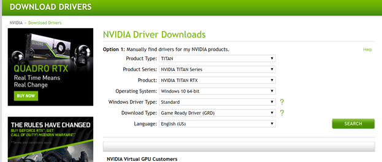
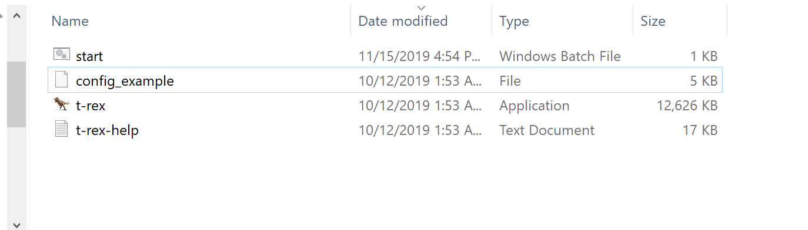
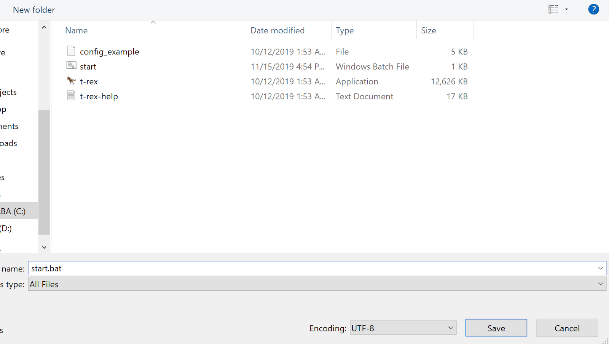
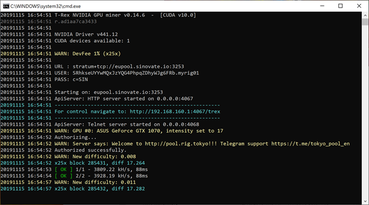

SIN (X25X Algo) Mining Using T-Rex Miner

1-  Download T-Rex

Download the current T-Rex version for your Nvidia graphics card.

Cuda 10 is preferred.

[https://trex-miner.com/download/t-rex-0.19.14-linux-cuda10.0.tar.gz](https://trex-miner.com/download/t-rex-0.19.14-linux-cuda10.0.tar.gz)

[https://trex-miner.com/download/t-rex-0.19.14-linux-cuda11.1.tar.gz](https://trex-miner.com/download/t-rex-0.19.14-linux-cuda11.1.tar.gz)

[https://trex-miner.com/download/t-rex-0.19.14-linux-cuda9.2.tar.gz](https://trex-miner.com/download/t-rex-0.19.14-linux-cuda9.2.tar.gz)

[https://trex-miner.com/download/t-rex-0.19.14-win-cuda10.0.zip](https://trex-miner.com/download/t-rex-0.19.14-win-cuda10.0.zip)

[https://trex-miner.com/download/t-rex-0.19.14-win-cuda11.1.zip](https://trex-miner.com/download/t-rex-0.19.14-win-cuda11.1.zip)

[https://trex-miner.com/download/t-rex-0.19.14-win-cuda9.2.zip](https://trex-miner.com/download/t-rex-0.19.14-win-cuda9.2.zip)


2-  Update Nvidia GPU Driver

If your video card driver is not up-to-date, it is recommended that you update it from the following address.

[https://www.nvidia.com/Download/index.aspx?lang=en-us](https://www.nvidia.com/Download/index.aspx?lang=en-us)



  

3-  Creating a sample start.bat file

Go to the folder located in the T-Rex miner.



  
  

Open a new Text Document


Stratum :

```bash
@echo off
:start
t-rex.exe -a x25x -o stratum+tcp://sin.speedpool.top:50001 -u your_sin_address.your_worker_name -p c=SIN
goto start
```


Select Save as and name the start.bat file.



4-  Start the mining

Please double-click the start.bat file you just created. The T-Rex will connect to the server of your choice and start mining.

 



