**SINOVATE Desktop QT Wallet Tutorial**

**Primary SIN wallet functionalities**

On the left side, there are fundamental operations such as:

-   Home (General layout with useful links and balances)
 
-   My Wallet (Send and Receive)
    
-   Staking (Staking info and choice to stake)
    
-   InfinityNodes (Possibility to set up a node with 1-click setUP and detailed information of the node)
    
-   Transactions (Detailed and complete SIN transactions history)
    
-   Statistics (SIN statistics info pulled from the explorer.sinovate.io)
 
# Home Menu
   
The "Home" page shows essential balances and valuable links for SINOVATE.

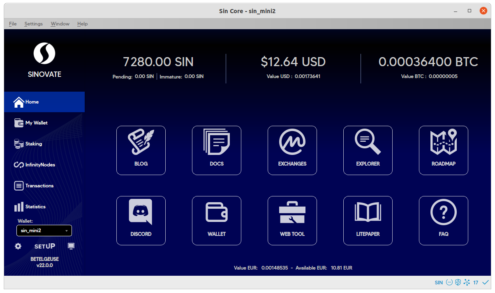

  

  # My Wallet Menu
    

"My Wallet" page shows the following:

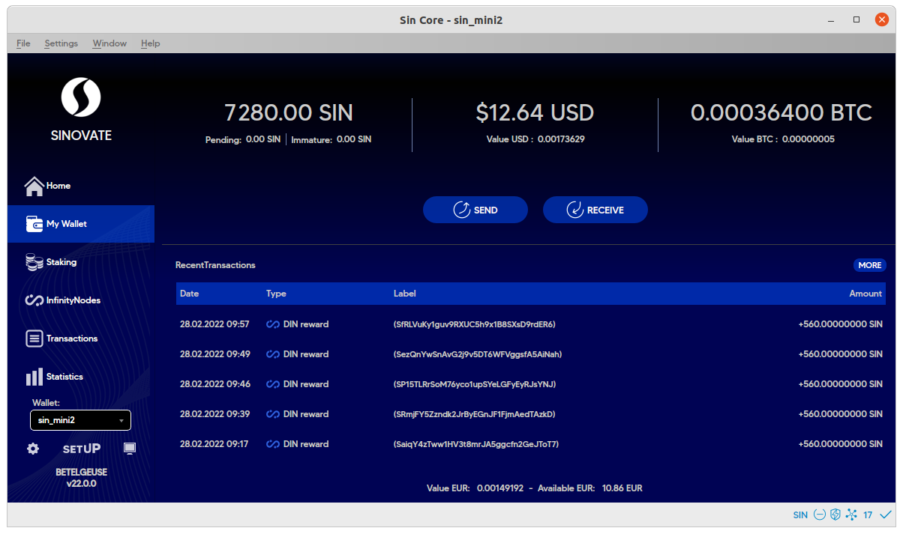

  

**SIN Balances** 

-   Available
    
-   Pending
    
-   Immature
    
-   Usd, Btc,and Euro values

    

  

**Recent SIN Transactions**

Incoming and outgoing transactions are shown here, including coins from staking, mining, InfinityNodes, and dCloud transactions.

  

 **SEND Button**

On the "SEND" menu, there are easy-to-use essential functions. 

**Pay to:** This is the address to send SIN (Only SIN addresses work)

**Label:** it is a label to remember the SIN address (optional)

**Amount:** This is the amount of SIN to Send.

Once the required areas are covered, click on the "SEND" button to send the SIN coins to the address entered above.
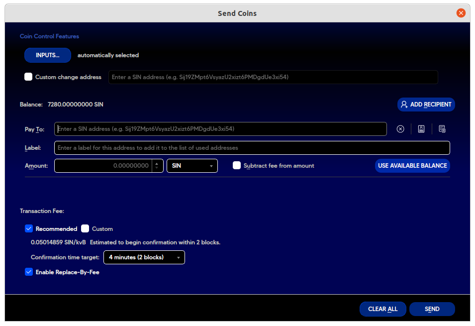
  

**RECEIVE Button**

This is where SIN wallet addresses are and for generating new ones.

It is helpful for receiving payments from more than one sender and enables tracking of each transaction.

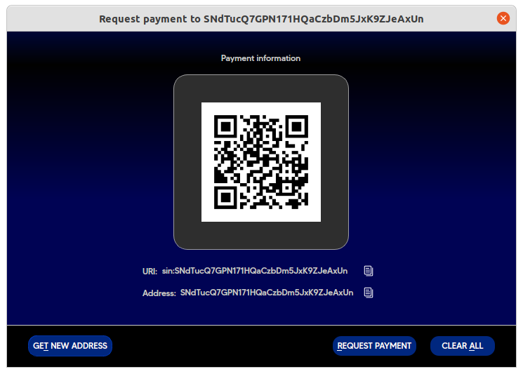

To obtain the deposit address, click on "Get New Address," and you'll see the address and URI are refreshed. Copy the address.

  

## SIN Wallet Encryption

Please encrypt your wallet before making a backup that authorizes the backup to be encrypted.

For this, Go to **Settings -> Encrypt** wallet for encryption.

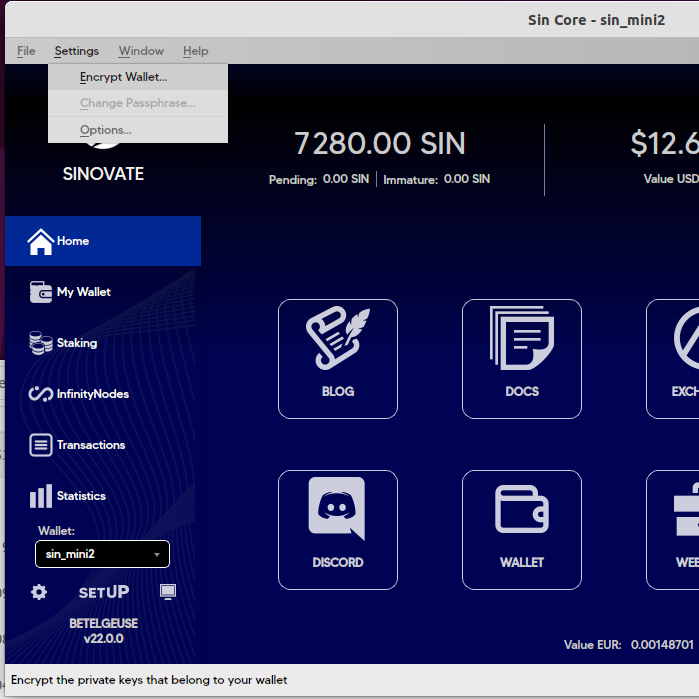

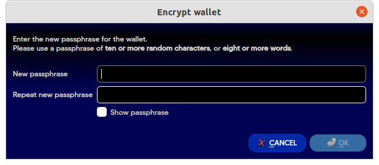
  

After that, enter the password for the wallet. You must remember the password to access your SIN funds as **there is no way to recover** your SIN without it.

  

**Note:** The wallet does not restart after encrypting, but encryption is ready for use.

## Unlock your Wallet

To unlock the wallet for any use, go to Settings > Unlock Wallet.

To unlock the wallet for only staking, follow the below procedure.

**Note:** If the wallet is unlocked for only staking, the Staking menu Stake button must also be clicked to activate staking.

  

## Wallet Backup

We highly recommend creating a backup after wallet encryption.

  

For backup access, go to **File/Backup Wallet,** choose a folder and enter a name for your backup.

After entering the backup's name, click on save to back up the wallet successfully.

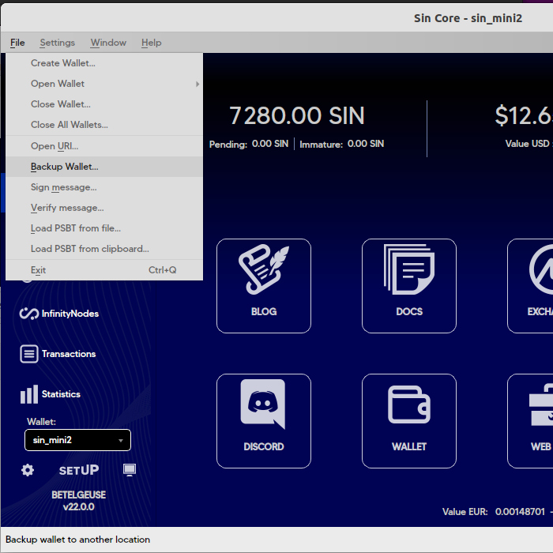 

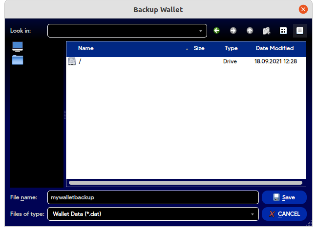 

 

  # Staking Menu
    

For staking to take place, it is required to:

1.  Have SIN coins
    
2.  Unlock the wallet before staking.
    
3.  Keep the wallet open at all times; otherwise, it is not possible to stake it even if the coins are matured.
    
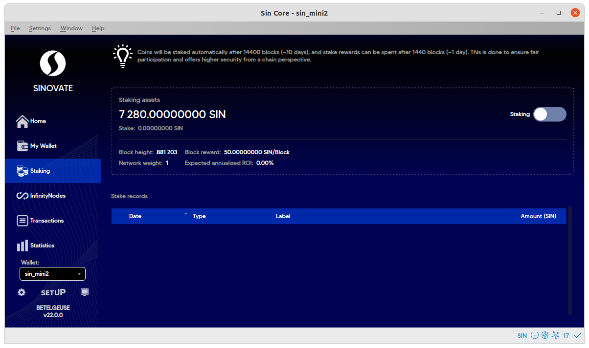
  

First, select the "Staking" menu to show the Staking page. Next, click the Stake button on the right. After reading the warning, click Yes and enter the passphrase, tick "unlock for staking only" box for staking activation.

 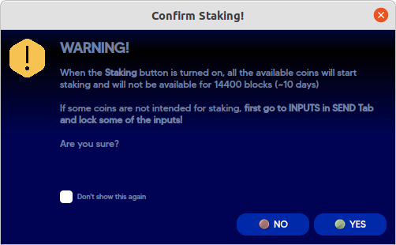

**IMPORTANT:** The Staking menu Stake button must be turned on for staking activation. The wallet must be online 24/7 for the staking to work.

  
  

## Access the console tab

On SIN core Betelgeuse 0.22x, the console tab can be accessed from the bottom left console icon, as shown here:

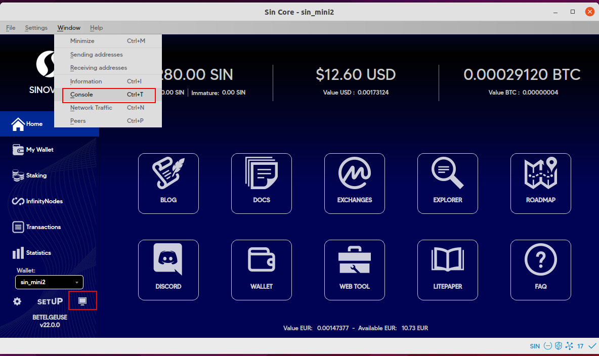  
  

The console tab is handy; although it's mostly for advanced users, it is a potent tool and can perform actions that aren't possible using the graphical user interface.

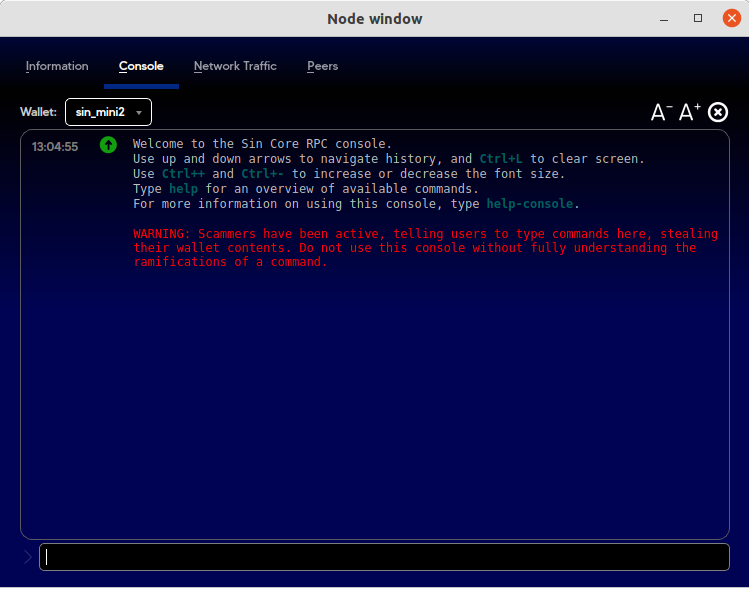 

This document [https://docs.sinovates.io/commands/](https://docs.sinovates.io/commands/) explains how to use the console tab in an obvious way.

  
  

  # InfinityNodes Menu

  InfinityNodes menu provides real-time infinitynode node information.
  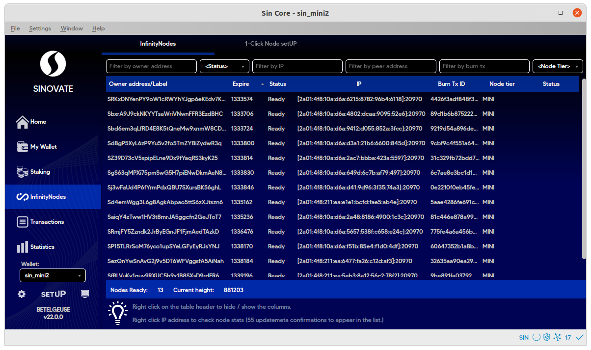
  
  
  It also allows creating an infinitynode with a 1-click setUP.
  
  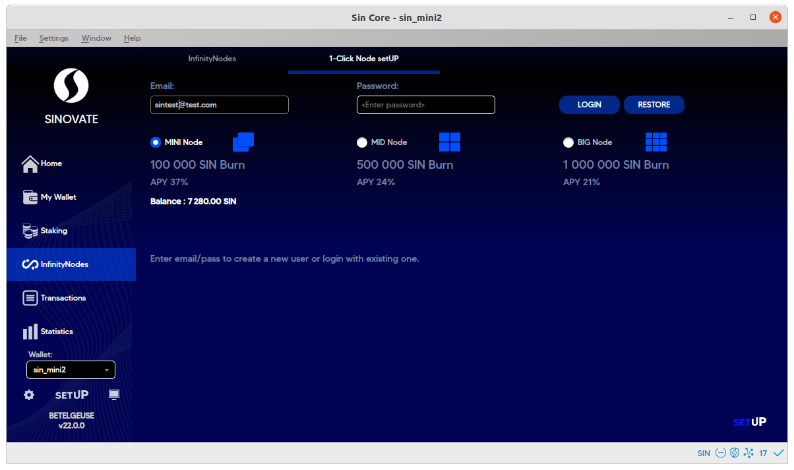
  
  

  # Transactions Menu

This menu shows every incoming and outgoing SIN transaction that has happened.

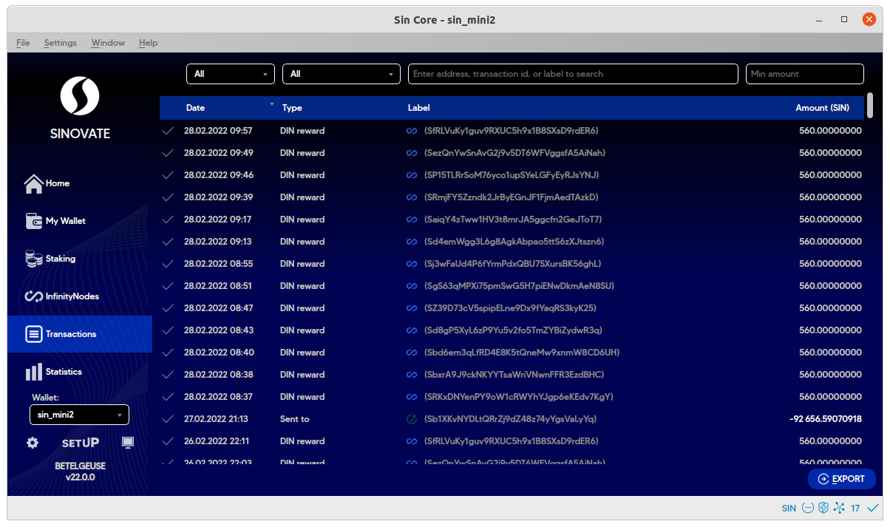

  

  # Statistics Menu

  In this menu, the display shows essential real-time blockchain statistics pulled from https://explorer.sinovate.io/.

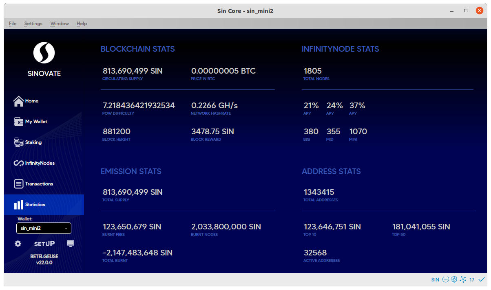
