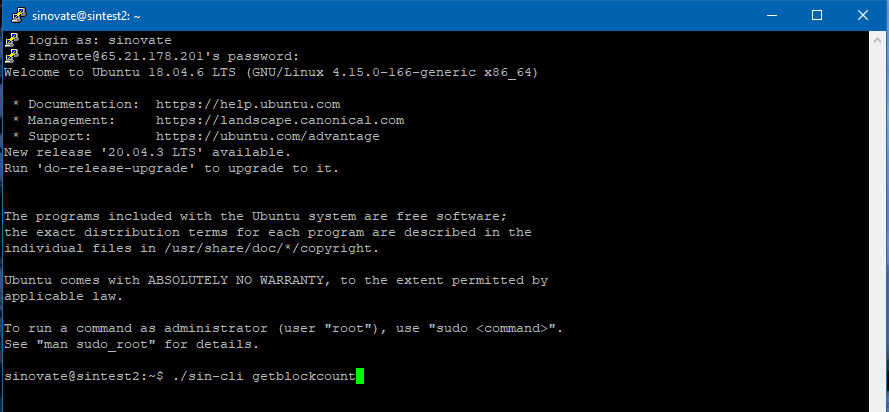
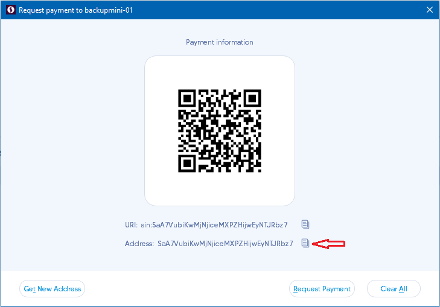

# [SINOVATE InfinityNodes Manual VPS Configuration Setup:](https://docs.sinovate.io/#/din_manual_vps_configuration_setup?id=sinovate-infinitynodes-manual-vps-configuration-setup)

An Ubuntu 18.04 VPS with 1 Cpu, 10GB free disk space and 1GB MB Ram is needed.

Download putty or any SSH client program of your choice

[https://www.chiark.greenend.org.uk/~sgtatham/putty/latest.html](https://www.chiark.greenend.org.uk/~sgtatham/putty/latest.html)

Enter your IP information for the new VPS and click on the Open Button.

Enter your username as root and enter the password given to you.

Some VPS providers may ask you to change your temporary password immediately.

  

Enter the following command to download the installation script. Please enter the code as a single line:

wget -q https://github.com/SINOVATEblockchain/sinovate/releases/latest/download/din_install_vps_noroot.sh

  

Enter this command to make the script executable:

chmod +x din_install_vps_noroot.sh

  

Enter the code below to run the script:

./din_install_vps_noroot.sh

  
Setup will ask for a username. You can enter a username, or just press enter for the user sinovate

  
At this stage, the installation will ask you to enter a password for the new user. Please choose a strong password and do not share it with anyone. The script disables root user VPS access for security.

  

Further there will be preparatory procedures: creating a swap file if necessary, updating and installing the necessary packages on the vps, downloading sinovate binary files, creation of private keys. The next step is to ask for confirmation to download and install bootstrap for faster node deployment. This will take some time depending on your network bandwidth:

  

When the installation is completed, an information screen like the one below appears.

Please save the given keys and address information. You can do this by choosing with the mouse. PuTTY and similar programs also copy the selected area to the clipboard. This information will be required in the later stages of the installation:

  

Then you need to log in to vps on behalf of the created new user (by default: sinovate), the root user will be blocked for security. To do this, type “exit” and log in again:

  

Type

./sin-cli getblockcount

to track the sync progress

  

If the result is “Rescanning…” then wait 2-3 minutes:

  

When the result is in the form of a number, it means that synchronization is in progress. You can find out the current block in the explorer [https://explorer.sinovate.io](https://explorer.sinovate.io)

If there are no errors, then type “exit” to close the window.

  

Return to your desktop wallet. If the wallet is locked with a password, then it must be unlocked:

or you can do it from the console:

type

walletpassphrase “your password” 1000

to unlock for 1000 sec.

  

Send 5 coins to the node address (in our example it is SkF1qwTpw3Z87gD1MiTvKS2vctUtiHLPp1), in wallet interface MyWallet -> Send:

  

Next, create a backup address (for example backupmini-01) for creating a DIN-node, in wallet interface MyWallet -> Receive, button at the bottom:

  

Copy and save the backup address, for example in notepad, it will come in handy later:

  

Create an address for the DIN-node that will receive rewards, for example mini-01 (same button “Request Payment”):

  

Also copy and save this address:

  

Send the required number of coins to this address:

Big DIN: 1000000

Mid DIN: 500000

Mini DIN: 100000

+25 coins to activate the DIN-node. In our case it is 100025 coins:

  

We are waiting for 6 confirmations and proceed to the step of burning the coins of the node. In the console we type the following command:

infinitynodeburnfund [YourOwnerAddress] [Amount 1000000/500000/100000] [YourBackupAddress]

  

For our example:

infinitynodeburnfund STBksfDCPA8UnhEKWzXgmy78XDoaGqNJAu 100000 SaA7VubiKwMjNjiceMXPZHijwEyNTJRbz7

  

The result will be the following:

We are interested in BURNTX, copy and save it. Select the first 16 characters.

Waiting for 6 confirmations.

  

Next, we will form a command to update the metadata and launch the DIN-node. In general, the command looks like this:

infinitynodeupdatemeta [YourOwnerAddress] [node PublicKey] [node IP] [first 16 characters of BurnFundTx]

  

In our example it is (the data that was previously saved):

infinitynodeupdatemeta STBksfDCPA8UnhEKWzXgmy78XDoaGqNJAu AkuukYEUIu5ZplPp2AzrrleXsua8zsCUjV5z7ZtnizFN 65.21.178.201 c0c754f490a7c7e5

  

If node IP is ipv6 then it must be enclosed in square brackets.

  

Enter the command to activate our node in the console:

Wait for 55 confirmations for the DIN-node to appear in the list of InfinityNodes in the desktop wallet.

  

To monitor the state of the DIN-node on your vps, enter the command:

./sin-cli infinitynode mypeerinfo
