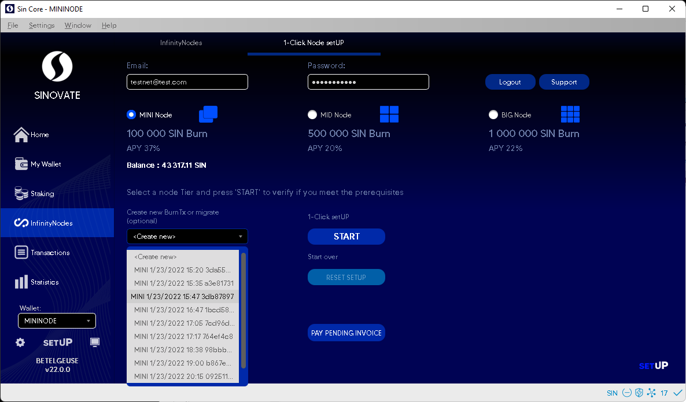
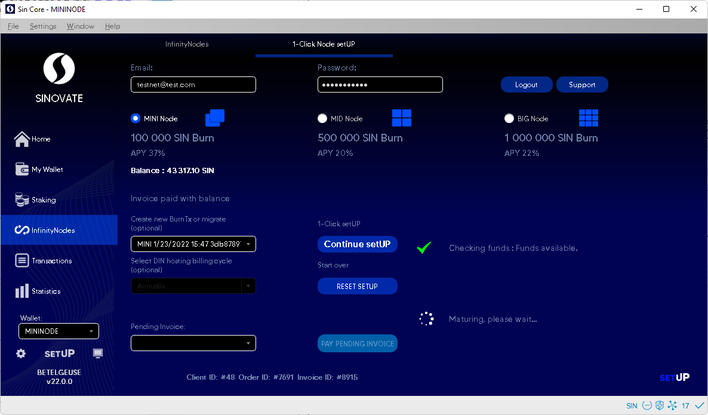
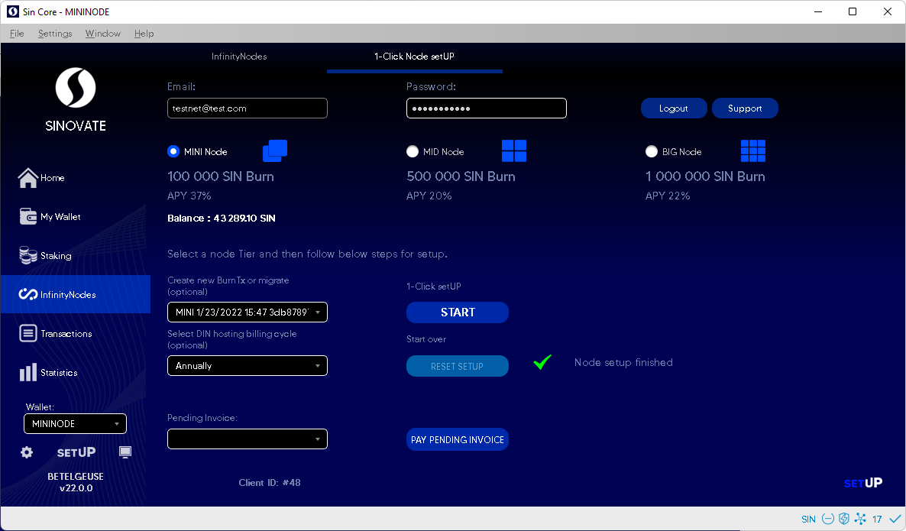
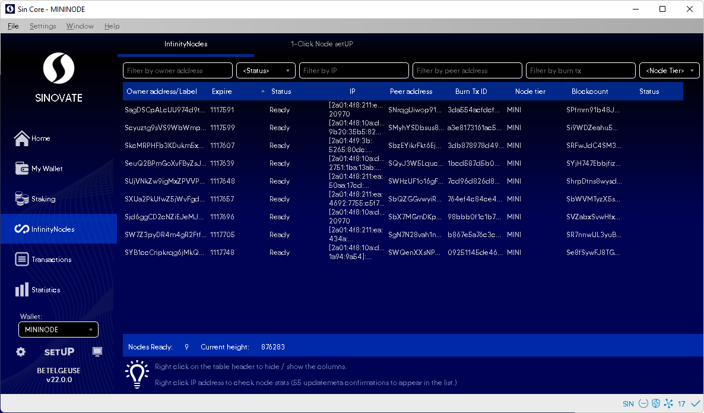

# DIN setUP Migration Guide

- This guide allows migration of infinitynodes to easy 1-click SetUP using the BurnTXs of the burnt collateral.

- Go to Infinitynodes > 1-click Nodes setUP in a synchronized and updated wallet. If not a member, log in with your mail and password for the first time, and you will be logged in as a new user. (Please use a valid email address and Eng symbols in the password.)

- Find your BurnTX (1) Select DIN hosting Billing Cycle (optional) Then click the 1-click setUP button (2)

- Invoice will be auto paid from the SetUP system balance if there are enough credits in the account, or the wallet will ask YES/NO to pay with SIN coins.

("Invoice paid from credit balance" message will appear if there are enough credits)

  

- SetUP will go through the setup process in the background.  
 Do not shut down the wallet or send any transactions until the setup is "Finished."

  

  
  

- Congratulations, you have completed your infinitynode migration with setUP.

- This tab will need up to 55 confirmations to update. You can see your new node in the InfinityNodes tab. 

  

