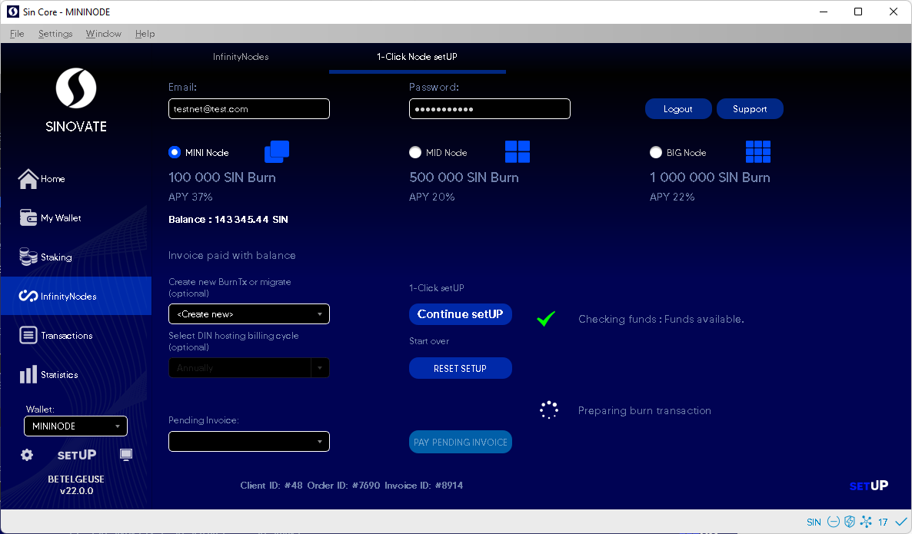

# DIN Setup Tips and Help

   

> Make sure you have your wallet synched and you have enough funds for DIN node creation and hosting.
 

- If DIN setup failed or frozen in the middle of the process, please logout and login, reset order and press 1-Click setUP.

 

   

- If DIN setup failed and you already have the burntx.

   

- If My Peers DIN tab shows the node as incomplete.

   

- If you see Deterministic Infinity nodes not in list on setup.sinovate.io website on your account.

   

Please use the migration guide to fix the issues. [https://docs.sinovate.io/#/din_setup_migration_guide](https://docs.sinovate.io/#/din_setup_migration_guide)
