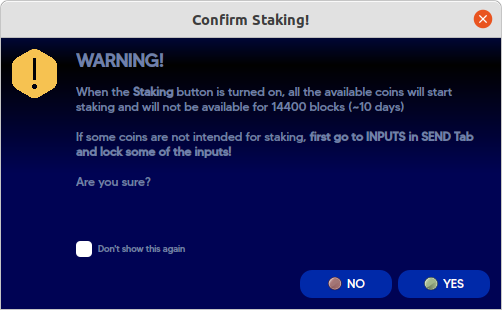

# User Staking Guide

To ensure maximum network stability and node infrastructure growth, Sinovate has implemented a powerful staking feature. Hence, SIN coins participate in the network by validating transaction blocks, increasing the network’s scalability, and making profits with the distribution of rewards. SINOVATE uses this approach alongside the PoW mechanism, which guarantees decentralization, scalability (+2,000 TPS), and security (InfinityNode LockReward and Proof-of-Burn).

## Brief Reminder

Similarly to Bitcoin, Sinovate is based on the UTXO (unspent transaction output) model. A given wallet balance is represented by the total of the combined value of all UTXOs within that wallet. For example, if you have $80 in your wallet, your wallet doesn’t actually have an $80 bill but is made up of $10, $20, and $50 bills. Like UTXO, each of these bills can be used separately in several different transactions.

PoS of SINOVATE (PoS4) integrates a novel feature called LockStake, where a UTXO must not be spent for a considerable time to be eligible for staking. This safety guard ensures a lower attack surface of an already complex vector. Hence, the staker must wait for around 14,440 blocks (10 days approximately one block per minute) to become a staking validator. The daily block confirmations are about 1,440 blocks every 60 seconds.

The long waiting time and the long confirmation period allow the attacker to reduce the attacker’s success rate. Last but not least, the PoS mechanism will discourage centralized exchanges from using the coins they have in hand for staking.

In a more straightforward explanation, The SIN coins can only be used for staking if they remain in the user wallet for at least ten days. Once a staking reward is received, it is locked for one day (after that, it can only be spent); the received reward is automatically staked only after ten days of remaining in your wallet.

https://sinovate.io/blog/weekly-update/proof-of-stake-enters-in-the-sinovate-blockchain/

**Important**:

-   Staking option is only supported in the SINOVATE Desktop Wallet.
    
-   When staking is enabled, each individual UTXO will compete for becoming the next block producer, and the probability of each UTXO is equivalent to its proportion to the combined total network weight.
    
-   14400 blocks maturity (approx 10 days) is required for a UTXO to be eligible and start staking. Before that, you will have a zero probability of producing a block even if your staking is enabled.
    
-   Once a UTXO becomes the block producer, it will immediately generate a reward and will become locked from staking for 14400 blocks (approximate 10 days). The UTXO also get locked for 1440 (approximate 1 day) from spending. You can’t use these coins. Therefore, the immature UTXOs are not calculated in your total wallet balance (you may notice that your total wallet balance is lower and a balance appears in the "immature" state). Once mature, it will be added back.
    
-   The generated rewards require 1440 blocks to mature and can be spent afterwards.
    
-   When a UTXO is released from the 14400 blocks staking lockdown, it will automatically be eligible to become the block producer.

## How to Stake

For staking to take place, it is required to:

1.  Have SIN coins
    
2.  Unlock the wallet before staking.
    
3.  Keep the wallet open at all times; otherwise, it is not possible to stake it even if the coins are matured.
    


First, select the "Staking" menu to show the Staking page (Staking-> staking(toggle button)). Next, click the Stake button on the right. After reading the warning, click Yes and enter the passphrase, tick "unlock for staking only" box for staking activation.



If you hover your mouse over the lock icon, you should see the following:


**IMPORTANT:** The Staking menu Stake button must be turned on for staking activation. The wallet must be online 24/7 for an optimal staking. We recommend to check the next section for optimizing your staking.

## Manage UTXOs in SINOVATE Desktop Wallet

### Overview

To view UTXOs, you can locate them: My Wallet -> Send -> Inputs as follows.


Once you are in “Inputs”, there will be two options to display UTXOs


**Tree mode** – group UTXOs under a specific wallet address

**List mode** – list UTXOs in descending timeline structure (most recently received at the top)

In either of the two ways, the GUI will show you a list of your UTXOs. This feature allows you to select or lock UTXO and, therefore, define which UTXO can be used when sending outward transactions. In addition, you can use this feature to lock funds that you don’t want to participate in staking.


In the above screenshot, the wallet has an approximate balance of 275 SIN and is made up of 4 separate UTXOs (47, 55, 60 and 113 SIN). Each UTXO has a separate maturity counter (you can see it under confirmations). The first has 644414 confirmations.

When you receive a transfer, the amount is always received as a single UTXO. This means you can consolidate smaller UTXOs into a single UTXO by sending them to yourself in a single transaction.

### Advanced Tips

To see the amount of UTXO competing for a block reward, go to windows -> console


Type “getstakinginfo” at the bottom at the console


You will then see the following output

```
03:15:11

getstakinginfo

  

03:15:12

{

"blocks": 913221,

"currentblockweight": 5352,

"currentblocktx": 1,

"difficulty": 4001.46807931312,

"pooledtx": 2,

"chain": "main",

"warnings": "",

"staking": true,

"staking_available": 12,

"connections": true,

"unlockedwallet": true,

"blocks_since_last_try": 0,

"hash_last_try": "26sfsf86b7c435ea0e674cb3b3db0e314e3b1safse11a75285fa278e2ed7",

"time_last_try": 123456128,

"available_at_last_try": 12,

"number_attempts_last_try": 12,

"wallet": "",

"staking_nethash": 7100052030020.400

}
```
After the word “Staking available”, a unit will indicate the number of UTXOs competing for a block reward.

After leaving the wallet in staking mode for about 1-2 hours, the word “staking: true” could also be seen. If the entire Sinovate network doesn’t have 5 million SIN staking, this will also not display true.

### Maximize Rewards

If you have a large SIN amount in a single UTXO, you can break it into smaller ones (UTXO staking chunks) as it could help increase the efficiency to validate a block as a UTXO is pushed away froms taking for 10 days. 

Example: If you have a single UTXO with 10,000 SIN coins, then this UTXO will be unavailable from staking for 14400 blocks (approximate 10 days) when it produces a block. 
On the other hand, if you have 10 UTXO staking chunks with 1,000 SIN coins each, producing a block will only "freeze" a chunk of 1,000 SIN coins from staking (for 10 days), while the remaining 9,000 SIN will continue to stake in the meantime. 

Splitting in too many UTXOs will result in high transactions cost when sending and lower chances to win a block if UTXO staking chunks are too small. 

The easiest decision of choosing the best UTXO in average is to use the following equation: 

best_UTXO = circulating_supply/14,400

For a supply of 900,000,000 SIN coins, an UTXO of 62,500 coins would find systematically a new block. Of course, the game of luck and profitability would tend to have a lower number of SIN coins per chunk. Plus, this is function of the real number of stacked SIN coins in the network.

**Important**: After a split, the UTXOs would require 10 days to produce new blocks.