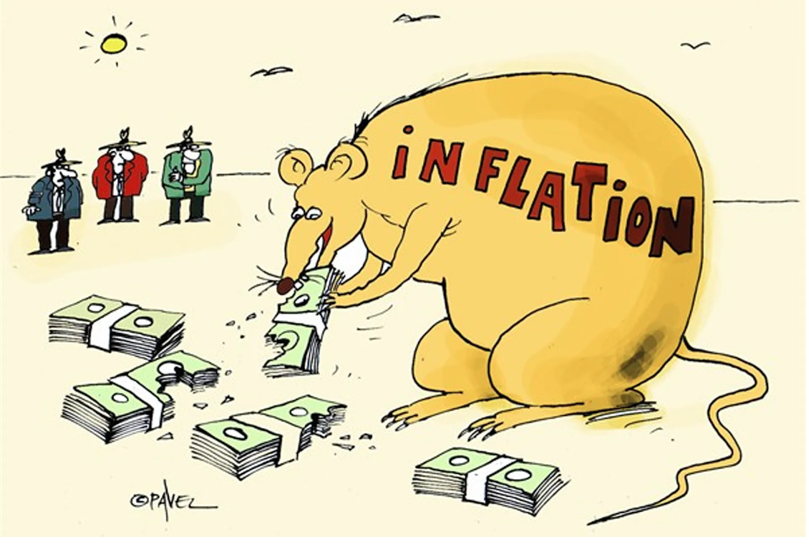

Many of those reading this article are familiar with the concept of Masternodes. However, for those of you who aren’t, the first section of this article will serve as a brief introduction to this genre of blockchain technology. If you are already familiar with this concept, feel free to skip to the next section.

## **Introduction to Masternodes**

The term “Masternode” refers to a specific protocol implemented by many blockchains as a second layer to their network. In the current crypto market, Masternodes are most often utilized in proof of stake blockchains and serve a crucial role in the security and integrity of the blockchain.  
Many coins base their Masternode model after the first coin to pioneer this technology: DASH. To run a DASH Masternode, one must possess the required collateral of 1000 DASH coins. This collateral is locked in an address as long as the node is running. As compensation for supporting the network, Masternodes receive a dedicated portion of the block reward in the form of more coins. This passive income model explains the meaning of a node’s ROI. It also serves as an incentive to purchase and hold coins for long periods, leading to coin scarcity — which is strongly correlated with coin value.  
Not all nodes require 1000 coins as collateral. Each chain will have its required collateral or multiple collaterals for tiered MN systems. In the case of SINOVATE, there are three tiers as collateral: 100k for “Lil Sin,” 500k for “Mid Sin,” and 1M for “Big Sin.” The idea is  
that the higher the tier, the higher the reward for posting such substantial collateral(initial investment).

## **Economic Problems with Masternodes**

If you’ve been in the Masternode market for any length of time, you are likely aware that nearly all Masternode coins dump precipitously. There are many contributing factors, such as the lack of a use case, bear markets, and exit scams, but the common denominator across nearly every failed coin is this: poor economics.  
Far too many coins offer a deceivingly high ROI to lure investors into purchasing collateral. But the repeating theme is that when the ROI begins to drop due to decreasing block rewards, tons of coins are dumped, and the value plummets. This phenomenon has happened over and over again and is a classic case of supply and demand. If demand > supply, the price will go up. If supply > demand, the price will go down. When coins are flooding the network due to coins not being locked in masternodes, the supply is inevitably higher than demand. The masternode model only works so long as coins are locked in nodes, or are otherwise utilized.

## **SINOVATE Economic Solution: Infinity Nodes**

The SINOVATE team understood that the fundamental economics behind Masternodes was unsustainable, and sought to find a model that would benefit all investors. That is how Infinity Nodes were born. “Infinity Nodes” differ from traditional masternodes in several ways, and these differences contribute to a positive economic outlook.

## 1. Node collateral is burned.

When a SINOVATE investor posts collateral to run an Infinity Node, that collateral is burned forever via proof-of-burn. This burn mechanism is distinctly different from traditional nodes, whose collateral can be unlocked and sold. For the creation of an Infinity Node, the user must burn the node collateral(coins needed for a node).  
In the burn process, the coins are destroyed and can never be recovered. However, the burning of coins does not mean the investment is lost; in fact, the investment returns daily from block rewards without the fear of hyper-inflation or big dumps.  
This model changes the economic outlook from an inflationary one to a deflationary one. The more nodes that are on the network, the fewer coins are in existence. Fewer coins in existence mean there is a lower supply, and when supply < demand, the coin value is high!

## 2. Limited Node Life Span

Traditional masternodes have an unlimited life cycle. As long as the collateral is locked in the address, the node will receive rewards indefinitely. To increase the number of coins burned in the SINOVATE network, and to control the inflation of the node counts, Infinity Nodes have a limited life span of one year. This limited-time ensures a continuous demand for coins to be purchased and subsequently burned. The limited life span feature enhances the effect of the collateral burning function to produce a compounding effect on economics, namely price stability.

## 3. Network Benefits for Infinity Node Holders

Aside from the strong economic argument to run an Infinity Node, there are a few key network benefits that Infinity Node owners enjoy. These are governance rights and free data storage.  
Decentralized governance is the future of all successful blockchain projects, and the SINOVATE team believes that blockchain will be present in nearly all infrastructure and services in the future world economy. Having a fair say in network developments is crucial. For the life of their nodes, SIN Infinity Node holders can participate in voting, giving them a direct ownership stake in the direction of the project.  
The blockchain-based network powered by these Infinity Nodes is incredibly powerful and can be used to store millions of documents for users. SINOVATE has been developing the IDS protocol, which will allow users to digitally document their data on the blockchain, providing them with a free and safe method of decentralized data storage, beginning with DataSend in Q2–2020.  
DataSend(Blockchain Mail) will allow sending and storing a limited number of documents. Details of IDS Step-1 technically will be published in due course.

## **Conclusion**

Infinity Nodes are unlike anything seen before in Crypto. The combination of Collateral Burning and Finite Node Lifespan create the necessary conditions for coin price stability. Positive economics and ownership benefits provide significant incentives for investors to run Infinity Nodes.
