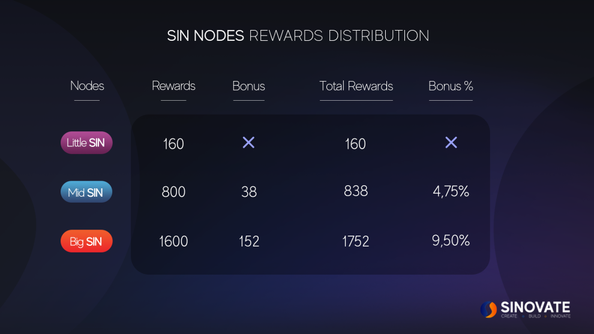
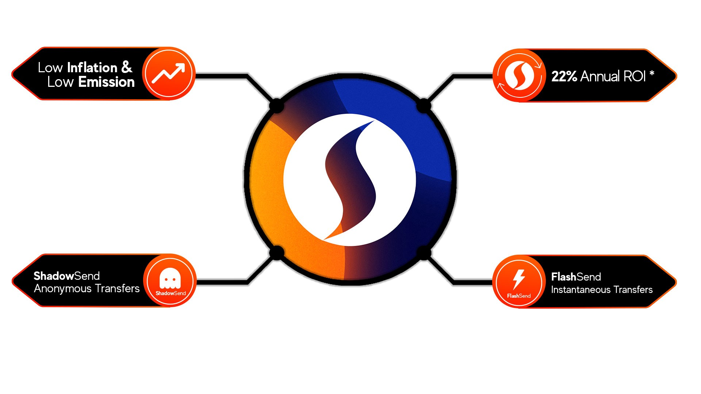

**SINOVATE**  (SIN), formerly known as the  **SUQA Blockchain**, have been busy designing alternative ways in which to attract new investors, grow their community and increase the decentralisation of their Blockchain. Blockchains use different consensus methods by which to achieve decentralisation, including  **Proof of Work (PoW)**,  **Proof of Stake (POS)**  and Proof of Service  **Masternode technology**.

SINOVATE has invented a unique and revolutionary alternative to ordinary Masternodes called Infinity Nodes. SINOVATE describes this technology as ground breaking and innovative in the cryptocurrency space. They are similar to Masternodes, but have been designed to solve issues with high inflation and coin emission.

As known by informed members of the cryptocurrency community, Masternodes are specialised nodes which allow their holders to execute bespoke tasks. A Masternode is usually defined as:

> **It supports a cryptocurrencies network, through the form of a computational wallet. A Blockchain is replicated by the node owner, who is compensated for using their resources via crypto coins. In essence, Masternodes serve as a profitable alternative to earning cryptocurrency via mining and being rewarded for securing the network.**

**How Will Infinity Nodes Work?**

**SINOVATE**  is confident that Infinity Nodes will solve the unintended consequences of high inflation and bloated coin supply emission witnessed in all other Masternode orientated cryptocurrencies. Scarcity of the SIN coin supply will be attractive to those wishing to invest.

_Key features of Infinity Nodes are:_

**·** SIN used to create  **Infinity Nodes**  are  **immediately burnt**, so no longer form part of the overall coin supply. In effect, this decreases the  **sell pressure** on all relevant SIN trading markets, due to the fact that there are fewer wallets containing SIN. Infinity Nodes will provide guaranteed incentives to holders for a limited time of 12 months.

**·** Each Infinity Node can hold a  **maximum of 1,000,000 SIN(BIG SIN) for a 10% additional bonus**. Holders can also choose to acquire either  **100,000 SIN (Little SIN)**  or  **500,000 SIN (Mid SIN) for a 5% bonus**.

**·**  Infinity Node holders earn a  **minimum guaranteed up to 22% annual ROI**, (only if the limit of 594 million SIN are locked in Infinity Nodes) after they have operated a node for  **12 months**. Upon annual maturity, nodes will no longer form part of the network protocol node count (a unique and revolutionary feature of Infinity Nodes).

**Infinity Node Use Cases**

Similar to how Masternodes work, Infinity Node holders will be able to perform specific tasks. There are an unforeseen number of potential use cases, some of which are listed below:

·  **FlashSend**  allows for the instantaneous transfer of SIN between wallets by using the Infinity Node consensus mechanism. Currently, the SINOVATE network protocol can handle a maximum of  **533 transactions per second**. FlashSend permits less than  **3 second** transfers, whereas normal SIN transactions usually require less than 10 confirmations.

·  **ShadowSend** allows for the  **anonymous**  transfer of SIN, with mixing of 5 rounds set as a default.

· Infinity Nodes disappear after being operational for  **12 months**. This is a unique and  _revolutionary_ key feature of the ecosystem.

· Infinity Node holders can participate in decentralised voting by using the enhanced in-built  **E-Governance system**, known as  **Revolving Sovereignty Votes (RSV)**.  Revolving votes will encourage the SINOVATE network to obtain significantly greater nodes than traditional Masternodes, where voting lacks true transparency and mass community involvement. Voting rights have to be renewed every 12 months, due to the lifespan of nodes.

**Private Networking — Incorruptible Data Storage**

Infinity Nodes will also facilitate the ability for users to transfer  **encrypted** files and store these on the decentralised  **SINOVATE** Blockchain network.  **Incorruptible Data Storage (IDS)** is a new encrypted file sending mechanism. It will permit users to send each other documents through trusted protection from the Bitcoin, Komodo and SINOVATE Blockchains. The larger the file size (initially up to 1.5MB), the higher the required transaction fee. All transaction fees will be  **burnt** (removed from the coin supply). IDS will have 5 levels of implementation. Step 1 is up to 1.5 mb documents, Step 2 is increased storage and added voice, video data. Step 3 and 4 will be all for increasing the storage and making it better. Step 5 aims to have unlimited, decentralized, encrypted storage to encourage the world to get rid of the data centers.

SINOVATE has outlined its intentions to reinvigorate proof of work mining. Unfortunately, it is true that miners are left aggrieved when their hard earn resources have failed to earn the desired rewards. This is due to the fact that block rewards become smaller during the lifespan of many other cryptocurrencies. Alongside lower transaction fees, it becomes problematic when the overall network hashrate  **reduces to dangerous levels**, hence an increased possibility of a  **51% attack**.

With the advent of Infinity Nodes, the danger posed by decreasing block rewards (reduced hashrate) is no longer a significant concern. Infinity Nodes allow investors to gain greater returns on their investments, **reduce the energy** costs of decentralising the network and increase scarcity of the available SIN coin supply.

Ultimately, Infinity Nodes have been designed to be highly attractive to investors due to guaranteed controlled inflation and incentives. It is expected that this will result in SINOVATE having more full nodes than any other cryptocurrency. Besides the security provided by Komodo’s Delayed Proof of Work (dPoW) algorithm, Infinity Nodes will serve to deliver the quickest, most secure and most reliable decentralised Blockchain in the entire cryptocurrency space.

**Current State**

SINOVATE anticipate to implement  **Infinity Nodes during April 2019**. Currently, its functionality is being thoroughly tested on the SINOVATE Private T_estnet Blockchain_, which will go live on the **14th April 2019**.

Besides other code protocol changes, Infinity Nodes will be implemented into the SINOVATE Blockchain via a hard fork, the date for which is yet to be decided.

SINOVATE is proud of the fact that all transaction fees get burnt (_are permanently removed from the coin supply_). This reduces the overall emission rate of the number of SIN, alongside the Infinity Node burn process.
