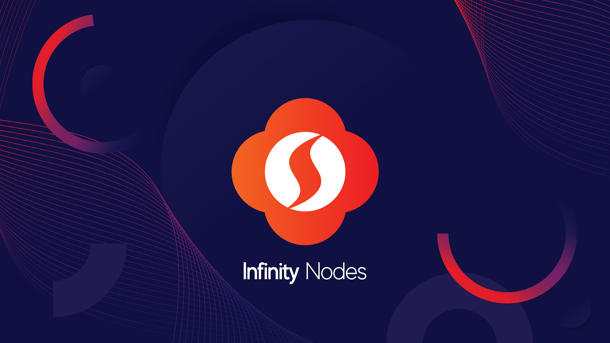

# An explainer on inflation, what burning coins means and how SINOVATE solves this problem; which leads to similar effects to a Bitcoin halving event.

SINOVATE is a cryptocurrency that recently had its first anniversary of the launch of its blockchain. They are focused on bringing innovations to the crypto space with a talented team of developers and a fast-growing, active community.

It uses both proof-of-work (PoW) consensus, focused on being ASIC, and FPGA resistant but also has another layer known as the Infinity Chain that interlinks and is run by the masternode network, known as Infinity Nodes. It currently uses a brand-new algorithm called X25X at the proof-of-work layer and is committed to continually evolve in order to prevent ASICs being present on the network.

It has one of the fastest PoW transaction speeds at around 533 transactions per second with the FlashSend feature utilizing the Infinity Node layer. It also brings other components and features such as governance voting, data storage and data send (IDS), and transmission capabilities similar to IPFS and asset creation synonymous with the likes of Ravencoin, along with other features.

Readers may have heard of the upcoming Bitcoin “Halving” event that is due to take place in the coming months. This is where at regular intervals, the Bitcoin protocol changes and the rewards issued to miners for finding a successful block is cut in half. This is done to keep control of the Bitcoin supply, to keep inflation under healthy levels.

# Why does it do this, what does this mean and how does SINOVATE compare?

High Inflation is a problem that affects many cryptocurrencies; below will set out what this means and how SINOVATE uniquely addresses this.

# Inflation — What is it and how does it affect Cryptocurrencies?

# The traditional world:

_“In economics, inflation is a sustained increase in the general price level of goods and services in an economy over a period of time. When the general price level rises, each unit of currency buys fewer goods and services; consequently, inflation reflects a reduction in the purchasing power per unit of money — a loss of real value in the medium of exchange and unit of account within the economy._

_Economists generally believe that very high rates of inflation and hyperinflation are caused by an excessive growth of the money supply” [1]_

In a nutshell, if there is too much money supply, the value of that currency dwindles compared to what you can exchange for goods. There are many cases throughout history where governments have sought to ease financial burdens by simply printing new money, this generally leads to a very short-term gain, but with dire consequences. Hyper-inflation is where this gets completely out of control and spirals into an ever-decreasing value in the currency affected. [2]This is even happening right now in Venezuela. [3]It is commonly thought that an inflation rate of around 2 % is a sign of a good economy. [4]

# Supply / Demand

This a core principle of economic theory; it merely states that if the demand for something outweighs the supply, this leads to an increase in price. The reverse is if supply outstrips demand, this leads to a lower price for the goods.

The same applies to currencies with the rate of inflation often dictating how much money is “produced.”

# Circulating Supply

This is simply the amount of currency or asset that is available for trade or commerce. If there is a greater circulating supply than the demand for that currency, the price tends to trend down and vice versa, if the circulating supply is less than demand, this leads to a price increase.

# Reducing Supply

One way of controlling the supply of a currency or asset, and the overall rate of inflation is to remove assets from circulation. This has the same effect as reducing the supply, reducing the amount available for commerce, leading to higher demand pressures.

In the traditional finance world, an example of this is stock buyback initiatives where a company buys back stock and removes it from being tradable.

# Enter Cryptocurrencies!

Who sets the rate at which new money is issued has thus far been decided by governments or corporations, this is where cryptocurrency changes the game! Taking Bitcoin for the first example, its monetary policy (how much new Bitcoin is created by mining) has been known ever since it was first announced, with the code dictating that the reward for mining a block is cut in half at regular intervals.

The intention behind this is to control the supply of Bitcoin and keep inflation under control through the market principles of supply and demand. [5]

2020 is when Bitcoin will halve its reward again and will bring its inflation to around 2%.

# Problems in other Cryptocurrencies

Many other Altcoins have launched since Bitcoin, many of these use different methods, and monetary policies regarding generating new coins, and often these can lead to high levels of inflation.

This often plagues blockchains that use master nodes to run the network as the high rate of return offered attracts investors, but the high rate of inflation causes the price to drop over time, leaving the node owner less incentivized to maintain their node and thus secure the network.

# Burn your Sins away….

**We hate inflation here at SINOVATE and have made it our mission to ensure this never affects our users negatively.**

SINOVATE has a unique take on how to tackle this problem with a blockchain mechanic known as “Burning”, first widely brought to public attention by Binance and their regular burning of the BNB token. [6]

“Burning” a coin on a blockchain means removing it from the circulating supply permanently.

# Proof-of-Burn

With SINOVATE, this is done by sending the coins to a unique wallet address that is inaccessible for anyone, removing the coins from supply forever using our “proof-of-burn” mechanic.

-   Standard transaction fees — Burnt (they gone forever!)
-   Flashsend fees — Yep, they are burnt
-   Asset creation fees — Can you guess?
-   Data storage / transmission fees — In a bonfire!
-   Locking up a node? Yeah,  **we burn that too**!

This can all be tracked here:

[http://explorer.sinovate.io/address/SinBurnAddress123456789SuqaXbx3AMC](http://explorer.sinovate.io/address/SinBurnAddress123456789SuqaXbx3AMC)

**That last bullet point is a major difference compared to other coins that use master nodes with SINOVATE’s unique INFINITY NODES.**

# Infinity Nodes

When an Infinity Node is created, the proof-of-burn consensus mechanism ensures that all SIN coins used in its creation are immutably burnt and recorded as un-spendable. This process helps to increase the validity of the decentralized network and ensures all participating nodes reach consensus.

This feature further secures the network by deterring bad actors who may attempt to carry out malicious activities on the network. [7] By locking and burning SIN coins in an Infinity Node, the node holder has committed to uphold the integrity of the network for the lifetime of their node. In not doing so, they lose their collateral and potential return on investment. This is not the case with traditional master nodes that can be liquidated and sold at any time.

SINOVATE Infinity nodes operate for a maximum lifetime of one year, after that they are gone forever until the node owner replaces it with a new one, earned over the lifetime of their previous node. The new node, yet again burns the coins needed to set it up.

Governance of the network will also be decided by the network as the roadmap is realized, this will evolve to give control of the monetary policy to node holders.

In the next hard fork in 2020, the limit on the number of nodes able to be created will be increased, but the block rewards will remain the same.

The new node limit will be a little more than 1200 Infinity Nodes, with 62.2 million extra coins removed permanently from the circulating supply each year when the new nodes are locked up.

In the next soft fork in December 2019, the transaction fees will be increased to 0.05 SIN per input, and they will all be burnt and removed from the circulating supply.

These changes, developed with feedback and voting from the SINOVATE discord community, are aimed to allow further network expansion and features but also to further control emission rates.

# Conclusion

With the revolving nature of how nodes are locked up and with the keen approach to burning fees throughout the use of the SINOVATE network, inflation will be kept tightly under control while incentivizing network participants to maintain their nodes.

These unique mechanics also will ensure the security and operation of the network with full nodes locked up for extended periods allowing for features not seen on other networks.
