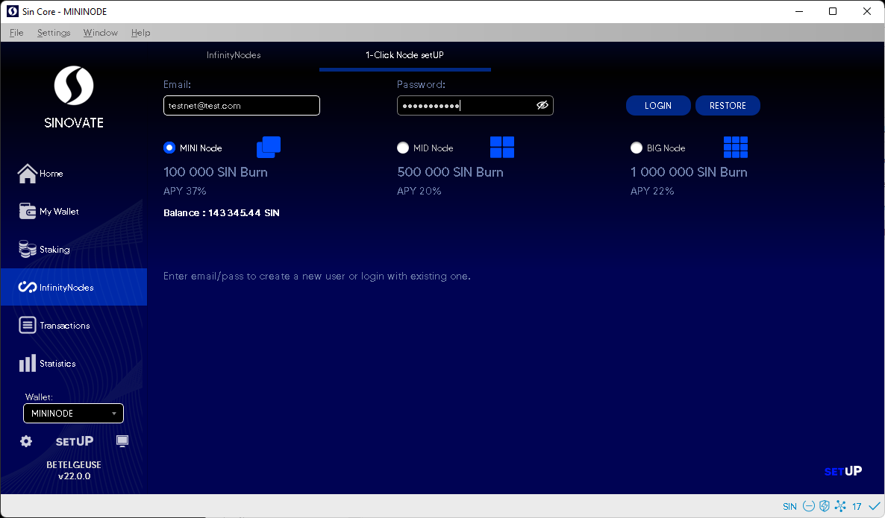
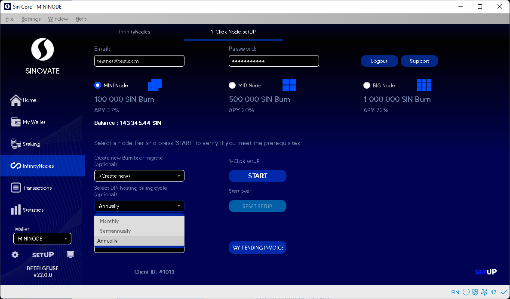
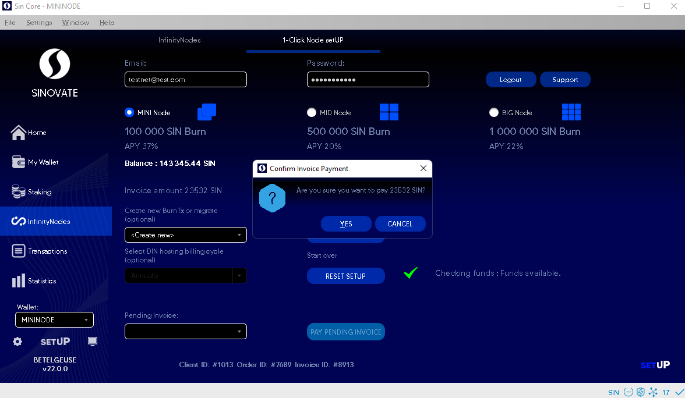
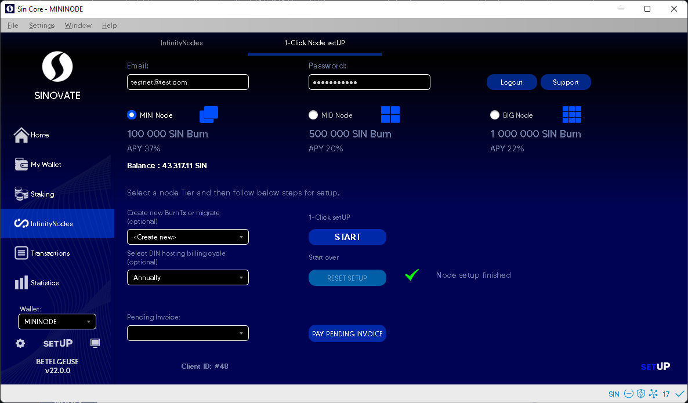

Please follow the instructions for setting up a Deterministic Infinity Node using the in-wallet 1-click SINOVATE setUP service:

**Please go to INPUT (coin control), select all inputs, and send them all to your own address before clicking on the 1-click setUP START button**

> **Create new address inside core wallet and send all coins to this address** click My Wallet> RECEIVE > Get new address.

  

> 1. Upon opening your core SINOVATE wallet, click the "setUP" icon on the lower left side. (You can download the core wallet here  https://github.com/SINOVATEblockchain/sinovate/releases)

>  2. Enter your Email address and Password for the SINOVATE setUP cold hosting service. Then, click the "Create/Login" button to create your login credentials.

  

  

>  3. Select the "MINI Node" (100,000 SIN), "MID Node" (500,000 SIN), or "BIG Node" (1,000,000 SIN) circle, according to your desired level of investment.

  

  

>  4. Once determined, select your preferred payment plan from the drop-down menu. Annually paid contract plans are the most economical per month at $2.99 monthly if paid in full at $35.88 (SIN only payment). The monthly contract price is $4.79. The SIN price paid for hosting is equivalent to the USD price of the contract.

   :warning: **Please make sure to have enough extra funds for the hosting!**

  
  

  

>  5. Click on the "START" button and Confirm your Invoice Payment by clicking "Yes." Please ensure that you have the required additional SIN coins within your wallet balance to process the VPS (Virtual Private Server) rental fee. Please note that this will vary depending on the payment plan selected.

  
  

  

> Do not close wallet till you see "Finished." 

  

  - SINOVATE infinitynode setUP is now complete. The block confirmation speed, invoice payment, and the SIN coin burning process will take between 3 and 10 minutes. The node will appear on the infinitynodes tab after 55 blocks.

  

It really is that simple; with just a few clicks, would-be network participants will earn considerable passive income for up to a year. In addition, the SINOVATE setUP provides the perfect opportunity to reassess your VPS needs at competitive prices paid in SIN for community members who have previously set up an infinity node.

