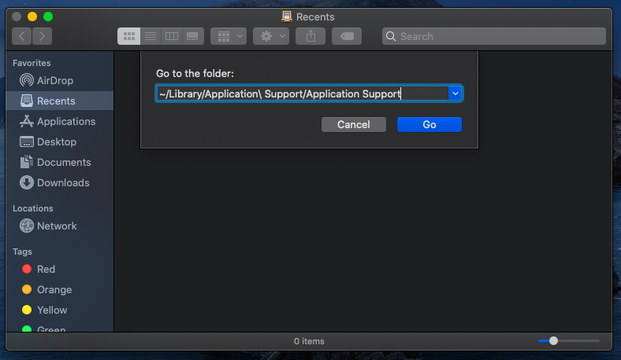
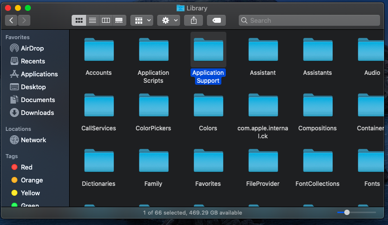
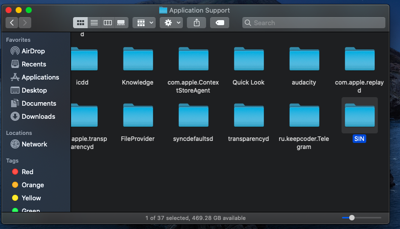
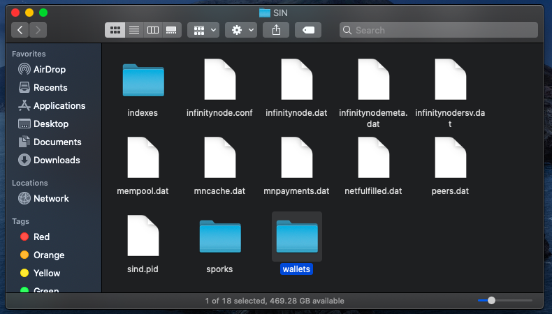
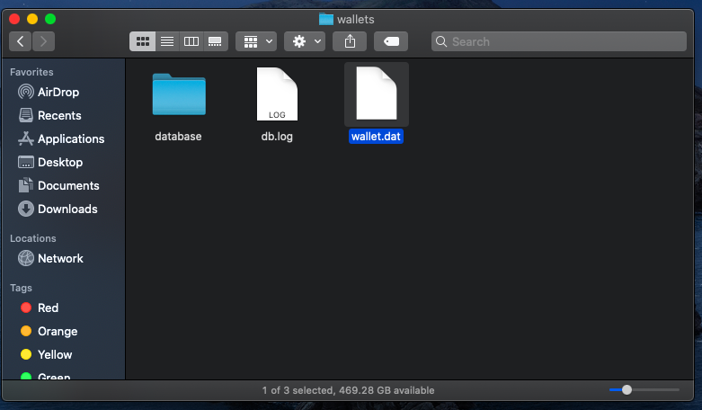
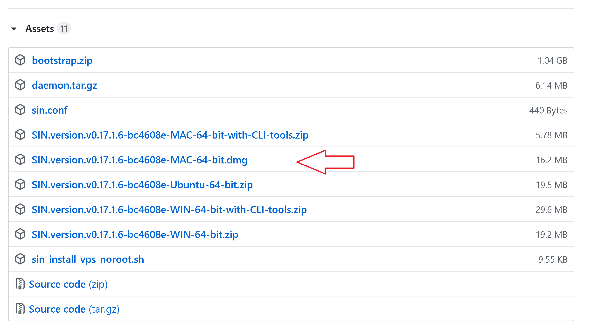

## MAC QT Wallet Backup and Upgrade Guide

  

* First of all, don't forget to back up your current data.

* Close your wallet.

* In order to see hidden folders, such as `~/Library` from Finder, simply hit `shift + ⌘ (command) + G` which will GO to a folder, then paste in this location:


* ```~/Library/Application Support/SIN```






 

Your wallet.dat file can be either in the wallets directory or in the SIN home directory, depending on the situation. Pay attention to this and back up these files to a suitable medium. We recommend that you do this periodically.

  





Download the latest version of MAC Wallet at [https://github.com/SINOVATEblockchain/SIN-core/releases](https://github.com/SINOVATEblockchain/SIN-core/releases)
 


  

Replace the `sin-qt app` file in the compressed file you downloaded with the `sin-qt app` file you are currently using.
