**Mobile Wallet: Infinitynode SetUp**

1. Open the mobile wallet, and type in your password/fingerprint, make sure you’ve backed up your mnemonic passphrase in a safe place before setting up the InfinityNode, if your phone/tablet is lost or broken you won’t be able to recover your funds!

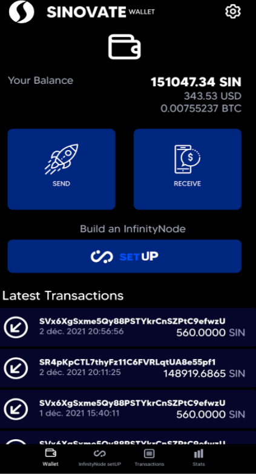

2. Deposit the necessary amount for the node creation , you can check missing amount clicking on SetUp “select tier” tab. InfinityNode price include burned collateral committed to network , and VPS (server) fees for 12 month hosting.

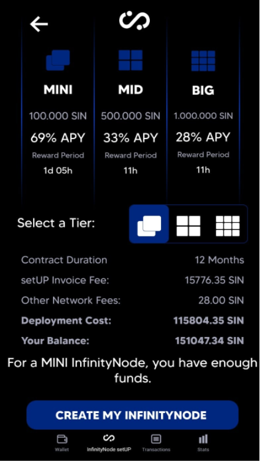

3. Select the tier you want to deploy, MINI, MID, or BIG, and then click on “CREATE MY INFINITYNODE”

4. The wallet give you the concerned tier specs you’ve chosen. **Make sure you have enough battery and stable internet connection for next steps before clicking on “launch InfinityNode.**

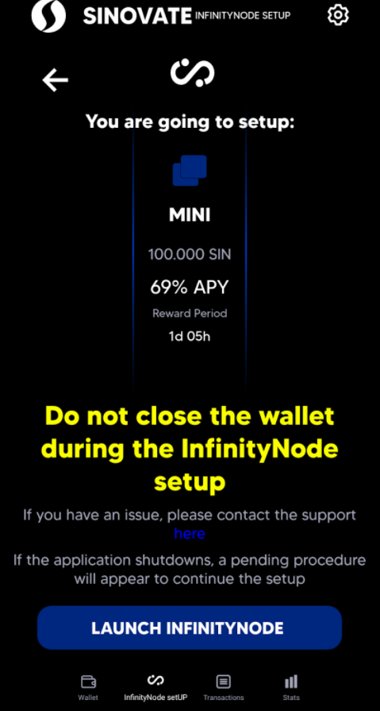

5. You will now be redirected to send tab, once you verified VPS invoice, click on “SEND” button.

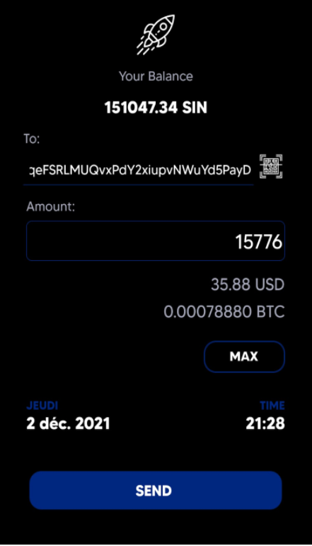

6. Wallet will ask you to confirm VPS invoice transaction twice, at transaction emission and to valid Fees. 
	
 Click “YES” twice to continue .

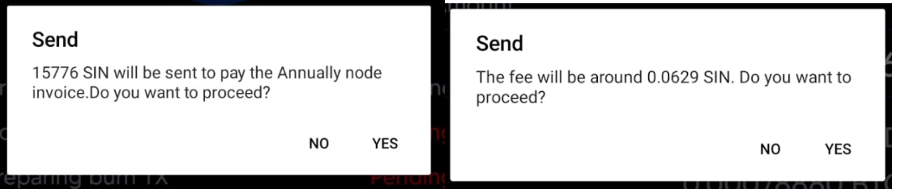

7. Wait for confirmation VPS bill.

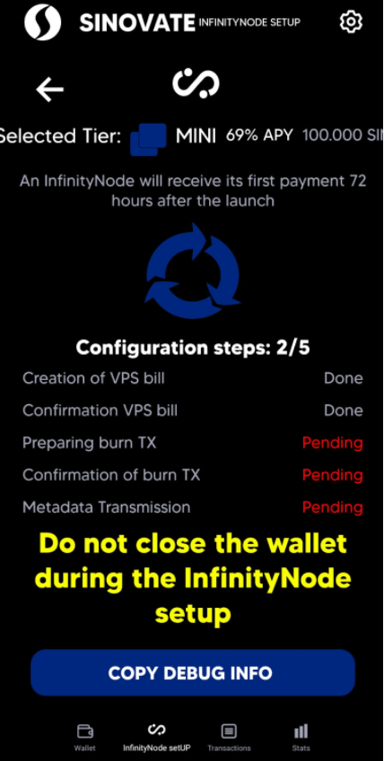

8. SetUp will automatically prepare burn Tx by moving fund to collateral address, this step generate a transaction that need 3 confirmations.

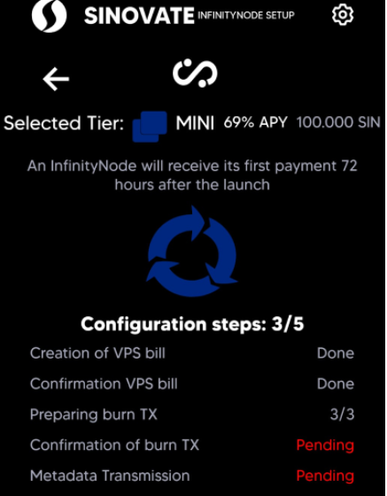

9. Once burntx preparation is set, wallet ask you to burn coins to SinBurnAdress. Click “YES” to proceed . **The burnt amount of SIN coins depend on the selected tier.**

 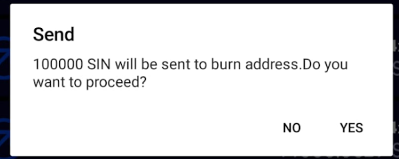

10. Burn transaction need also 3 confirmations from the network to continue.

 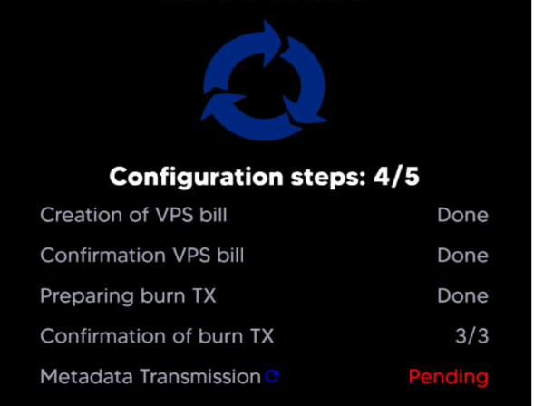

11. Last step is Metadata transaction, this transaction declare you node on chain to the infinitynodes network. SetUp will automatically send 25 SIN to Sin metadata address and later on 3 SIN to wallet VPS to activate the InfinityNode.

Wait for Metadata TX confirmations, and your InfinityNode configuration is done (green message shows up).

 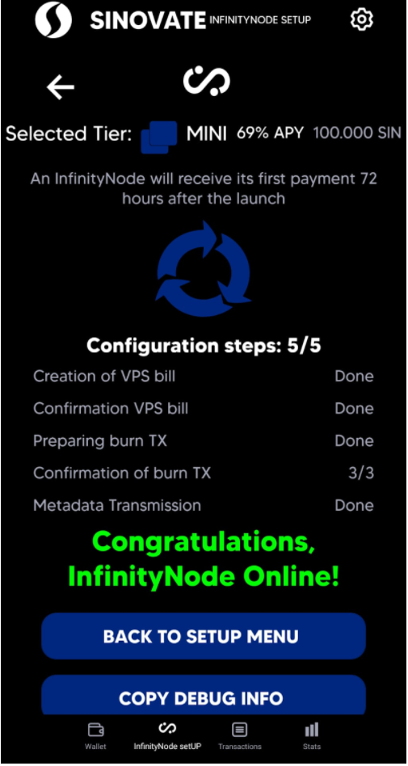
 
12. You can check all transactions of the process on the transaction tab , you should have these transactions in the exact same order :

a. VPS Tx (35$ worth of SIN coins sent)

b. preparing burn Tx (25 SIN Sent and received + 1M SIN sent and received)

c. Burn Tx to SinBurnAddress ( 1M SIN sent)

d. Metadata TX ( 25 SIN sent )

e. Activate Tx ( 3 SIN sent )

If something is different/missing compared to this sequence:  please contact support

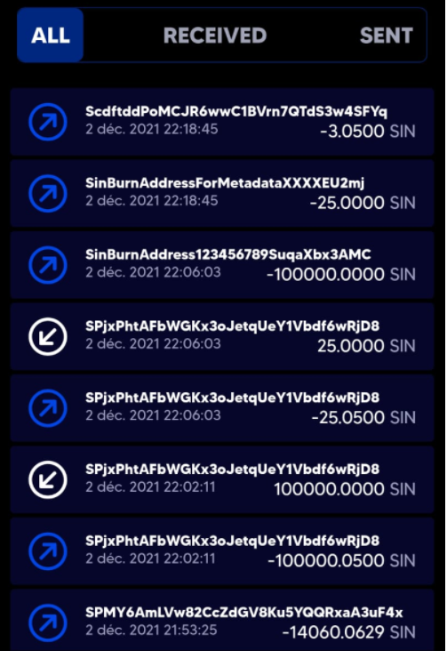

13. You will see your newly created InfinityNode in list after **55 confirmations from network on Metadata TX** ( 25 SIN to SinBurnAddressForMetadata), it is the necessary time for the node to be known in the network.

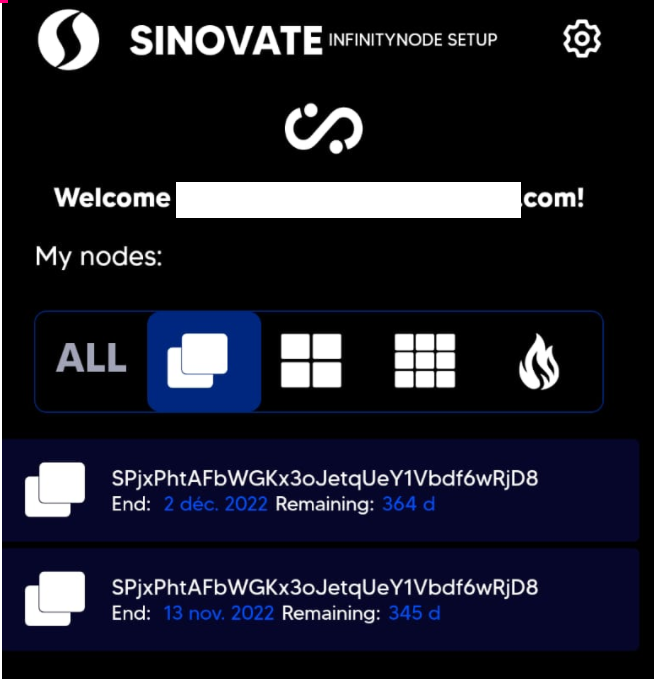

14. You can also see owned Burn Tx by wallet in the SetUp tab.

 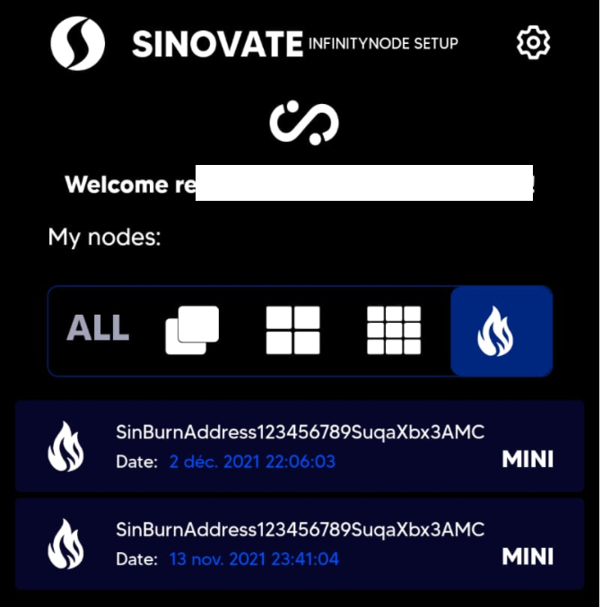

**Congratulations! You now have a little part of a future blockchain driven cloud solution on mobile!**

