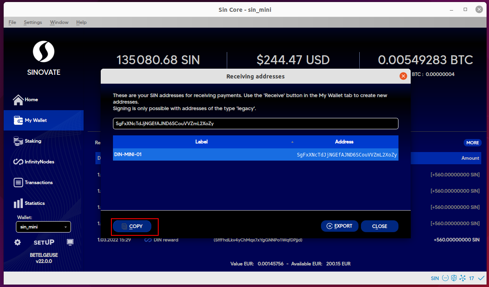

This guide is for Pecunia hosting SINOVATE InfinityNodes created by our discord member chaks#0133. Big thanks to him for his contribution.

Please follow these steps:

Link to Pecunia: [https://pecuniaplatform.io/](https://pecuniaplatform.io/)

Sign up for a pecunia account:

Part 1

Put some money onto the Pecunia platform. Pecunia only accepts crypto; I chose TRON because it’s got cheap transfer fees, and I had some spare. When you are transferring from an exchange, make SURE you are transferring on the Tron network or lose your crypto.
 

  

Part 2

On the pecunia page, log on and click SINOVATE. Then, select the size you want to create.

  

Pecunia is cheaper than 1-click setUP hosting for small and mid-size tiers, but it also requires some effort. $6 for six months, whereas $9 for six months for big-sized nodes. It’s still cheaper for the big-sized nodes, but it’s debatable whether or not you want to save time and effort.

  

Part 3

Setting up the node:
1. Return to your control wallet and create a new receiving address. In our example,  we will create MINI DIN (InfinityNodes).

    
2. Copy the new address you create and send it exactly 1 000 000 SIN to this address. For BIG DIN 1 000 000, for MID DIN 500 000 ,for MINI DIN 100 000.

    
3. Unlock your wallet walletpassphrase "your_password" 300 replace your password with your wallet password
    
4. Run the following command in debug console infinitynodeburnfund your_address collateral_ammount YourBackupAddress collateral_amount 1000000 or 500000 or 100000 save the output you get from this last command you can create the node now using the burntx
    
5. You need to wait for about 55 blocks for your node to be operational and approximately three days for your first payment
