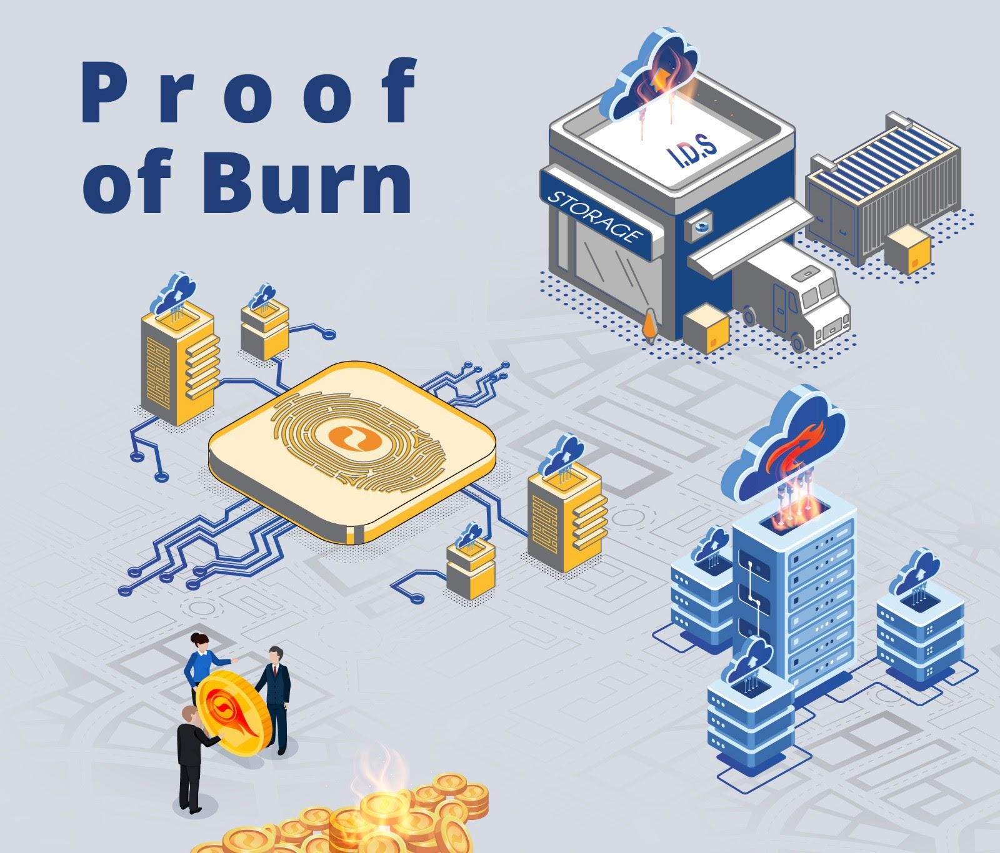
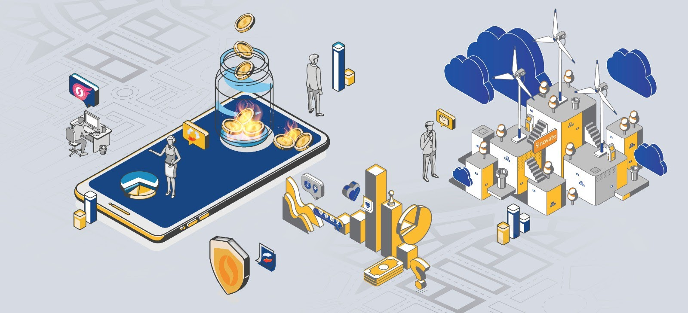

## What is Coin Burning?

*Cue video of the Joker burning a massive pile of cash*

[https://youtu.be/Wa0bO2JWvC8?t=76](https://youtu.be/Wa0bO2JWvC8?t=76)

Coin burning is the process of intentionally destroying cryptocurrency to reduce the total circulating supply. In most blockchain-based currencies, there are three numbers (other than the price) that investors must take into account when evaluating a project before investing. These numbers are the market cap, total supply, and maximum supply. Here is a quick definition of each of these terms:

Total Supply: This represents the total number of coins currently in existence (and circulation).

Maximum Supply: This represents the total number of coins that can ever be in circulation. In other words, the supply will never exceed this value.

Market Cap: This represents the total value of all the coins in a project’s circulating supply. It is calculated through the following equation:

Market Cap = Total Supply * Current Price

Those who are familiar with traditional investment markets have likely heard of companies buying back their stock from the market to preserve or raise its value. Coin burning is a similar function designed to achieve similar results. It is buying back a commodity with limited supply to reduce the percentage of shares floating on the market. This reduces sell pressure while simultaneously providing buying pressure — creating ripe conditions for a favorable price movement. Where coin burning goes farther is that it removes coins (in place of shares) permanently through “burning” them.

[Proof-of-Burn](https://www.youtube.com/watch?v=ZabgG6YTZfY&t=1s)

**Different Versions of Coin Burning**

With the economic benefits of coin burning so obvious, many projects have taken on their own twist to the practice. Here are a few of the popular ones:

**Burning Circulating Supply**

This describes burning coins held by investors and repurchasing coins from exchanges to be burned. Binance’s version of quarterly coin burning can be put in this category. The size and effectiveness of these burns are variable and relies primarily on market action. In some cases (such as TRX), these burns do not occur regularly.

**Burning Non-Circulating Supply**

This would refer to burning coins that are not currently in circulation (obviously), such as coins held by team members, or in project treasuries. These funds are often held in large accounts. Since these funds are not being taken off of exchanges (or out of circulation), they do not often have a significant impact on the value of non-burned coins.

**Burning During Transaction**

Ripple (XRP) and VeChain employ this burn model through burning transaction fees. In the case of XRP, the network burns about 0.5 XRP per minute (about 250,000 XRP per year). These numbers can change depending on the throughput demand placed on the XRP network. This method of burning helps to reduce market volatility — employing more of a “slow-burn” than the extensive burns conducted by burning circulating supplies. Another effect of this protocol is that it de-incentivizes DDoS attacks.

**Price-Targeted Burns**

In the case of stablecoins that employ burning (such as USDT), these projects are continually minting and burning coins in order to have the circulating supply match the backing fiat. This is how they guarantee that each coin is backed by the corresponding amount of fiat currency — thus ensuring its value. In this case, when Tether burns coins, it is indicating that money is moving out of its reserves.

**What is The History of Coin Burning?**

There are at least two different mainstream cryptos that have employed this functionality to reap economic benefits. They would be TRX and BNB. BNB — the underlying currency of the popular Binance exchange — employs a quarterly coin burn based on the trading volume on their exchange. To date, they have reported over 14.4M BNB coins burned (a value of over $170M).

**Coin Burning As A Consensus Protocol**

Some projects have elected to incorporate coin burning into their consensus protocol, requiring users to burn coins in order to attain mining rights. This is what is called “Proof of Burn” (PoB). Essentially, the number of blocks that a miner can verify (and therefore receive block rewards for) is limited by the number of tokens they burn. In effect, this practice is similar to Proof of Stake (PoS), which requires users to hold collateral in a wallet in order to receive rewards and process the blockchain.

  

**Why Coin Burning?**

It is safe to say that the saying “less is more” applies here. Fewer coins available for sale means that the remaining coins will be more valuable in theory. While the effectiveness of coin burns on maintaining value and reducing volatility is debatable, it certainly has not had a negative effect on valuation. Since many projects rely on coin burning on a small scale, the effects of this are not seen right away. Coin burning is a long-term play, as reducing the available supply of coins only produces decisive price action consistent with growing demand. Coin burning can be thought of as applying positive leverage to future purchases.

While the effects of coin burning are not immediate, it is a positive contribution in a non-zero-sum game. The positive effects are cumulative for both investors and the projects themselves.

**SINOVATE’s Coin Burning Model**

SINOVATE has observed the positive economic benefit seen by burning coins and has adopted widespread practice with its twist. The combination of coin burning and masternode technology produces a robust network with an equally powerful economic tool to match it.

In order to run an [Infinity Node](https://medium.com/@sinovatechain/sinovate-infinity-nodes-invention-7ca6979288e) (SINOVATE’s innovation of the Masternode), a user must burn the required collateral. This is essentially a [Proof of Burn](https://www.youtube.com/watch?v=ZabgG6YTZfY&t=1s) (PoB) protocol, which was discussed above, but in combination with a Infinity Node (Masternode) tiered network. There are three collateral levels to choose from “Lil Sin” with collateral of 100k, “Mid Sin” for collateral of 500k, and “Big Sin” with collateral of 1M. It is burning more coins that results in an increased ROI over the lifespan of the node.

Nevertheless, SINOVATE has recently voted to combine the Infinity Node [Proof of Burn](https://www.youtube.com/watch?v=ZabgG6YTZfY&t=1s) (PoB) structure with the structure utilized by Ripple (XRP). Now burning transaction fees, which were recently voted to be increased, the effects of coin burning will have a compounded effect. The updated tx fee is 0.05 SIN per transaction input, which at current network rates will burn around 1800 SIN per day on average. As the SIN network develops to support more applications, the burn rate of the network itself is expected to increase.

To conclude, coin burning is a popular protocol that helps projects and investors alike to ensure coin value. Though it does not guarantee results, it creates the proper market conditions for price growth. SINOVATE has combined the best and most proven coin burning features to give investors the best chance for success.
