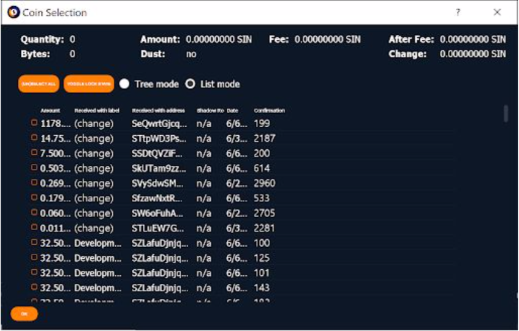
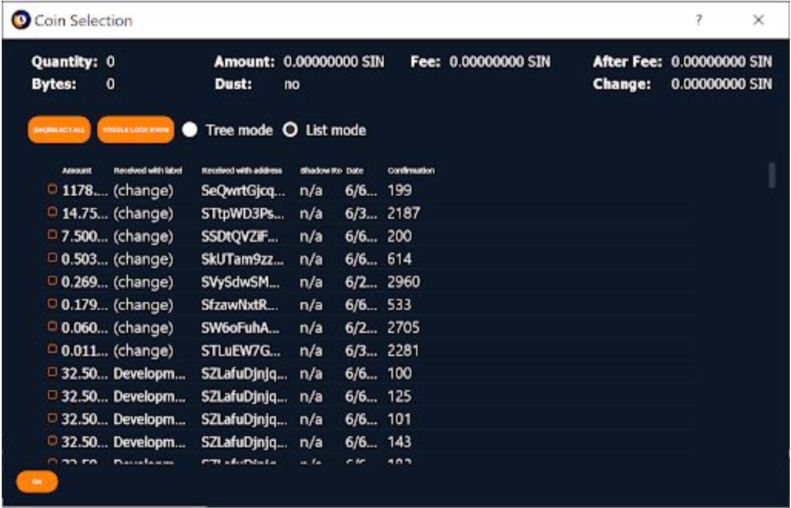

## Guide For Old SUQA Coins Conflict

### 1. First:
* [x] close the wallet.
* [x] make a wallet backup.

### 2. Coin Control
Go to SEND tab and open coin control

### 3. Try sending using coin control:

* [x] select some inputs
* [x] send to yourself
* [x] send all funds as "subtract fee from amount".
* [x] select custom fee of 0.17 SIN".
