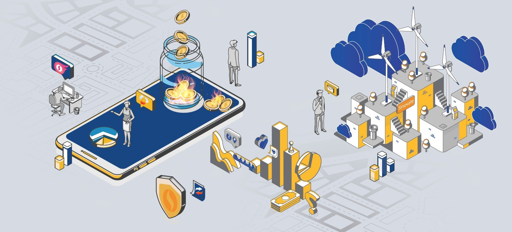

# Tokenomics

## Block Reward Distribution

### Introduction

A tokenomics corresponds to the distribution of a block reward to the participants of the blockchain. The block reward is divided into 3 parts:

-   A validator reward that depends on if you are a Proof-of-Work or a proof-of-Stake validator,
    
-   Service reward distributed to every tier of the InfinityNode layer,
    
-   10% of the addition of previous rewards is automatically provided to the community treasury.

### Validator Reward

The blockchain of SINOVATE infrastructure may be validated by two approaches: Proof-of-Work and Proof-of-Stake. 

The first is the validation by a miner that is using the power of hardware (Graphical Processing Units known as GPU) to compete with other other miners. The validation by a miner creates a "coinbase" transaction where **12.5 SIN** coins are given to the validator. In this "coinbase" trasaction, other rewards will be generated for the service layer and the community fund. 

The second is the validation by a staker that is using the SIN coins in a wallet to compete with other stakers. The validation by a stake creates a "coinstake" transaction where **50 SIN** coins are given to the validator. In this "coinstake" trasaction, other rewards will be generated for the service layer and the community fund. 

### Service Reward

SINOVATE is providing different layer-2 services with the InfinityNode technology. While the InfinityNode can provide features for payments, these service nodes are the medium of data storage of SINOVATE Nephele. In many cloud projects, the service node is directly paid by the user that is going to upload and to store data. The mechanism in SINOVATE is different and the service reward is mainly a compensatory function to the 12-month contract commitment. Hence, if the owner guarantees the InfinityNode is permanently online (and then provide the service), it will receive a reward. 

The reward of InfinityNode is distributed according to a deterministic list. If there are 500 InfinityNode in the tier, you will receive a reward. This reward is different depending on the tier of the InfinityNode. The service layer is composed of MINI, MID, and BIG tiers. BIG is the one requiring the most coins for the contract commitment but provide the biggest reward and the best ROI (by considering the hardware cost for hosting the service node). Then, the reward for MINI, MID, and BIG tiers are respectively **280 SIN**, **419 SIN**, and **876 SIN** coins.

###  Community Fund

The community has been introduced in the early stages of the project to support the technical and marketing development. This is set to **10%** of the block reward that is the addition of the validator and service rewards. The address is owned by the core team which presents financial updates regularly to know the situation of the treasury.

## Proof-of-Burn (PoB) Mechanism

### Introduction

[Proof-of-Burn](https://www.youtube.com/watch?v=ZabgG6YTZfY&t=1s)

Coin burning is the process of intentionally destroying cryptocurrency to reduce the total circulating supply. In most blockchain-based currencies, there are three numbers (other than the price) that investors must take into account when evaluating a project before investing. These numbers are the market cap, total supply, and maximum supply. Here is a quick definition of each of these terms:

**Total Supply**: This represents the total number of coins currently in existence (and circulation).

**Maximum Supply**: This represents the total number of coins that can ever be in circulation. In other words, the supply will never exceed this value.

**Market Capitalization**: This represents the total value of all the coins in a project’s circulating supply. It is calculated through the following equation:

*Market Capitalization = Total Supply * Current Price*

Those who are familiar with traditional investment markets have likely heard of companies buying back their stock from the market to preserve or raise its value. Coin burning is a similar function designed to achieve similar results. It is buying back a commodity with limited supply to reduce the percentage of shares floating on the market. This reduces sell pressure while simultaneously providing buying pressure — creating ripe conditions for a favorable price movement. Where coin burning goes farther is that it removes coins (in place of shares) permanently through “burning” them.

### Different Solutions

With the economic benefits of coin burning so obvious, many projects have taken on their own twist to the practice. Here are a few of the popular ones:

#### Burning Circulating Supply

This describes burning coins held by investors and repurchasing coins from exchanges to be burned. Binance’s version of quarterly coin burning can be put in this category. The size and effectiveness of these burns are variable and relies primarily on market action. In some cases (such as TRX), these burns do not occur regularly.

#### Burning Non-Circulating Supply

This would refer to burning coins that are not currently in circulation (obviously), such as coins held by team members, or in project treasuries. These funds are often held in large accounts. Since these funds are not being taken off of exchanges (or out of circulation), they do not often have a significant impact on the value of non-burned coins.

#### Burning During Transaction

Ripple (XRP), VeChain, or Ethereum with the EIP-1559 employ this burn model through burning transaction fees. In the case of XRP, the network burns about 0.5 XRP per minute (about 250,000 XRP per year). These numbers can change depending on the throughput demand placed on the XRP network. This method of burning helps to reduce market volatility — employing more of a “slow-burn” than the extensive burns conducted by burning circulating supplies. Another effect of this protocol is that it de-incentivizes DDoS attacks.

#### Price-Targeted Burns

In the case of stablecoins that employ burning (such as UST ... RIP), these projects are continually minting and burning coins in order to have the circulating supply match the backing fiat. This is how they guarantee that each coin is backed by the corresponding amount of fiat currency — thus ensuring its value. In this case, when Tether burns coins, it is indicating that money is moving out of its reserves.

#### What is The History of Coin Burning?

There are at least two different mainstream cryptos that have employed this functionality to reap economic benefits. They would be TRX and BNB. BNB — the underlying currency of the popular Binance exchange — employs a quarterly coin burn based on the trading volume on their exchange. To date, they have reported over 14.4M BNB coins burned (a value of over $170M).

#### Coin Burning As A Consensus Protocol

Some projects have elected to incorporate coin burning into their consensus protocol, requiring users to burn coins in order to attain mining rights. This is what is called “Proof of Burn” (PoB). Essentially, the number of blocks that a miner can verify (and therefore receive block rewards for) is limited by the number of tokens they burn. In effect, this practice is similar to Proof of Stake (PoS), which requires users to hold collateral in a wallet in order to receive rewards and process the blockchain.

### Application in SINOVATE Network

SINOVATE network uses the PoB mechanism for different operations. It is mainly applied on the transaction, governance, and data storage fees. This means the higher is the use of the network, the more is the destruction of coins in the unspendabble address. Additionally, the network creates InfinityNodes that requires to commit a 12-month contract by sending a specific of SIN coins to the unspendabble address. Hence, the growth of the network by adding more InfinityNodes or novel Tiers will systematically create a big period of supply deflation and the maintenance of the InfinityNode will decrease the natural inflation effect of SINOVATE coin supply that has no theoritical limit.

## Self-Regulated Coin Supply

### The Problem of Hyperinflation

Bitcoin is a pioneer in tackling inflation and proposes an alternative economy that recently made a surge beyond 60k USD. Its economic model is straightforward: Bitcoin is a blockchain where blocks require to be validated by the so-called miners. 

The network accepts the new block consensually from miners, and the miners receive rewards for their efforts. The reward comes from the mined block. It is how the money is generated with Bitcoin. 

The reward is distributed in BTC coins every 10 minutes and respects a specific model of distribution. In Bitcoin, the first block started with a 50 BTC reward in 2008, and every four years, a halving is applied to the block reward. In 2021, the block reward is around 6.5 BTC and will structurally tend to 0. This means the final circulating supply of BTC coins is 21 million, and it is why Bitcoin is considered a refuge investment. 

This economic model ensures that 1 BTC will always be 1 BTC. The USD value of the BTC coin cannot change because of its emission but because of its adoption for different use cases such as payments. However, this emission is set at the genesis and cannot be changed without corrupting the fundamentals of the generated blockchain. Some projects decide not to set a specific complex market capitalization or a big one, but these projects suffer from heavy coin supply inflation.

Why? The blockchain technology suffers from scalability issues at its early stages. While BFT-based approach solves this issue by restraining the decentralization to a hundred of main nodes, some projects have imagined the concept of Layer-2 solutions such as masternodes technology. The masternode is simply a node that will provide additional services such as instant payments. It requires a stake of native coins to "freeze" in an address to be elligible as a service provider. However, adding this requires to increase the block coin creation to reward the masternodes owners for their contribution. This implies directly a hyperinflation where the coin supply is growing way faster than the offer/demand tradeoff. 

### Break the Wheel of Hyperinflation

The world of cryptography applied to currency applications allows processes that do not apply to traditional currencies. Coins are digitally registered and traceable. It is possible to publicly delete units using a simple mechanism to reduce the circulating supply that burns coins which is equivalent to sending coins to an unspendable address (no one has the private key of this address). This mechanism is called Proof-of-Burn. 

The Prophecy project sets monetary policies to regulate the circulating supply according to various data sources, such as the staking rate, open market interest, available liquidity, and volume of its network. Another project called BOMB decided to systematically burn the transaction fees while there is no coin generation from the block reward. The initial supply is the hand of the creators, which is a governance problem of the solution. 

However, the circulating supply is guaranteed to reduce over time until there is no supply left. Whereas BOMB is funny but not reliable for a massively adopted and sustainable ecosystem, Prophecy tried to offer a self-regulated monetary policy. 

SINOVATE introduces the PoB mechanism based on the offers and demands for its ultra self-regulated circulating supply. Contrary to Prophecy, the offers/demands balance is not based on market rules but is applied only to the network protocols such as the transaction, data transfer, and governance vote fees, and the creation of the so-called InfinityNodes. 

### Our Model

The economy model is a very unique and it demands a more in-depth presentation to understand how the blockchain has a self-regulated circulating supply. The blockchain is generating every minute a new block. This block contains different economic elements that participates to the inflation (green) and deflation (red). Here are the **elements participating into the inflation**:

-   **Service reward** that contains the payments for the different InfinityNode tiers. This creates then an inflation in the circulating supply by adding new generated coins,
    
-   **Validator reward** adds new generated coins as an inlfation vector that are distributed to the miners (as a Coinbase) or the stackers (as a Coinstake) that are sharing mutually the validation (one block over two),
    
-   And the 10% of the addition of previous rewards is automatically provided to the **community treasury**. This participates to the inflation of the circulating supply even though this community fund can be used for paying employees or external third-party services, and can be burnt in the community allows it.

**The inflation is then by 1,766.875 SIN coins per block.**

The elements that contributes into the deflation comes mainly from the PoB application to different economic elements in the block. The deflation mainly comes from the use of the blockchain by the users using SINOVATE as a mean of payments or asset transactions, the users of SINOVATE Nephele, the governance of the blockchain, and (not defined) the InfiniteChain. Hence, the list of elements that are burnt is as follows:

-   Transaction fees of payments and transfer of assets bu blockchain users. Nowadays, the fee is set as 0.05 SIN per kB. As the block can reach a size of 32MB, the transaction fees per block has a maximum equal to 1,638.4 SIN. This fee level can be changed by the governance vote of the comunity. It can be lowered or increased depending on the evolution of the blockchain.
    
-   SINOVATE nephele brings the payment of data storage users for uploading data files in the network. Considering the payment value as X and A the number of GB of the file, B is the transaction fee of payments (0.05 SIN), then the equation is as follows: 
X = AC + B where C is the cost per GB. This value will evolve with the use of the network and the community governance.
    
-   The commitment of the InfinityNode contracts. The block containg such an event creates a significant one-shot drop in the circulating supply. However, the effect of this drop to the circulating supply over the 12 months of the contract can be averaged with the number of blocks produced every year. There are 525,600 blocks per year, then the commitment is like a fee of X/525,600 for every block where X is the contract amount. For instance, having 380 BIG, 380 MID, and 1,000 MINI creates a burnt of 1,246 SIN coins per block.

The deflation effect provided by the PoB application to different elements of the network must then compensate the inflation and more if the circulating supply must be trully deflationist over a period of time. **The ntwork use brings the deflation.** The different circulating states and SIN coin value can be resumed as follows:

-   **Inflation**: Growing circulating supply because of lower demands. Variant SIN value depending on other factors.

-   **Stagflation**: The stable economic system between capital flows and network use. Increasing SIN value by use.

-   **Deflation**:  Decreasing circulating supply because of high demands. SIN values increasing by rarefaction that would require fees adjustments and the storage capacity of the network grows because the higher is the ROI in USD, the more GB the InfinityNode onwers can add to the network.

SINOVATE economy designed as a complex and elegant model is tending to a deflationist circulating supply by design. hence, the inflation of early stage is only beneficial for the future of the network that would provide enough supply for multiple years of deflation. If the sellers becomes higher than the buyers of SIN coins during a deflation period, the network will stabilize or reduce its capacity. Inversely, the capacity of the network could reduce because of external parameters and brings a season of inflation until finding new ressources and users that will increase the use of the network. 

Many scenarios from this presentation can be designed and imagined by our community members, users, and businesses. Compared to other blockchain projects, this makes SINOVATE a living economy model that becomes a data metaverse by design. 