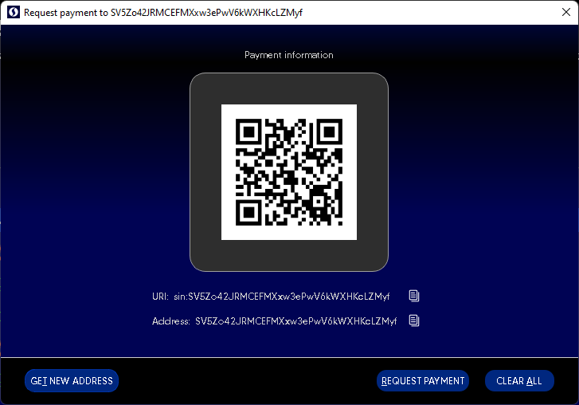

**Transaction too large / Transaction too high / Transaction creation failed**

 

Transaction too high error is a standard miners limit error first introduced with the Bitcoin core wallet.

For example, many small transactions hit the blockchain limit error when a wallet has too many transactions (inputs) from mining, nodes, staking, or any received transactions.
In that case, please use the Coin Control feature.

Create a new Receiving address. Go to "My Wallet" > "RECEIVE" > " Get new address".

Please select and copy with a right mouse click.

Select several addresses from [INPUTS (Coin control)]> Coin Selection window

and send several times to the recently generated address

**The goal is to lover address count in the **Coin Selection window.****
