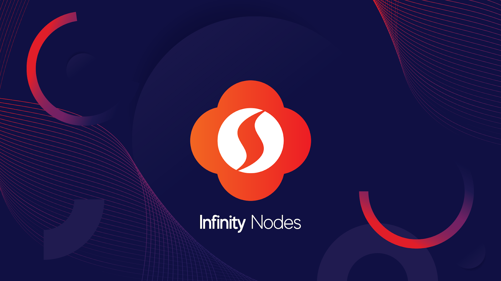

# Understanding InfinityNodes

## What is an InfinityNode?
    
Like other blockchain solutions, the main SINOVATE chain relies on hundreds of nodes spread across the globe, beyond all borders or proper jurisdiction.

In the SINOVATE network, each node hosts a replica of the main chain, allowing the ledger’s authenticity. In addition, infinitynodes help support the network by providing owners with additional custom-made, unique, and advanced functionality that typical network nodes cannot provide. In return, the blockchain delivers a reward to holders of InfinityNodes for each confirmation of transaction blocks alongside the Proof-of-Work and Proof-of-Stake consensus mechanisms. The InfinityNodes can be associated with the Proof-of-Service (PoSe) layer concept, initially created by the DASH project. As a Layer-1 solution, the SIN coin is the currency used in the committed contracts and reward payments delivered to one holder at every block generation.

## InfinityNodes: Beyond Masternode Technology
   
SINOVATE uses a custom codebase written from scratch with unique concepts and let's explore the technological evolutions compared to the masternodes. 

**What is a masternode?**

The term “masternode” refers to a specific protocol implemented by many blockchains as a second layer to their network. In the current crypto market, masternodes serve a crucial role in the security and integrity of the blockchain.  

Many coins base their masternode model after the first coin to pioneer this technology: DASH. To run a DASH masternode, one must possess the required collateral of 1000 DASH coins. This collateral is locked in an address as long as the node is running. As compensation for supporting the network, masternodes receive a dedicated portion of the block reward in the form of more coins. This passive income model explains the meaning of a node’s ROI. It also serves as an incentive to purchase and hold coins for long periods, leading to coin scarcity — which is strongly correlated with coin value.  
Not all nodes require 1000 coins as collateral. Each chain will have its required collateral or multiple collaterals for tiered masternode systems.

**What is the difference?**

There is no configuration file and requires burning the collateral to establish a contract with the Proof-of-Service layer of the network (see (4)). This is the Proof-of-Burn mechanism. The future owner commits the contract with a specific and unique command for 12 months (only sending coins to the unspendable address will lead to losing your SIN coins). This contract can have a different number of SIN coins depending on the selected Tier. Hence, the InfinityNode will receive rewards from generated blocks according to the payment round. It will enable us to retrieve the burnt collateral with additional income. This payment round is fully deterministic (see (5)) and depends on the number of active InfinityNodes in the Tier. It means the frequency of received rewards may vary over time which is very different from the masternodes system where the frequency is mainly decreasing. After 12 months, the InfinityNode expires and the owner should have collected the burnt collateral and additional incomes with all the received block rewards. The collateral is not returned at the end of the contract.

## Tier-based InfinityNode Structure
      
InfinityNode owners have three different levels to establish their nodes called Tiers. Each Tier is seen as a layer of the network. They provide separate and distinctive functions to ensure decentralization, overall network stability, and Data Storage service, which is the major strength of SINOVATE. Each level requires a different number of coins to create a node which is defined for the following:

-   MINI Tier: 100 000 SIN coins,
    
-   MID Tier: 500 000 SIN coins,
    
-   BIG Tier: 1 000 000 SIN coins.
    
As a reminder, the SIN coins used for starting the “InfinityNodes” must be transferred to an unusable SIN wallet address as the Proof-of-Burn mechanism.

## Integration of Proof-of-Burn (PoB) Mechanism

The coin destruction mechanism known as Proof-of-Burn (PoB), supports a self-regulating circulating suppy based on the offer and demand of SIN coin market. This regulation is made by transferring transaction fees to an unusable SIN address. They are then burnt, which is one of the main functions of the PoB mechanism. Furthermore, as the ledger is public and open to everyone, the unusable generic address of the project below makes it possible to trace all transactions and actions linked to the PoB mechanism:

**SinBurnAddress123456789SuqaXbx3AMC**

One of the characteristics specific to SINOVATE is to have extended this principle to create PoSe nodes of the blockchain called InfinityNodes. This implies that all the SIN coins pledged (“collateral”) to rule on the veracity of their posting are transferred immutable and recorded as unusable. This process helps increase the decentralized network's validity. Furthermore, it ensures that all participating nodes reach consensus or risk losing transaction block rewards to fill back the collateral.

This requirement for stability ensures the endurance of the network. In addition, it limits the circulating supply of SIN coins, thus reducing selling pressure on the exchanges. As a reminder, this is not the case with traditional Masternodes, which can be liquidated and sold at any time.

The PoB mechanism offers this desired stability because of future use cases of the Data Storage functions, whose cloud data is stored in a decentralized manner hosted on the InfinityNodes.

## Deterministic Rewards
    
The word “deterministic” means every InfinityNode receives a reward from generated blocks in an order specified by the round payment list (called Statement). Hence, the network guarantees a regular payment for InfinityNodes and removes any current luck in non-deterministic masternode systems. It enables easy tracking and assessment of the return on investment for the owner.

## Purpose and Different Functions of InfinityNodes in hte Network

Proof-of-Burn not only self-regulates the circulating supply, but this mechanism also brings another significant benefit in the decentralized system: A 100% runtime. Hence, if the owner wants to recover the coins used in the committed contract, He must guarantee that his InfinityNode is always connected with suitable hardware and Internet connection. Technically, it requires to engage money to prove their good intentions by committing the contract (RPC Command: Infinitynodeburnfund) and to engage the hardware (VPS as a data hoster/ RPC Command: Infinitynodeupdatemetadata)

This stability enables our network to transfer and store data in InfinityNodes in a low-cost and high-speed manner. It is the foundation of SINOVATE Nephele: The Incorruptible Data Storage. Nephele is the decentralized Cloud Infrastructure where any web 3.0 application will plug for their own data management. The data storage for MINI, MID, and BIG should have the same priority level by default for storing data. The offers and demands would regulate specifically the data market in SINOVATE. For instance, BIG is a higher investment risk than MINI because the collateral is burnt. Therefore, BIG InfinityNodes owners must propose reliable and efficient data storage to optimize their incomes with block rewards. Then, BIG hosters would probably have more crucial data and collect more data. The SIN price growth will reward the node owners.

BIG Tier also contributes to the Layer-1 security as a critical layer for validating the reward payment from the block (see (7)). Finally, it could be a fundamental Tier in the InfiniteChain. The BIG InfinityNode could be a Layer-2 validator of side chains. They can operate alongside the mainchain. In addition, they will have the possibility to interact with SINOVATE Nephele for storing their data.

## LockReward Security Mechanism
    
Using novel cryptographic systems (such as Schnorr MuSig, a Schnorr-based signature aggregation scheme: [https://en.wikipedia.org/wiki/Schnorr_signature](https://en.wikipedia.org/wiki/Schnorr_signature)), the LockReward mechanism collects signatures from network participants. It uses them as novel proof for security purposes. The participants must be specially selected to meet this new security standard, where SINOVATE InfinityNodes come into play.

InfinityNodes are "burn to run" collateralized nodes that are rewarded over time based on their LockReward commitments. (the 12-month contract commitment which is based on the transaction to the unspendable address with a specific command) Each node must be online and listening to contribute their commitment. Each node validates the reward which is being produced by the block generation. LockReward essentially serves as a powerful security tool, benefiting the node owners and the ledger itself.

In the SINOVATE mainchain, BIG Tier operates as a critical layer for validating the reward payment from block validations. Therefore, 16 BIG InfinityNodes called network participants will participate in certifying the healthiness of the InfinityNode of each Tier in every block that should receive a reward for its contribution to the Proof-of-Services layer composed of data storage or instant payments. This novel cryptographic mechanism is called LockReward, based on the MuSig, a Schnorr-based signature aggregation scheme. The InfinityNode receiver must then collect signatures from network participants and validate its aggregation to certify its validity.

When the InfinityNode is a candidate to receive the block reward, the LockReward mechanism works as follows:

1.  The candidate collects the blockhash of the N-100 blockheight where N is the current blockheight. The gap of 100 has been selected to not be disturbed by the security protocols against 51% attacks with the blockchain reorganization,
    
2.  The candidate gathers all the InfinityNode IDs from the BIG Tier,
    
3.  With every InfinityNode ID fused with the blockhash, the InfinityNode calculates a new Hash. This creates a list of Hash codes,
    
4.  The InfinityNode sorts all the newly created Hash in an ascending or descending order. This is performed by Hash comparisons which is equivalent to comparing numbers,
    
5.  16 BIG InfinityNodes are then selected by considering the 16 first Hash created by the candidate,
    
6.  The candidate selects 4 of the 16 BIG InfinityNodes to build a Schnorr MuSig with the selected BIG InfinityNodes. The 4 BIG InfinityNodes are the first to answer the candidate request for the Schnorr MuSig. In other words, the 4 BIG InfinityNodes have the lowest latency with the candidate.
    
7.  The candidate commits to the network (on-chain) the Schnorr MuSig. The candidate receives its reward if it is accomplished in 1 minute (mean of block generation interval).
    
The first significant benefit of LockReward is that a group of BIG InfinityNodes does the Schnorr MuSig. Therefore, it considerably reduces the risk of falsification because the attacker must have the four malicious BIG InfinityNodes picked by the algorithm. The second significant benefit is the healthiness of the InfinityNode that must have perfect hardware and Internet connection which is mandatory for a scalable, fast, and reliable decentralized Cloud. For instance, the user will communicate directly with InfinityNode to upload and download its data. Hence, there is no need to split the data from the user, which saves considerably a lot of time. The section about SINOVATE Nephele: The Incorruptible Data Storage highlights how it is working more precisely.

## Payments and Rewards

An InfinityNode is a peer which executes operations for the Proof-of-Services (PoSe) layer, such as instant transactions or governance votes. The owner receives a reward from generated blocks for this contribution. Then, the running cost of an InfinityNode is mainly covered by the block reward, and an owner can already satisfy a return on investment (ROI) from this. The Proof-of-Burn mechanism is applied to the transaction, votes, and data transaction fees plus the collateral of InfinityNodes to execute a 12-month contract commitment. During the contract period, InfinityNode participates in the SINOVATE decentralized Cloud storage. The owner can then receive an additional income for data storage depending on the contract payment encapsulation in the data transaction fees.

## 12-Month Contract Renewable System

The contract of InfinityNodes expires 12 months after the Proof-of-Burn-based commitment. The InfinityNode is then rejected from the deterministic list of the payment round for the PoSe layer. The InfinityNode will be disconnected from the network and not receive more rewards from blocks. The owner would not be able to participate in the governance vote. The data storage is deactivated, and the owner does not receive more data. This does not impact the user experience because the data are replicated over multiple InfinityNodes by default.

The DAO is investigating possible solutions to continue participating in the data storage if you submit at least one contract. This is not in the current development roadmap, but users will be informed if this idea becomes a reality. However, the running cost will not be covered by block rewards, and it is up to the owner to pursue or not the activity.

## Know Risks by owning an InfinityNode

Before investing in an InfinityNode, the owner (or the investor) must understand that it is fundamental to guarantee the InfinityNode has a maximized runtime that means it is permanently connected to the SINOVATE blockchain network. A disconnection or a handover of the InfinityNode will result in missing rewards, reducing the chance to recover the committed contract properly.

A second risk is the hardware quality (VPS) of the InfinityNode. We highly recommend setting up an InfinityNode in a unique and dedicated VPS. Avoiding complex setups with multiple PoSe solutions will maximize the chance of successful LockReward execution.

## InfinityNode Setup Overview

An InfinityNode is composed of a native SINOVATE wallet for receiving the payments and a virtual private server (VPS). 

The VPS is a server (network’s peer) that provides the services of transactions and data storage. It is then the operating node that will sign the Schnorr signature in the LockReward process with the pirvate and public keys. The VPS is essential to the PoSe layer and it is why a VPS can not host multiple contracts that would lead to Schnorr signature failures. It transfers the payment to the owner’s wallet (Payee Address). Hence, the VPS has also a third address called (DIN) Node Address and it uses the amount on this address to realize autoatically the transaction to the Payee Address (in the owner’s wallet).  

## InfinityNode Setup Solutions

There are multiple solutions to set up an InfinityNode. 

In the documentation, you will find two solutions: setUP which is guaranteed by the SINOVATE team and the “self-hosted” solution which corresponds to a standard installation by an operator. The setUP solution is powered by SINOVATE. This solution is integrated in the native SINOVATE wallets, it automatizes the VPS installation (hosted by SINOVATE), and it guarantees the users to have a full control of its InfinityNode (as the users owns its native wallet).

Depending on the selected solution, we recommend to read the guides in the documentation. 

## Technical Steps to Run an InfinityNode

Either the setUP solution or a self-hosted solution, the InfinityNode will follow different steps to subscribe to the InfinityNode list and to get rewards. 

A prerequisite is to get SIN coins. You will need to have the coins for submitting the PoB-based contract that will allow you to participate in the network for 12 months. Additionally, you will need coins for subscribing to the list of InfinityNodes to aknowledge you are ready for providing the InfinityNode service. It is the metadata transaction (around 25 SIN coins). And finally, you will need SIn coins for enabling the VPS to transfer the rewards to the Payee address in the native SINOVATE wallet. 

Then the steps are the following:
1.  Installation of SINOVATE VPS solution, 
2.  Provision of SIN coins in the Node Address (Standard transaction),
3.  Commitment of the InfinityNode contract by sending the collateral to the unspendabble adress,
4.  Metadata submission for validating the InfinityNode in the PoSe layer.

The Step 3 requires the following command: 

``infinitynodeburnfund [YourOwnerAddress] [Amount 1000000/500000/100000] [YourBackupAddress]``

The Step 4 requires the following command: 

``infinitynodeupdatemeta [YourOwnerAddress] [node PublicKey] [node IP] [first 16 characters of BurnFundTx]``

## Economic Consequences

The contract commitment slows considerably the inflation of the SINOVATE economy compared to the masternodes technology. If you’ve been in the masternode market for any length of time (or do not know it but it is better because there is the InfinityNodes), you are likely aware that nearly all masternode coins dump precipitously. There are many contributing factors, such as the lack of a use case, bear markets, and exit scams, but the common denominator across nearly every failed coin is this: poor economics.
Far too many coins offer a deceivingly high ROI to lure investors into purchasing collateral. But the repeating theme is that when the return of investments (ROI) begins to drop due to decreasing block rewards, tons of coins are dumped, and the value plummets. This phenomenon has happened over and over again and is a classic case of supply and demand. If demand > supply, the price will go up. If supply > demand, the price will go down. When coins are flooding the network due to coins not being locked in masternodes, the supply is inevitably higher than demand. The masternode model only works so long as coins are locked in nodes, or are otherwise utilized. 

When a SINOVATE investor commits a contract to run an InfinityNode, that collateral is burned forever via proof-of-burn. This burn mechanism is distinctly different from traditional nodes, whose collateral can be unlocked and sold. For the creation of an InfinityNode, the user must burn the collateral of the contract.  
In the burn process, the coins are destroyed and can never be recovered. However, the burning of coins does not mean the investment is lost; in fact, the investment returns daily from block rewards without the fear of hyper-inflation or big dumps.  
This model changes the economic outlook from an hyperinflationary one to a weakly inflationary one. As the PoB mechanism is also applied on the transaction fees and the data storage contracts, the igher is the demand, the lower is the inflation and it is possible to have seasons of deflation depending on the demand.

## Additional Security Benefits

Readers may have heard of attacks that can affect proof-of-work coins like Bitcoin such as 51% or Genesis attacks. However, coins that use masternodes also have their own attack vectors that can be exploited. Let’s dive into this…

**Sybil Attacks**

Sybil attacks are something that occur around the world daily. It is basically where a user will try to take over a peer-to-peer network by creating a vast amount of network identities or nodes to exert an unduly large influence.

An example today on social media are the large amount of fake accounts created to try to subvert debates in certain directions. A network’s ability to fight off these types of attacks are largely down to the cost to create or join the network with a new identity. While these attacks are an issue on social media, it could be devastating to a blockchain if it were to happen. An attacker’s chances of success and what they can do largely depends on how much they could dominate the network.

In Bitcoin and other proof-of-work coins, if an attacker were able to compromise the network with a Sybil attack, they would have far reaching powers over the network activity.

For example:

-   The attacker could only relay blocks they create, allowing double spend attacks.
-   They could refuse to relay blocks and transactions for everyone, effectively shutting down the network.

Proof-of-work makes this very difficult to do as the costs to join the network (by mining) are prohibitive and to create enough nodes to execute would be uneconomical.

**Masternodes Attack Vectors**

To attack the system using a Sybil attack, an attacker must own enough masternodes to guarantee that they will form the selected group to process transactions. If they are able to do this, it would mean they would be able to execute a double spend transaction or other attacks as above.

On usual masternode networks, the attacker must only lock up the currency needed while they execute the attack. Afterwards they are freely able to unlock their nodes and sell the currency. This is not possible with SINOVATE. The cost in acquiring enough SIN coins, bearing in mind liquidity, price, and VPS requirements make this prohibitive in a similar way to proof-of-work.

**Transaction Locking Race Attack**

In this type of attack, the attacker would send two competing blocks to the network at the same time, one to themselves and one to a third party. The network would be divided in consensus about which is valid. The attacker must be able to maintain the node throughout this period and beyond or face losing their coins, unlike with other iterations where they are able to withdraw funds after the attack. With SINOVATE, once all nodes in the group have returned their transactions, a non-consensus would be identified, and the transaction would resort to the proof-of-work chain.

**Finney Attack**

A Finney attack is thus named as was first suggested by Hal Finney, the first known receiver of Bitcoin from Satoshi. In this attack, malicious actors also try to send a transaction to themselves by using the proof-of-work network to execute.

They mine blocks normally, waiting to find one in which they have sent a transaction to themselves. Instead of broadcasting, they then make a transaction on the masternode network for goods which must be completed before the next block is produced. Once the goods have been received, the mined block is broadcast which invalidates the masternode transaction.

The SIN protocol prevents this by being able to recognize the difference in transaction locks between proof-of-work and masternode consensus and when all members of the group have validated conflicting blocks rejected. Again, the attacker must maintain InfinityNodes for the complete lifetime or face losing these funds.

