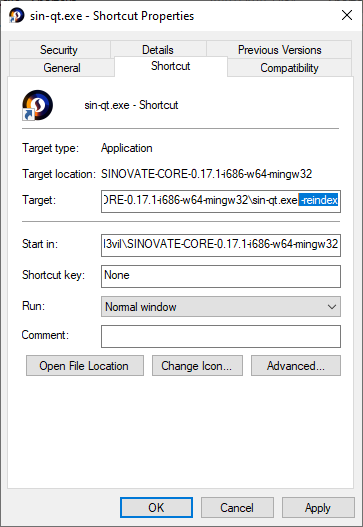

## Resync Windows wallet
In case you need to resync your local wallet in Windows:
* Close wallet;
* Create a shortcut;
* Rick click on shortcut and select properties;
* add in target, at the end of the path ` -reindex` (space -reindex, see screenshot below)
* wait full resync

