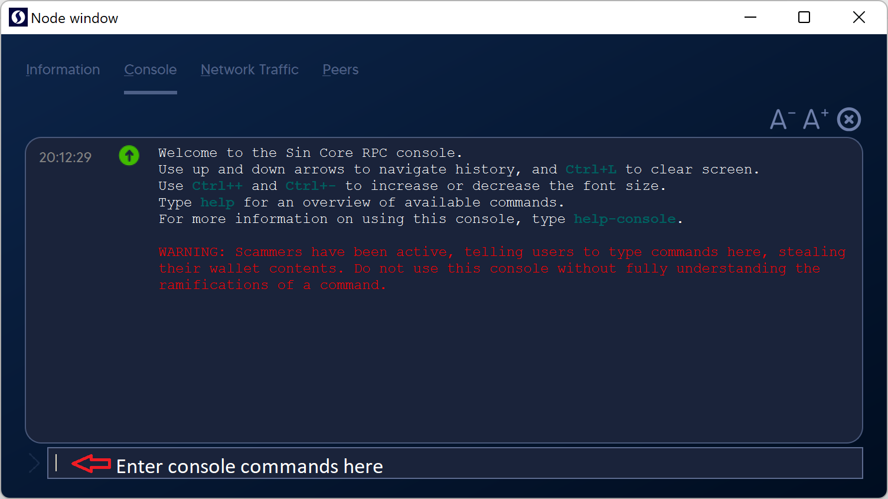
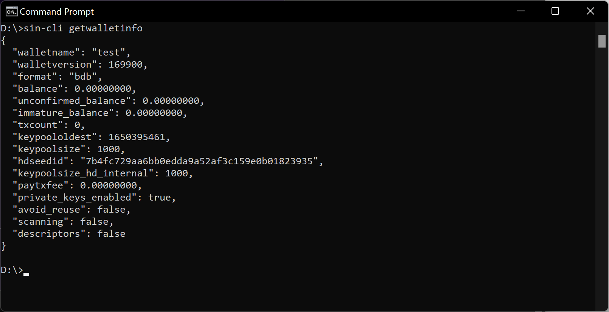
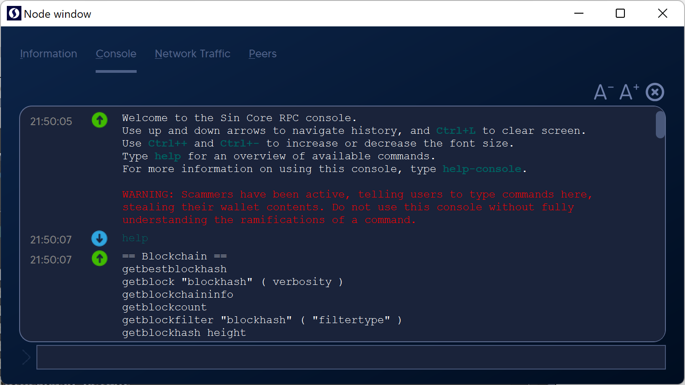
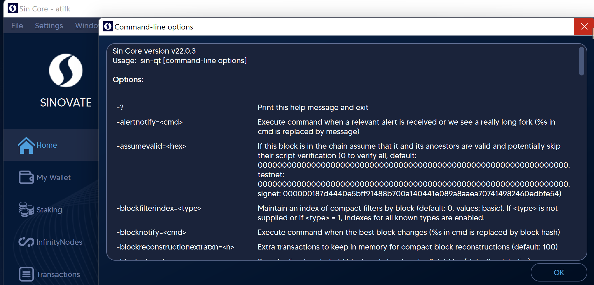
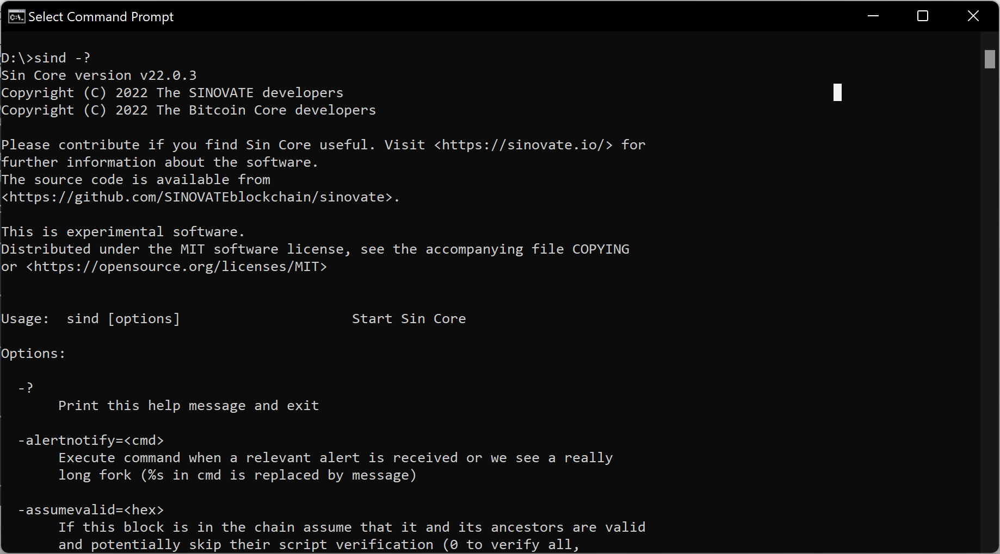
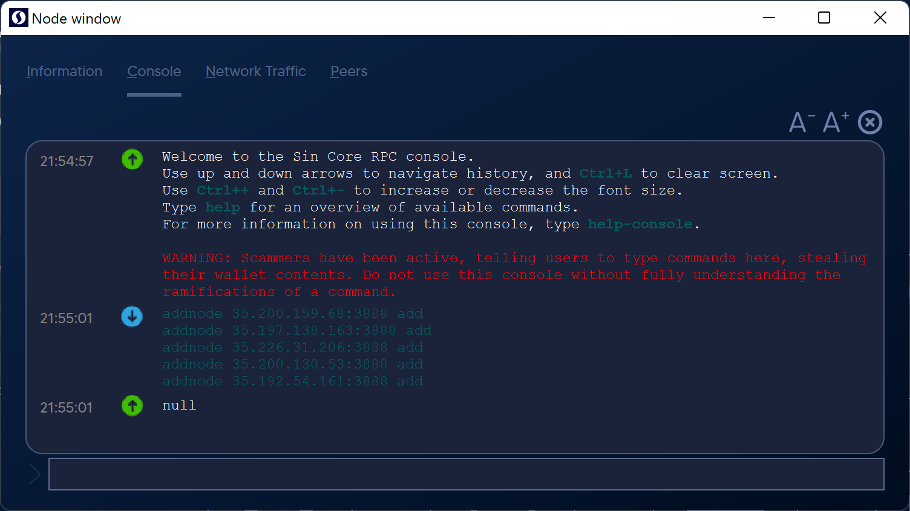
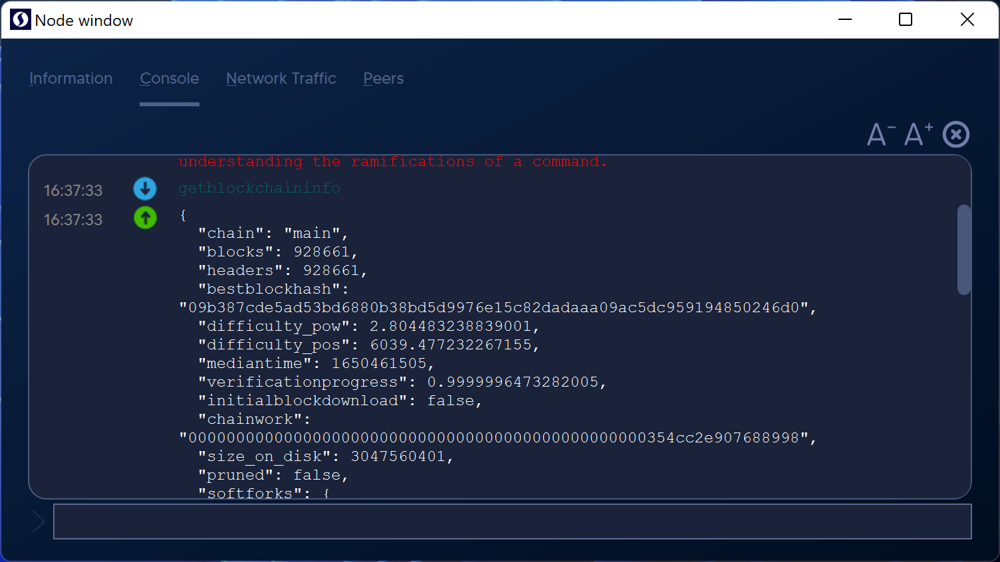

# ``Commands``


``The SINOVATE Core wallet has a rich set of commands which give comprehensive control of the wallet and blockchain transactions. There are two sets of commands that can be used with SIN Core wallets:``

-   Console commands to use on a wallet that is already running.
    
-   Startup commands to use when starting up a wallet.
    

``This manual focuses on the console commands given to a running wallet and can be sent using RPC (Remote Procedure Calls). The command line to the sind server wallet and the sin-qt desktop GUI (Graphical User Interface) wallet can be entered using the Debug window.``

  

``Console command line (see Figure 1).``


Figure 1. The sin-qt Console

``Note the warning message in red in Figure 1 and be careful using the private key commands (dumpprivkey and dumpwallet) with Mainnet wallets.``

``Console commands for the server wallet sind are given using the Command Line Interface application sin-cli on the system command line prompt (see Figure 2).``


Figure 2. System command line prompt

``You can always get a list of the current console commands using the help command (see Figure 3.)``


Figure 3. The help command

## ``Console Commands :``

``Console commands are given to a running SIN Core wallet and provide additional information and control. Console commands are required to operate the sind server wallet, a "headless" wallet with no graphical user interface.``

``One hundred thirty-six console commands with some good references for the 112 inherited from bitcoin. In addition, 13 "hidden" commands are used by developers and won't show up in the "help" list.``

``Commands can have required or optional parameters, and more numerous parameters are entered in JSON (JavaScript Object Notation) format with escaped double quotes ( \" ) as shown below.``

``Typical parameters for these commands are SIN addresses, block hashes, contact addresses, etc. In addition, some of the commands will have an optional parameter "minconf" (minimum confirmations), which allows you to get a response for a transaction or block with at least that number of confirmations.``

``The chain query bitcoin API reference [http://chainquery.com/bitcoin-api](http://chainquery.com/bitcoin-api) explains the parameters and gives examples of the commands inherited from bitcoin. The bitcoin chain query API reverence gives 67 commands, of which 2 are not in SIN (estimatepriority, getgenerate), and two (gettransaction, walletpassphrase) have an additional parameter for SIN. See also [https://bitcoin.org/en/developer-reference#remote-procedure-calls-rpcs](https://bitcoin.org/en/developer-reference#remote-procedure-calls-rpcs).``

``Advanced interfaces to the SIN Core wallet (full node) can use these "console commands" as RPCs (Remote Procedure Calls) over a dedicated port connection to the node. To build an exchange hot wallet or server node for a mobile DAPP (Distributed Application), you can use RPCs following these same console commands. The client node offers a JSON-RPC interface over HTTP sockets to perform various operational functions and manage the local node.``

``A quick comment on "accounts." Accounts were an ill-fated way from bitcoin to track balances for what are UTXO transaction-based values, and "accounts" are deprecated and will be phased out by version 0.18.``

``Here are some command groupings that are useful for various tasks:``

-   Peer connections: getconnectioncount, getpeerinfo, addnodes, getnetworkinfo
    
-   Staking: getstakinginfo, getwalletinfo, getnetworkinfo
    
-   Sending: listaddressgroupings, sendtoaddress, sendmany, sendmanywithdupes
    
-   Raw transactions: crearterawtransaction, signrawtransaction, combinerawtransactoins, sendrawtransaction
    

  

## ``Startup Commands``

``Startup commands give additional control and recovery options when launching the wallet. For example, you can use startup commands for various kinds of blockchain recovery techniques and extra debug logging or additional controls. If you use these startup commands, make sure you have a good backup of the wallet.dat file.``

``See the startup commands on the sin-qt wallet with Help - Command line options:``


Figure 4. Startup commands

and on the command line itself with "sind -?":


Figure 5. Startup commands from the command line

## ``Console Commands A - Z``

``Responses are given for default parameters for these console commands documented below (SIN version 0.16 - winter 2018/2019). Commands marked DEPRECATED should not be used because they will be removed and replaced in future wallet versions; for example, commands using "account" will be removed in version 0.18.``

``Using the command "help \" will give complete information about the command and relevant parameters, formatted so you can copy and paste (replacing the addresses, transactions IDs, etc., as required). The format below shows the command with parameters followed by the response. In some cases, parameters or responses are truncated with the term "\." Where noted, some commands only work with the regtest (Regression Test) network. Also, many commands will return "null" for sin-qt and return nothing for command-line systems.``

### ``abandontransaction "txid"``

``Works on transactions not in the blockchain or mempool, used in testing.``

```
abandontransaction "0cc99a30bc2064041ea4263835b4ed594ff500c56d6b14e4970aeee548e71389"
Transaction not eligible for abandonment (code -5)
```
### ``abortrescan``

``Stops a wallet rescan triggered by a command such as importprivkey. This command can be issued by opening a 2nd command line window (where the first window is scanning), in which case the command will stop the scan and return "true."``
```
sin-cli abortrescan

true
```
### ``addmultisigaddress nrequired ["key",...] ( "account" "address_type" )``

``Add a multi-signature address to the wallet so you can receive and send from that address. Run the command on each machine that will be signing and backup the wallet.dat file. The address can be a SIN address or hex-encoded public key. Use importaddress to add the multisig address on each signing wallet.``

``This functionality is only intended for use with non-watch-only addresses. See importaddress for watch-only p2sh address support. Use of account is DEPRECATED). See also validateaddress.``
```
addmultisigaddress 2 "[\"SgdaD9b3ppKowoC45EZMtepjjBfnvEe6m\",\"SFmr8vY29reHj73XSHfdWvkV3mD57Kqd8\"]"
{
"address": "mHB9w64hHbm2YtCxyqS8kG3g77b2gbSvK",
"redeemScript": "5321538ef45ab52bd53508adfda3cfe82ebcaf0495963729e5ff2a8e5aeecdd4cdd23daea03cf4394ad4c578caff2d297ce937c3afba5bc56f31c786b2addf56c72ab"
}
```
### ``addnode "node" "add|remove|onetry"``

``Attempts to add a node with a known IP address. This command is helpful for new wallets that are having trouble making peer connections. Here are some excellent IP addresses to add; you can put these commands in one after another, then the wallet will try for a few minutes to make a peer connection with each. Sind returns nothing:``
```
addnode 35.200.159.68:20970 add
addnode 35.197.138.163:20970 add
addnode 35.226.31.206:20970 add
addnode 35.200.130.53:20970 add
addnode 35.192.54.161:20970 add
```
sin-qt returns "null" after each (see Figure 6).

Figure 6. Entering the addnode command
### ``analyzepsbt "psbt"``
``Analyzes and provides information about the current status of a PSBT and its inputs``
``Arguments:``
``1. psbt (string, required) A base64 string of a PSBT``
  Result:
```
{ (json object)
"inputs" : [ (json array)
{ (json object)
"has_utxo" : true|false, (boolean) Whether a UTXO is provided
"is_final" : true|false, (boolean) Whether the input is finalized
"missing" : { (json object, optional) Things that are missing that are required to complete this input
"pubkeys" : [ (json array, optional)
"hex", (string) Public key ID, hash160 of the public key, of a public key whose BIP 32 derivation path is missing
...
],
"signatures" : [ (json array, optional)
"hex", (string) Public key ID, hash160 of the public key, of a public key whose signature is missing
...
],
"redeemscript" : "hex", (string, optional) Hash160 of the redeemScript that is missing
"witnessscript" : "hex" (string, optional) SHA256 of the witnessScript that is missing
},
"next" : "str" (string, optional) Role of the next person that this input needs to go to
},
...
],
"estimated_vsize" : n, (numeric, optional) Estimated vsize of the final signed transaction
"estimated_feerate" : n, (numeric, optional) Estimated feerate of the final signed transaction in BTC/kvB. Shown only if all UTXO slots in the PSBT have been filled
"fee" : n, (numeric, optional) The transaction fee paid. Shown only if all UTXO slots in the PSBT have been filled
"next" : "str", (string) Role of the next person that this psbt needs to go to
"error" : "str" (string, optional) Error message (if there is one)
}
```
``Examples:``
```
analyzepsbt "psbt"
```
### ``backupwallet "destination"``
``The destination can be a filename or a path with a filename. The wallet must be fully decrypted (not just for staking only) for this command to work. sin-qt will return "null," sind returns nothing. On Windows:``
```
backupwallet "C:\Users\<username>\Desktop\Backups\backup2018-10-21.dat"
null
```
### ``bumpfee "txid" ( options )``
``Bumps the transaction fee, replacing it with a new transaction by adjusting the change. The new fee can be calculated automatically or by using various options.``
```
bumpfee "cae25062777fca1bce7f860dd238af2be4495f4aef1b5a15bbee260b4c3cde2"
{
"txid": "ecbc798c140b5104ae3d5828493e8e5ef04131dd0e44eb7fa7e1abba24901a5",
"origfee": 0.00090400,
"fee": 0.00093061,
"errors": [
]
}
```
### ``clearbanned``
``Clear all banned nodes' IPs. sin-qt returns "null", sind gives no response.``
```
clearbanned
null
```
### ``combinepsbt ["psbt",...]``
``Combine multiple partially signed SIN transactions into one transaction.``
``Implements the Combiner role.``
``Arguments:``
```
1. txs (json array, required) The base64 strings of partially signed transactions``
[
"psbt", (string) A base64 string of a PSBT
...
]
```
``Result:``
```
"str" (string) The base64-encoded partially signed transaction
```
``Examples:``
```
combinepsbt '["mybase64_1", "mybase64_2", "mybase64_3"]'
```
### ``combinerawtransaction ["hexstring",...]``
``Combine multiple partially signed raw transactions into one transaction. The combined transaction may be another partially or fully signed transaction. Here two raw transactions are combined:``
```
combinerawtransaction "[\"0200000001b<snip>000000\", \"0200000001c<snip>000000\"]"
0200000001b<snip>000000
```
### ``converttopsbt "hexstring" ( permitsigdata iswitness )``
``Converts a network serialized transaction to a PSBT. This should be used only with createrawtransaction and fundrawtransaction``
``createpsbt and walletcreatefundedpsbt should be used for new applications.``
``Arguments:``
```
1. hexstring (string, required) The hex string of a raw transaction
2. permitsigdata (boolean, optional, default=false) If true, any signatures in the input will be discarded and conversion
will continue. If false, RPC will fail if any signatures are present.
3. iswitness (boolean, optional, default=depends on heuristic tests) Whether the transaction hex is a serialized witness transaction.
If iswitness is not present, heuristic tests will be used in decoding.
If true, only witness deserialization will be tried.
If false, only non-witness deserialization will be tried.
This boolean should reflect whether the transaction has inputs
(e.g. fully valid, or on-chain transactions), if known by the caller.
```
 ``Result:``
```
"str" (string) The resulting raw transaction (base64-encoded string)
```
 ``Examples:``
``Create a transaction``
```
createrawtransaction "[{\"txid\":\"myid\",\"vout\":0}]" "[{\"data\":\"00010203\"}]"
```
``Convert the transaction to a PSBT``
```
converttopsbt "rawtransaction"
```
### ``createmultisig nrequired ["key",...]``
``DEPRECATED. Use addmultisigaddress.``
### ``createrawtransaction [{"txid":"id","vout":n},...] {"address":amount,"data":"hex",...} ( locktime ) ( replaceable )``
``Create a hex-encoded raw transaction sending some inputs to outputs. The transaction must then be signed and sent to the network; see signrawtransaction and sendrawtransaction. Returns a hex-encoded raw transaction. If you are sending coins, make sure to create a change address to return the change; any difference between the input and output values will be taken as the transaction fee. You could pay a hefty transaction fee if you don't work out the math.``
```
createrawtransaction "[{\"txid\":\"17b3f9ef530695ef2e0368e445a3b59bf12811bdfd42325bb14248e72deb7e2\",\"vout\":0}]" "{\"Sd5eHho389mJMCxSzAbe31w2vntTc7192\":1.0, \"SdXtq55Bf443Lkme2hdj4mD8KKepk32f6\":0.99}"
020000001d637cf207c6418fb6220cfcb2b141ba5d230f0ba0a43c68b358aff9a8a6000000000fffffff0509e5f50480000001983a952d5fb15a70832ffdc3cadd3dc7749a49bf053ed6defacd09ef6060000000187aa814bd4ae4167bebbf56bb7c51c5eabf35d50a5c6e7f33ad0000000
```
### ``createpsbt [{"txid":"hex","vout":n,"sequence":n},...] [{"address":amount,...},{"data":"hex"},...] ( locktime replaceable )``
``Creates a transaction in the Partially Signed Transaction format.``
``Implements the Creator role.``
``Arguments:``
```
1. inputs (json array, required) The json objects
[
{ (json object)
"txid": "hex", (string, required) The transaction id
"vout": n, (numeric, required) The output number
"sequence": n, (numeric, optional, default=depends on the value of the 'replaceable' and 'locktime' arguments) The sequence number
},
...
]
2. outputs (json array, required) The outputs (key-value pairs), where none of the keys are duplicated.
That is, each address can only appear once and there can only be one 'data' object.
For compatibility reasons, a dictionary, which holds the key-value pairs directly, is also
accepted as second parameter.
[
{ (json object)
"address": amount, (numeric or string, required) A key-value pair. The key (string) is the sin address, the value (float or string) is the amount in SIN
...
},
{ (json object)
"data": "hex", (string, required) A key-value pair. The key must be "data", the value is hex-encoded data
},
...
]
3. locktime (numeric, optional, default=0) Raw locktime. Non-0 value also locktime-activates inputs
4. replaceable (boolean, optional, default=false) Marks this transaction as BIP125 replaceable.
Allows this transaction to be replaced by a transaction with higher fees. If provided, it is an error if explicit sequence numbers are incompatible.
```
``Result:``
```
"str" (string) The resulting raw transaction (base64-encoded string)
```
``Examples:``
```
createpsbt "[{\"txid\":\"myid\",\"vout\":0}]" "[{\"data\":\"00010203\"}]"
  ```
  ### ``createrawtransaction [{"txid":"hex","vout":n,"sequence":n},...] [{"address":amount,...},{"data":"hex"},...] ( locktime replaceable )``
``Create a transaction spending the given inputs and creating new outputs.
Outputs can be addresses or data.
Returns hex-encoded raw transaction.
Note that the transaction's inputs are not signed, and
it is not stored in the wallet or transmitted to the network.``
``Arguments:``
```
1. inputs (json array, required) The inputs
[
{ (json object)
"txid": "hex", (string, required) The transaction id
"vout": n, (numeric, required) The output number
"sequence": n, (numeric, optional, default=depends on the value of the 'replaceable' and 'locktime' arguments) The sequence number
},
...
]
2. outputs (json array, required) The outputs (key-value pairs), where none of the keys are duplicated.
That is, each address can only appear once and there can only be one 'data' object.
For compatibility reasons, a dictionary, which holds the key-value pairs directly, is also
accepted as second parameter.
[
{ (json object)
"address": amount, (numeric or string, required) A key-value pair. The key (string) is the sin address, the value (float or string) is the amount in BTC
...
},
{ (json object)
"data": "hex", (string, required) A key-value pair. The key must be "data", the value is hex-encoded data
},
...
]
3. locktime (numeric, optional, default=0) Raw locktime. Non-0 value also locktime-activates inputs
4. replaceable (boolean, optional, default=false) Marks this transaction as BIP125-replaceable.
Allows this transaction to be replaced by a transaction with higher fees. If provided, it is an error if explicit sequence numbers are incompatible.
```
``Result:``
```
"hex" (string) hex string of the transaction
```
``Examples:``
```
createrawtransaction "[{\"txid\":\"myid\",\"vout\":0}]" "[{\"address\":0.01}]"
createrawtransaction "[{\"txid\":\"myid\",\"vout\":0}]" "[{\"data\":\"00010203\"}]"
> curl --user myusername --data-binary '{"jsonrpc": "1.0", "id": "curltest", "method": "createrawtransaction", "params": ["[{\"txid\":\"myid\",\"vout\":0}]", "[{\"address\":0.01}]"]}' -H 'content-type: text/plain;' http://127.0.0.1:8332/
> curl --user myusername --data-binary '{"jsonrpc": "1.0", "id": "curltest", "method": "createrawtransaction", "params": ["[{\"txid\":\"myid\",\"vout\":0}]", "[{\"data\":\"00010203\"}]"]}' -H 'content-type: text/plain;' [http://127.0.0.1:8332/](http://127.0.0.1:8332/)
```
### ``createwallet "wallet_name" ( disable_private_keys blank "passphrase" avoid_reuse descriptors load_on_startup external_signer )``
``Creates and loads a new wallet.``
``Arguments:``
```
1. wallet_name (string, required) The name for the new wallet. If this is a path, the wallet will be created at the path location.
2. disable_private_keys (boolean, optional, default=false) Disable the possibility of private keys (only watchonlys are possible in this mode).
3. blank (boolean, optional, default=false) Create a blank wallet. A blank wallet has no keys or HD seed. One can be set using sethdseed.
4. passphrase (string, optional) Encrypt the wallet with this passphrase.
5. avoid_reuse (boolean, optional, default=false) Keep track of coin reuse, and treat dirty and clean coins differently with privacy considerations in mind.
6. descriptors (boolean, optional, default=false) Create a native descriptor wallet. The wallet will use descriptors internally to handle address creation
7. load_on_startup (boolean, optional) Save wallet name to persistent settings and load on startup. True to add wallet to startup list, false to remove, null to leave unchanged.
8. external_signer (boolean, optional, default=false) Use an external signer such as a hardware wallet. Requires -signer to be configured. Wallet creation will fail if keys cannot be fetched. Requires disable_private_keys and descriptors set to true.
```
``Result:``
```
{ (json object)
"name" : "str", (string) The wallet name if created successfully. If the wallet was created using a full path, the wallet_name will be the full path.
"warning" : "str" (string) Warning message if wallet was not loaded cleanly.
}
```
``Examples:``
```
createwallet "testwallet"
> curl --user myusername --data-binary '{"jsonrpc": "1.0", "id": "curltest", "method": "createwallet", "params": ["testwallet"]}' -H 'content-type: text/plain;' http://127.0.0.1:8332/
> sin-cli -named createwallet wallet_name=descriptors avoid_reuse=true descriptors=true load_on_startup=true
> curl --user myusername --data-binary '{"jsonrpc": "1.0", "id": "curltest", "method": "createwallet", "params": {"wallet_name":"descriptors","avoid_reuse":true,"descriptors":true,"load_on_startup":true}}' -H 'content-type: text/plain;' http://127.0.0.1:8332/
```
### ``decodeburnanddatascript "hexstring"``
``Decode a hex-encoded script.``
``Arguments:``
```
1. hexstring (string, required) the hex-encoded script
Result:
{ (json object)
"sizeCheck" : true|false, (boolean) true/false
"positionOPCheck" : true|false, (boolean) true/false
"pubkeyhash" : "hex", (string, optional) pubkeyhash
"address" : "str", (string, optional) address
"info" : "str" (string, optional) data in tx
}
```
``Examples:``
```
decodeburnanddatascript "hexstring"
> curl --user myusername --data-binary '{"jsonrpc": "1.0", "id": "curltest", "method": "decodeburnanddatascript", "params": ["hexstring"]}' -H 'content-type: text/plain;' http://127.0.0.1:8332/
```
### ``decodepsbt "psbt"``
``Return a JSON object representing the serialized, base64-encoded partially signed SIN transaction.``
``Arguments:``
```
1. psbt (string, required) The PSBT base64 string
```
  ``Result:``
```
{ (json object)

"tx" : { (json object) The decoded network-serialized unsigned transaction.
... The layout is the same as the output of decoderawtransaction.
},
"unknown" : { (json object) The unknown global fields
"key" : "hex", (string) (key-value pair) An unknown key-value pair
...
},
"inputs" : [ (json array)
{ (json object)
"non_witness_utxo" : { (json object, optional) Decoded network transaction for non-witness UTXOs
...
},
"witness_utxo" : { (json object, optional) Transaction output for witness UTXOs
"amount" : n, (numeric) The value in BTC
"scriptPubKey" : { (json object)
"asm" : "str", (string) The asm
"hex" : "hex", (string) The hex
"type" : "str", (string) The type, eg 'pubkeyhash'
"address" : "str" (string) SIN address if there is one
}
},
"partial_signatures" : { (json object, optional)
"pubkey" : "str", (string) The public key and signature that corresponds to it.
...
},
"sighash" : "str", (string, optional) The sighash type to be used
"redeem_script" : { (json object, optional)
"asm" : "str", (string) The asm
"hex" : "hex", (string) The hex
"type" : "str" (string) The type, eg 'pubkeyhash'
},
"witness_script" : { (json object, optional)
"asm" : "str", (string) The asm
"hex" : "hex", (string) The hex
"type" : "str" (string) The type, eg 'pubkeyhash'
},
"bip32_derivs" : [ (json array, optional)
{ (json object, optional) The public key with the derivation path as the value.
"master_fingerprint" : "str", (string) The fingerprint of the master key
"path" : "str" (string) The path
},
...
],
"final_scriptsig" : { (json object, optional)
"asm" : "str", (string) The asm
"hex" : "str" (string) The hex
},
"final_scriptwitness" : [ (json array)
"hex", (string) hex-encoded witness data (if any)
...
],
"unknown" : { (json object) The unknown global fields
"key" : "hex", (string) (key-value pair) An unknown key-value pair
...
}
},
...
],
"outputs" : [ (json array)
{ (json object)
"redeem_script" : { (json object, optional)
"asm" : "str", (string) The asm
"hex" : "hex", (string) The hex
"type" : "str" (string) The type, eg 'pubkeyhash'
},
"witness_script" : { (json object, optional)
"asm" : "str", (string) The asm
"hex" : "hex", (string) The hex
"type" : "str" (string) The type, eg 'pubkeyhash'
},
"bip32_derivs" : [ (json array, optional)
{ (json object)
"pubkey" : "str", (string) The public key this path corresponds to
"master_fingerprint" : "str", (string) The fingerprint of the master key
"path" : "str" (string) The path
},
...
],
"unknown" : { (json object) The unknown global fields
"key" : "hex", (string) (key-value pair) An unknown key-value pair
...
}
},
...
],
"fee" : n (numeric, optional) The transaction fee paid if all UTXOs slots in the PSBT have been filled.
}
```
``Examples:``
```
decodepsbt "psbt"
```
### ``decoderawtransaction "hexstring" ( iswitness )``

``Gives the decoded data from a raw hex-encoded transaction. Here we decode the results from createrawtransaction above.``
```
decoderawtransaction 0200000<snip>f33ad0000000
{
"txid": "c93dace459f5ac38c9d28ded224e47364abdde5e3fa947dc2d9c4422afb8852",
"hash": "c93dace459f5ac38c9d28ded224e47364abdde5e3fa947dc2d9c4422afb8852",
"version": 2,
"size": 119,
"vsize": 119,
"locktime": 0,
"vin": [
{
"txid": "17b3f9ef530695ef2e0368e445a3b59bf12811bdfd42325bb14248e72deb7e2",
"vout": 0,
"scriptSig": {
"asm": "",
"hex": ""
},
"sequence": 4384362583
}
],
"vout": [
{
"value": 1.00000000,
<snip>
}
]
}
```
### ``decodescript "hexstring"``
``Decode a hex-encoded script, for example, decode the script for a mulitsig address:``
```
decodescript 52460396bc49812bad50949fbc0bbd44e95bf32a5695519b3ff267a5d93cba3bd169b2393cd4864da4c2786dd3322fcfcb239c3db185ef33fa14836b8fecf36c68bb84ddac92f2
{
"asm": "2 0396c2483bbc207827fbc06fb32f48bf28450b5fb973032b742aeedd98dadcf3ba 02ba529ef3455bcc4339dbd7269acc2de135ff65a33c706a9beef48c37ab2a95ab 2 OP_CHECKMULTISIG",
"reqSigs": 2,
"type": "multisig",
"addresses": [
"Sgw5Ds4Py6J2oBX3EKP3kyde2UpnWn7eV",
"SK3bx79fzkei5XF7h2q7wB4s6MK99u29x"
],
"p2sh": "mKa7c52cX97eK4vdk35jV442p3j59hk3R"
}
```
### ``decodetimelockscript "hexstring"``
``Decode a hex-encoded script.``
  ``Arguments:``
```
1. hexstring (string, required) the hex-encoded script
```
``Result:``
```
{ (json object)
"sizeCheck" : true|false, (boolean) true/false
"firstOPCheck" : true|false, (boolean) true/false
"timelockSize" : n, (numeric, optional) OP_CODE hex
"timelockValue" : n, (numeric, optional) OP_CODE value
"pubkeyhash" : "hex", (string, optional) pubkeyhash
"address" : "str" (string, optional) address
}
```
``Examples:``
```
decodetimelockscript "hexstring"
> curl --user myusername --data-binary '{"jsonrpc": "1.0", "id": "curltest", "method": "decodetimelockscript", "params": ["hexstring"]}' -H 'content-type: text/plain;' [http://127.0.0.1:8332/](http://127.0.0.1:8332/)
```
### ``deriveaddresses "descriptor" ( range )``

``Derives one or more addresses corresponding to an output descriptor.``
``Examples of output descriptors are:``
```
pkh(<pubkey>) P2PKH outputs for the given pubkey
wpkh(<pubkey>) Native segwit P2PKH outputs for the given pubkey
sh(multi(<n>,<pubkey>,<pubkey>,...)) P2SH-multisig outputs for the given threshold and pubkeys
raw(<hex script>) Outputs whose scriptPubKey equals the specified hex scripts
```
``In the above, <pubkey> either refers to a fixed public key in hexadecimal notation, or to an xpub/xprv optionally followed by one``
``or more path elements separated by "/", where "h" represents a hardened child key.``
``For more information on output descriptors, see the documentation in the doc/descriptors.md file.``
``Arguments:``
```
1. descriptor (string, required) The descriptor.
2. range (numeric or array, optional) If a ranged descriptor is used, this specifies the end or the range (in [begin,end] notation) to derive.
```
``Result:``
```
[ (json array)
"str", (string) the derived addresses
...
]
```
``Examples:``
``First three native segwit receive addresses``
```
deriveaddresses "wpkh([d34db33f/84h/0h/0h]xpub6DJ2dNUysrn5Vt36jH2KLBT2i1auw1tTSSomg8PhqNiUtx8QX2SvC9nrHu81fT41fvDUnhMjEzQgXnQjKEu3oaqMSzhSrHMxyyoEAmUHQbY/0/*)#cjjspncu" "[0,2]"
```
### ``disconnectnode "[address]" [nodeid]``
``Disconnects a peer (node) using either the IP address or node number. For example, sin-qt will return "null," sind will return nothing.``
```
disconnectnode "35.198.0.76:20970"
null
```
### ``dumpprivkey "address"``
``Displays the private key for a given address in WIF (Wallet Import Format). The wallet must be unlocked (and not for "staking only") for this command to work.``
```
dumpprivkey "SXfSbN8DaT21Z6L3Pw52UexuP8zW4mY6h"
V3vaEHms4VpciP85UsufQf3Gfa9p5gatBGm6Z4rD8FxzFLdXE5V
```
### ``dumpwallet "filename"``
``Writes all the wallet "private keys" to a file in clear text (unencrypted) format. The wallet must be fully decrypted (not just for staking only) for this command to work. Returns the filename. Dumpwallet will save all the private keys and their addresses; it will not save watch-only addresses (which do not have private keys in the wallet). This file contains all the private keys in the wallet (1,000 or more), be very careful and do not store the dump file online.``
``On PC:``
```
dumpwallet "C:\Users\<username>\Desktop\Backups\dump 2018-10-30.txt"
  {

"filename": "C:\\Users\\<username>\\Desktop\\Backups\\dump 2018-10-30.txt"
}
  ```
``File:``
```
Wallet dump created by SIN v22.x.x
* Created on 2022-03-31T01:56:32Z
* Best block at time of backup was 241161 (b11d5169d66d39cbcd848e2ea3f9adfcee1c22af945f100aec9e762d88609e2e),
mined on 2018-10-31T01:55:28Z
extended private masterkey: <snip>
```
``On Mac:``
```
dumpwallet /Users/<USERNAME>/Desktop/dump_2018-12-15.txt
{
"filename": "/Users/<USERNAME>/Desktop/dump_2018-12-15.txt"
}
```
``File:``
```
Wallet dump created by SIN core v22.x.x
* Created on 2018-12-16T02:22:59Z
* Best block at time of backup was 148510
(ca8a9457a69882b395bf56671e3661e148d3aca4a7b6c77398804229e7fb58f4),
mined on 2018-05-06T02:45:52Z
extended private masterkey: <snip>
```
### ``encryptwallet "passphrase"``
``Encrypts the wallet with "passphrase" for first-time encryption. After encryption, any calls that interact with private keys such as sending or signing will require passphrase entry to enable these functions. See also walletpassphrase, walletlock and walletpassphrasechange. After this command runs, the wallet will shut down.``
```
encryptwallet "you should always use a long and strong passphrase."
``` 
``(wallet exits)``
### ``echo "message"``
``Hidden command. Simply echo back the input arguments. This command is for testing.``
``The difference between echo and echojson is that echojson has argument conversion enabled in the client-side table in sin-cli and the GUI. There is no server-side difference. Here we echo the parameters used to set up a multisig address.``
```
echo "[\"sghwDvb1pyJoqoAD2ESMTevvvjUfNvReDn\",\"sfKr7vXdmroHi61XUUHedXvgV2mDx9Kudb\"]"
[
"[\"sghwDvb1pyJoqoAD2ESMTevvvjUfNvReDn\",\"sfKr7vXdmroHi61XUUHedXvgV2mDx9Kudb\"]"
]
```
### ``echojson "message"``
``Hidden command. Simply echo back the input arguments. This command is for testing.``
``The difference between echo and echojson is that echojson has argument conversion enabled in the client-side table in sin-cli and the GUI. There is no server-side difference. Here we echo the parameters used to set up a multisig address.``
```
echojson
"[\"SghwDvb1pyJoqoAD2ESMTevvvjUfNvReDn\",\"SfKr7vXdmroHi61XUUHedXvgV2mDx9Kudb\"]"
[
[
"SghwDvb1pyJoqoAD2ESMTevvvjUfNvReDn",
"SfKr7vXdmroHi61XUUHedXvgV2mDx9Kudb"
]
]
```
### ``echoipc "arg"``
``Echo back the input argument, passing it through a spawned process in a multiprocess build.``
``This command is for testing.``
``Arguments:``
```
1. arg (string, required) The string to echo
```
``Result:``
```
"str" (string) The echoed string.
```
``Examples:``
```
echo "Hello world"
> curl --user myusername --data-binary '{"jsonrpc": "1.0", "id": "curltest", "method": "echo", "params": ["Hello world"]}' -H 'content-type: text/plain;' http://127.0.0.1:8332/
```
### ``estimaterawfee conf_target (threshold)``
``Hidden command. WARNING: This command is unstable and may disappear or change, and the results are tightly coupled to the calling parameters.``
``It gives fee estimates for short, medium, and long-term confirmations and provides mempool statistics for transactions with those fees. In addition, it estimates the approximate fee per kilobyte needed for a transaction to begin confirmation within conf_target blocks.``
```
estimaterawfee 6
{
"short": {
"feerate": 0.01000002,
"decay": 0.962,
"scale": 1,
"pass": {
"startrange": 490954,
"endrange": 1e+099,
"withintarget": 14.31,
"totalconfirmed": 14.31,
"inmempool": 0,
"leftmempool": 0
},
"fail": {
"startrange": 0,
"endrange": 490954,
"withintarget": 3.57,
"totalconfirmed": 3.57,
"inmempool": 0,
"leftmempool": 0
}
},
"medium": {
"feerate": 0.00419464,
"decay": 0.9952,
"scale": 2,
"pass": {
"startrange": 403909,
"endrange": 490954,
"withintarget": 28.94,
"totalconfirmed": 28.94,
"inmempool": 0,
"leftmempool": 0
},
"fail": {
"startrange": 0,
"endrange": 403909,
"withintarget": 2.45,
"totalconfirmed": 2.45,
"inmempool": 0,
"leftmempool": 0
}
},
"long": {
"feerate": 0.00420764,
"decay": 0.99931,
"scale": 24,
"pass": {
"startrange": 403909,
"endrange": 626596,
"withintarget": 190,
"totalconfirmed": 190,
"inmempool": 0,
"leftmempool": 0
},
"fail": {
"startrange": 0,
"endrange": 403909,
"withintarget": 12.93,
"totalconfirmed": 12.93,
"inmempool": 0,
"leftmempool": 0
}
}
}
```
### ``estimatesmartfee conf_target ("estimate_mode")``
``Estimates the approximate fee per kilobyte needed for a transaction to begin confirmation within conf_target blocks.``
```
estimatesmartfee 10
{
"feerate": 0.00420597,
"blocks": 10
}
``` 
### ``finalizepsbt "psbt" ( extract )``
``Finalize the inputs of a PSBT. If the transaction is fully signed, it will produce a
network serialized transaction which can be broadcast with sendrawtransaction. Otherwise a PSBT will be created which has the final_scriptSig and final_scriptWitness fields filled for inputs that are complete.
Implements the Finalizer and Extractor roles.``
``Arguments:``
```
1. psbt (string, required) A base64 string of a PSBT
2. extract (boolean, optional, default=true) If true and the transaction is complete,
extract and return the complete transaction in normal network serialization instead of the PSBT.
```
``Result:``
```
{ (json object)
"psbt" : "str", (string) The base64-encoded partially signed transaction if not extracted
"hex" : "hex", (string) The hex-encoded network transaction if extracted
"complete" : true|false (boolean) If the transaction has a complete set of signatures
}
```
``Examples:``
```
finalizepsbt "psbt"
``` 
### ``fromhexaddress "hexaddress"``
``Converts a raw hex address to a base 58 pubkeyhash address. Returns the base58 pubkeyhash address.``
```
fromhexaddress 9467c4cbd6c4bb736cf4724de25a298bc529bfa3
SXvN7L3D2NkdPgt20rYrGkSPCggwkKbqa
```
``See gethexaddress to convert a base58 pubkeyhash to a hex address.``
### ``fundrawtransaction "hexstring" ( options iswitness )``
``Select and add inputs to a transaction until it has enough "in" value to meet its "out" value. Collects one or more unspent transactions as inputs and computes and specifies the change amount. Note that signed inputs may need to be resigned after completion since in/outputs have been added. The inputs added will not be signed; use signrawtransaction for that.``
```
fundrawtransaction "02000000000140620b00000000001875c9289dc9ffac451edb8229dd6e95221cd3b5c23af2698ec00000000"
{
"hex": "020000000150<snip 100 bytes>c3fb7a7636798bd00000000",
"changepos": 1,
"fee": 0.00090400
}
```
### ``generateblock "output" ["rawtx/txid",...]``

``Mine a block with a set of ordered transactions immediately to a specified address or descriptor (before the RPC call returns)``
```
Arguments:
1. output (string, required) The address or descriptor to send the newly generated sin to.
2. transactions (json array, required) An array of hex strings which are either txids or raw transactions.
Txids must reference transactions currently in the mempool.
All transactions must be valid and in valid order, otherwise the block will be rejected.
[
"rawtx/txid", (string)
...
]
```
``Result:``
```
{ (json object)
"hash" : "hex" (string) hash of generated block
}
```
``Examples:``
``Generate a block to myaddress, with txs rawtx and mempool_txid``
```
generateblock "myaddress" '["rawtx", "mempool_txid"]'
```
### ``generate nblocks ( maxtries )``
``Mine up to nblocks blocks immediately to an address in the wallet. They are used with the regression test "regtest" private test blockchain. Can "use" generate 1 to publish waiting transactions in the next block or generate 600 to initialize a new regtest blockchain.``
```
docker exec myapp scli generate 600
[
"5476f8f1c5feb8dd0eaecb113715337a418ae2538f478bb2e5454a801e2aec15",
"465b21528a217250ed300d0636e7838f8eb2539afec2a87e7052e2f901e31c03",
<snip 596 block hashes>
"5716637b80c70d3b0f6cb338fc772ac952c535fa19be086ee2e9c2e97d5ef396",
"59cde5be7929118bfc3239a93226eb35b7e0093fe9b6b7007b126365ab04901a"
]
```
### ``generatetoaddress nblocks address (maxtries)``
``Mine up to nblocks immediately to a specified address. Used with the regression test "regtest" private test blockchain. Here we generate 10 genesis blocks on regtest with 20,000 Test SIN each, plus an initial block, and listaddressgroupings shows the result:``
```
PS C:\Users\Test> docker exec myapp qcli generatetoaddress 10 "qNe5aDdubCGRaTp7vDYL4BASjzVH7c7Yc"
[
"7994c09b3c5a4f31976144a429695140ee4e0747de36a5eae4aefb169a8f558",
"79cd57805f061d964428dff08b03a91a3a7245bc6d6ea01f3bb735bac62decf",
"38cfab367ece8f34d4f48838ca9c43fc87873919dbe5113302e316890304adc",
"41d8f6276e7544d0992e95c216d42be391a3cdf72cd8ba128f7c8b879d7a1b8",
"3d270dfae9927870f342c6056adfdb3c6b121b6d38fc1a60e965deb33207035",
"5fb82e9978f83afc7c30bbdb6d195f5a26e8beace00a57e7581b1b4376f1351",
"65bce2a9f180246245944e235fa0c86fba2502e279b846f7e14e3265d620031",
"7d676d46c2c4008051cb4660a74ff0899ac647d8c1afedeabbe6a7fe935b7be",
"35482c05e5b5b173cd5ae3e1665d9b33811a4358249d566fded891b9d772ac5",
"06d5849f0b3c91ad215e364d183b39c4e156ea4024cb5337cadc47fb2a54cca"
]

PS C:\Users\Test> docker exec myapp qcli listaddressgroupings
[
[
[
"qNe5aDdubCGRaTp7vDYL4BASjzVH7c7Yc",
2200000.00000000
]
]
]
```  
### ``generatetodescriptor num_blocks "descriptor" ( maxtries )``

``Mine blocks immediately to a specified descriptor (before the RPC call returns)``
``Arguments:``
```
1. num_blocks (numeric, required) How many blocks are generated immediately.
2. descriptor (string, required) The descriptor to send the newly generated bitcoin to.
3. maxtries (numeric, optional, default=1000000) How many iterations to try.
```
``Result:``
```
[ (json array) hashes of blocks generated
"hex", (string) blockhash
...
]
```
``Examples:``
``Generate 11 blocks to mydesc``
```
generatetodescriptor 11 "mydesc"
``` 
### ``getaddednodeinfo ( "node" )``
``Returns information about nodes that have been manually added using the addnode command.``
```
getaddednodeinfo
[
{
"addednode": "35.200.159.68:20970",
"connected": true,
"addresses": [
{
"address": "35.200.159.68:20970",
"connected": "outbound"
}
]
},
{
"addednode": "35.231.140.221:20970",
"connected": true,
"addresses": [
{
"address": "35.231.140.221:20970",
"connected": "outbound"
}
]
}
]
```  
### ``getaddressesbylabel "label"``
``Returns the list of addresses assigned the specified label.``
``Arguments:``
```
1. label (string, required) The label.
```  
``Result:``
```
{ (json object) json object with addresses as keys
"address" : { (json object) json object with information about address
"purpose" : "str" (string) Purpose of address ("send" for sending address, "receive" for receiving address)
},
...
}  
```
``Examples:``
```
getaddressesbylabel "tabby"
> curl --user myusername --data-binary '{"jsonrpc": "1.0", "id": "curltest", "method": "getaddressesbylabel", "params": ["tabby"]}' -H 'content-type: text/plain;' http://127.0.0.1:8332/
```
### ``getaddressinfo "address"``
``Return information about the given sin address.
Some of the information will only be present if the address is in the active wallet.``
``Arguments:``
```
1. address (string, required) The sin address for which to get information.
```
``Result:``
```
{ (json object)
"address" : "str", (string) The sin address validated.
"scriptPubKey" : "hex", (string) The hex-encoded scriptPubKey generated by the address.
"ismine" : true|false, (boolean) If the address is yours.
"iswatchonly" : true|false, (boolean) If the address is watchonly.
"solvable" : true|false, (boolean) If we know how to spend coins sent to this address, ignoring the possible lack of private keys.
"desc" : "str", (string, optional) A descriptor for spending coins sent to this address (only when solvable).
"parent_desc" : "str", (string, optional) The descriptor used to derive this address if this is a descriptor wallet
"isscript" : true|false, (boolean) If the key is a script.
"ischange" : true|false, (boolean) If the address was used for change output.
"iswitness" : true|false, (boolean) If the address is a witness address.
"witness_version" : n, (numeric, optional) The version number of the witness program.
"witness_program" : "hex", (string, optional) The hex value of the witness program.
"script" : "str", (string, optional) The output script type. Only if isscript is true and the redeemscript is known. Possible
types: nonstandard, pubkey, pubkeyhash, scripthash, multisig, nulldata, witness_v0_keyhash,
witness_v0_scripthash, witness_unknown.
"hex" : "hex", (string, optional) The redeemscript for the p2sh address.
"pubkeys" : [ (json array, optional) Array of pubkeys associated with the known redeemscript (only if script is multisig).
"str", (string)
...
],
"sigsrequired" : n, (numeric, optional) The number of signatures required to spend multisig output (only if script is multisig).
"pubkey" : "hex", (string, optional) The hex value of the raw public key for single-key addresses (possibly embedded in P2SH or P2WSH).
"embedded" : { (json object, optional) Information about the address embedded in P2SH or P2WSH, if relevant and known.
... Includes all getaddressinfo output fields for the embedded address, excluding metadata (timestamp, hdkeypath, hdseedid)
and relation to the wallet (ismine, iswatchonly).
},
"iscompressed" : true|false, (boolean, optional) If the pubkey is compressed.
"timestamp" : xxx, (numeric, optional) The creation time of the key, if available, expressed in UNIX epoch time.
"hdkeypath" : "str", (string, optional) The HD keypath, if the key is HD and available.
"hdseedid" : "hex", (string, optional) The Hash160 of the HD seed.
"hdmasterfingerprint" : "hex", (string, optional) The fingerprint of the master key.
"labels" : [ (json array) Array of labels associated with the address. Currently limited to one label but returned
as an array to keep the API stable if multiple labels are enabled in the future.
"str", (string) Label name (defaults to "").
...
]
}
```
``Examples:``
```
getaddressinfo "bc1q09vm5lfy0j5reeulh4x5752q25uqqvz34hufdl"
> curl --user myusername --data-binary '{"jsonrpc": "1.0", "id": "curltest", "method": "getaddressinfo", "params": ["bc1q09vm5lfy0j5reeulh4x5752q25uqqvz34hufdl"]}' -H 'content-type: text/plain;' http://127.0.0.1:8332/
```
### ``getbalance ( "account" minconf include_watchonly )``
``Get the balance in SIN for a wallet.``
```
getbalance
1.53160855
```

### ``getbalances``
```
getbalances
{
  "mine": {
    "trusted": 132153.38899639,
    "untrusted_pending": 0.00000000,
    "immature": 10241.00000000
  }
}
```

### ``getbestblockhash``
``Returns the block hash of the most recent block.``
```
getbestblockhash
a18adc4fb204fe1818c30e3003fa8c8bf1833692d6df7dbb66d1569d27b18f8e
```
### ``getblock "blockhash" ( verbosity )``
``Returns information about a block.``
```
getblock a18adc4fb204fe1818c30e3003fa8c8bf1833692d6df7dbb66d1569d27b18f8e
{
"hash": "a18adc4fb204fe1818c30e3003fa8c8bf1833692d6df7dbb66d1569d27b18f8e",
"confirmations": 1,
"strippedsize": 1642,
"size": 1678,
"weight": 6604,
"height": 244847,
"version": 536870912,
"versionHex": "20000000",
"merkleroot": "8b5bc1b8201c483b3d2a8ea528429c73755cd4d026f4ea9ec000a8b9ff4d6913",
"hashStateRoot": "8c72ed6a22f205a31965acc8deb4e5a83aa1b3e9c2eb72b41fb966c244bbf7ae",
"hashUTXORoot": "a4a9138f1c02a7a8f2948cf255be5c85a774f0c58e55e754eeed83e41e44b0e3",
"tx": [
"be6f9a76ea5e495102504bcd4e0975006f9287421535eb830812bf225fd85a81",
"ef1153d23cbf664ddf37e93ad3995c77faba5f9425c9a8edf07173d10d68cc7d",
"28368d7c9afe354ee47322a21943191f41adef227b4cd28f808672a5fd6502ca",
"287ba39ef4b2f08dcf94bca8390749440fa3ef955c7270dc13ceff63d5a547a0",
"d9454d185072e44b7eedfd7d99d547af715e7966b774cc58c4378cd21404b6c1"
],
"time": 1539478304,
"mediantime": 1539478016,
"nonce": 0,
"bits": "1a06ff51",
"difficulty": 2397623.192092059,
"chainwork": "0000000000000000000000000000000000000000000000ae38c2396a362a5cad",
"previousblockhash": "4844ea8b549bda9a1d95050d68846f5943f07fbb39709cdd0c386efea193582d",
"flags": "proof-of-stake",
"proofhash": "00018df67d4d91255e3ccc6256ec894267aedddb0b17addc27984d33bbda0163",
"modifier": "a7d1d4fd5670a282ae5c8f231d3473eaa21ae89fe344f8101847fc11da8e6262",
"signature": "3044022019ef654d26e49f7bfa8cd2793fb4db7ab9017f82ec480f723230633a68757fb0022006d9137a72b61faf249587dcc323c1b097bfd1c923fba6be543d4d5227d4fc15"
}  
```
### ``getblockchaininfo``
``Returns information about the blockchain. Here "blocks" equals "headers," so this wallet is synced to the latest blocks. "moneysupply" gives the total SIN created (genesis blocks + all block rewards). "size_on_disk" gives the local storage size for blocks.``
```
getblockchaininfo
{
  "chain": "main",
  "blocks": 928661,
  "headers": 928661,
  "bestblockhash": "09b387cde5ad53bd6880b38bd5d9976e15c82dadaaa09ac5dc959194850246d0",
  "difficulty_pow": 2.804483238839001,
  "difficulty_pos": 6039.477232267155,
  "mediantime": 1650461505,
  "verificationprogress": 0.9999996473282005,
  "initialblockdownload": false,
  "chainwork": "000000000000000000000000000000000000000000000000354cc2e907688998",
  "size_on_disk": 3047560401,
  "pruned": false,
  "softforks": {
    "bip34": {
      "type": "buried",
      "active": false,
      "height": 2000000000
    },
    "bip66": {
      "type": "buried",
      "active": true,
      "height": 1
    },
    "bip65": {
      "type": "buried",
      "active": true,
      "height": 1
    },
    "csv": {
      "type": "buried",
      "active": false,
      "height": 2000000000
    },
    "segwit": {
      "type": "buried",
      "active": false,
      "height": 2000000000
    },
    "taproot": {
      "type": "bip9",
      "bip9": {
        "status": "failed",
        "start_time": 1619222400,
        "timeout": 1628640000,
        "since": 737856,
        "min_activation_height": 709632
      },
      "active": false
    }
  },
  "warnings": ""
}
```

Figure 7. The getblockchaininfo command
### ``getblockcount``
``Returns the number of blocks in the main (longest with most difficulty) blockchain.``
```
getblockcount
244848
```
### ``getblockfilter "blockhash" ( "filtertype" )``
``Retrieve a BIP 157 content filter for a particular block.``
``Arguments:``
```
1. blockhash (string, required) The hash of the block
2. filtertype (string, optional, default="basic") The type name of the filter
``` 
``Result:``
```
{ (json object)
"filter" : "hex", (string) the hex-encoded filter data
"header" : "hex" (string) the hex-encoded filter header
} 
```
``Examples:``
```
> sin-cli getblockfilter "00000000c937983704a73af28acdec37b049d214adbda81d7e2a3dd146f6ed09" "basic"
> curl --user myusername --data-binary '{"jsonrpc": "1.0", "id": "curltest", "method": "getblockfilter", "params": ["00000000c937983704a73af28acdec37b049d214adbda81d7e2a3dd146f6ed09", "basic"]}' -H 'content-type: text/plain;' http://127.0.0.1:8332/
(code -1)
```
### ``getblockhash height``
``Returns the hash of the main blockchain for the given block height (not an orphan block).``
```
getblockhash 244848
8c0a43d58e96bd081209243eb9406c98ab3771c900cc05d793a62c48f3b1c03f
```
### ``getblockheader "hash" ( verbose )``
``Returns hex or decoded data for the header of the given block hash.``
```
getblockheader 8c0a43d58e96bd081209243eb9406c98ab3771c900cc05d793a62c48f3b1c03f
{
"hash": "8c0a43d58e96bd081209243eb9406c98ab3771c900cc05d793a62c48f3b1c03f",
"confirmations": 1,
"height": 244848,
"version": 536870912,
"versionHex": "20000000",
"merkleroot": "55e9df47918882e9da67fca364102785f95f630277251e0f02c5a999a5ad7222",
"time": 1539478576,
"mediantime": 1539478048,
"nonce": 0,
"bits": "1a057777",
"difficulty": 3068960.095125648,
"chainwork": "0000000000000000000000000000000000000000000000ae38f10db922d370e0",
"hashStateRoot": "8c72ed6a22f205a31965acc8deb4e5a83aa1b3e9c2eb72b41fb966c244bbf7ae",
"hashUTXORoot": "a4a9138f1c02a7a8f2948cf255be5c85a774f0c58e55e754eeed83e41e44b0e3",
"previousblockhash": "a18adc4fb204fe1818c30e3003fa8c8bf1833692d6df7dbb66d1569d27b18f8e",
"flags": "proof-of-stake",
"proofhash": "00001121392ae309cf450c96f461cc4dcbaab48a07da28b3c391774a5051ea13",
"modifier": "d48db9884b7fd19852db420ad8faee6a51ca122574c041155965ac7de4cfe10c"
}
```  
### ``getblockstats hash_or_height ( stats )``
``Compute per block statistics for a given window. All amounts are in satoshis.
It won't work for some heights with pruning.``
``Arguments:``
```
1. hash_or_height (string or numeric, required) The block hash or height of the target block
2. stats (json array, optional, default=all values) Values to plot (see result below)
[
"height", (string) Selected statistic
"time", (string) Selected statistic
...
]
``` 
``Result:``
```
{ (json object)
"avgfee" : n, (numeric) Average fee in the block
"avgfeerate" : n, (numeric) Average feerate (in satoshis per virtual byte)
"avgtxsize" : n, (numeric) Average transaction size
"blockhash" : "hex", (string) The block hash (to check for potential reorgs)
"feerate_percentiles" : [ (json array) Feerates at the 10th, 25th, 50th, 75th, and 90th percentile weight unit (in satoshis per virtual byte)
n, (numeric) The 10th percentile feerate
n, (numeric) The 25th percentile feerate
n, (numeric) The 50th percentile feerate
n, (numeric) The 75th percentile feerate
n (numeric) The 90th percentile feerate
],
"height" : n, (numeric) The height of the block
"ins" : n, (numeric) The number of inputs (excluding coinbase/coinstake)
"maxfee" : n, (numeric) Maximum fee in the block
"maxfeerate" : n, (numeric) Maximum feerate (in satoshis per virtual byte)
"maxtxsize" : n, (numeric) Maximum transaction size
"medianfee" : n, (numeric) Truncated median fee in the block
"mediantime" : n, (numeric) The block median time past
"mediantxsize" : n, (numeric) Truncated median transaction size
"minfee" : n, (numeric) Minimum fee in the block
"minfeerate" : n, (numeric) Minimum feerate (in satoshis per virtual byte)
"mintxsize" : n, (numeric) Minimum transaction size
"outs" : n, (numeric) The number of outputs
"subsidy" : n, (numeric) The block subsidy
"swtotal_size" : n, (numeric) Total size of all segwit transactions
"swtotal_weight" : n, (numeric) Total weight of all segwit transactions
"swtxs" : n, (numeric) The number of segwit transactions
"time" : n, (numeric) The block time
"total_out" : n, (numeric) Total amount in all outputs (excluding coinbase/coinstake and thus reward [ie subsidy + totalfee])
"total_size" : n, (numeric) Total size of all non-coinbase/coinstake transactions
"total_weight" : n, (numeric) Total weight of all non-coinbase/coinstake transactions
"totalfee" : n, (numeric) The fee total
"txs" : n, (numeric) The number of transactions (including coinbase or coinstake)
"utxo_increase" : n, (numeric) The increase/decrease in the number of unspent outputs
"utxo_size_inc" : n (numeric) The increase/decrease in size for the utxo index (not discounting op_return and similar)
}
``` 
``Examples:``
```
> getblockstats '"00000000c937983704a73af28acdec37b049d214adbda81d7e2a3dd146f6ed09"' '["minfeerate","avgfeerate"]'
> getblockstats 1000 '["minfeerate","avgfeerate"]'
> curl --user myusername --data-binary '{"jsonrpc": "1.0", "id": "curltest", "method": "getblockstats", "params": ["00000000c937983704a73af28acdec37b049d214adbda81d7e2a3dd146f6ed09", ["minfeerate","avgfeerate"]]}' -H 'content-type: text/plain;' http://127.0.0.1:8332/
> curl --user myusername --data-binary '{"jsonrpc": "1.0", "id": "curltest", "method": "getblockstats", "params": [1000, ["minfeerate","avgfeerate"]]}' -H 'content-type: text/plain;' http://127.0.0.1:8332/
(code -1)
```
### ``getblocktemplate ( TemplateRequest )``
``Returns data needed to construct a block and has several TemplateRequst parameters. The default (no TemplateReqest) gives:``
```
getblocktemplate
{
"capabilities": [
"proposal"
],
"version": 536870912,
"rules": [
"csv",
"segwit"
],
"vbavailable": {
},
"vbrequired": 0,
"previousblockhash": "584350297b043c72e04afc9a5b5e61d5067b1c478554927dffb3101ccf681925",
"transactions": [
{
"data": "0200000000020000000000000000000084d71700000000015100000000",
"txid": "65b1a6eb24a3e0833a986eb88f969784811e2143ffce51d630873c1a49a2b596",
"hash": "65b1a6eb24a3e0833a986eb88f969784811e2143ffce51d630873c1a49a2b596",
"depends": [
],
"fee": -9223335579943919278,
"sigops": -8646875390281014959,
"weight": 116
}
],
"coinbaseaux": {
"flags": ""
},
"coinbasevalue": 0,
"longpollid": "584350297b043c72e04afc9a5b5e61d5067b1c478554927dffb3101ccf681925654",
"target": "000000000000052f650000000000000000000000000000000000000000000000",
"mintime": 1542420161,
"mutable": [
"time",
"transactions",
"prevblock"
],
"noncerange": "00000000ffffffff",
"sigoplimit": 80000,
"sizelimit": 8000000,
"weightlimit": 8000000,
"curtime": 1542420909,
"bits": "1a052f65",
"height": 265308
}
``` 
### ``getchaintips``

``Return information about all known tips in the block tree, including the main chain and orphaned branches. Will display chain tips since the wallet launched because only the main chain will be synced from other peers when this wallet was launched. The status "active" is the mainchain, "valid-fork" are orphan blocks, and "valid headers" are not on the blockchain.``
```
getchaintips
[
{
"height": 244849,
"hash": "87458fe59d6f0e7957030d1a30029dad1ef94782d747db46e5e83effa45caa4c",
"branchlen": 0,
"status": "active"
},
{
"height": 244315,
"hash": "7689474e181547e41c4ffc0afbbcb037b2a680bca52f93d186fe58a849cecc0f",
"branchlen": 1,
"status": "valid-fork"
},
{
"height": 242324,
"hash": "7da31893bf1e531b67711d7e831dd799b753503109e04ea0d96ff028acbee313",
"branchlen": 1,
"status": "valid-headers"
},
{
"height": 240795,
"hash": "b5ddb716d5d0a50e38e948c30d51a03e8982584a0c896a216ddf5d46c0630101",
"branchlen": 1,
"status": "valid-fork"
},
```
### ``getchaintxstats ( nblocks blockhash )``

``Compute statistics about the total number and rate of transactions in the chain, where the default "window" is the last one month.``

-   "time" gives the Unix timestamp for the last block in the window
  -   "txcount" shows the total transactions from the launch of the blockchain    
-   "window_block_count" gives the number of blocks in the window (675 TX/day * 30 days)
- "window_interval" gives the window length in seconds    
-   "txrate" provides the average transactions per second (TPS) in the window
```
getchaintxstats
{
"time": 1540774144,
"txcount": 2361329,
"window_block_count": 20250,
"window_tx_count": 135311,
"window_interval": 2928224,
"txrate": 0.046209238091075
}
```
### ``getconnectioncount``

``Get the peer connection count for the wallet, typically 8 for outgoing only peer connections, or up to 125 for outgoing + incoming connections.``
```
getconnectioncount

8
```  
### ``getdescriptorinfo "descriptor"``
``Analyses a descriptor.``
``Arguments:``
```
1. descriptor (string, required) The descriptor.
```
``Result:``
```
{ (json object)
"descriptor" : "str", (string) The descriptor in canonical form, without private keys
"checksum" : "str", (string) The checksum for the input descriptor
"isrange" : true|false, (boolean) Whether the descriptor is ranged
"issolvable" : true|false, (boolean) Whether the descriptor is solvable
"hasprivatekeys" : true|false (boolean) Whether the input descriptor contained at least one private key
}
```
``Examples:``
```
> getdescriptorinfo "wpkh([d34db33f/84h/0h/0h]0279be667ef9dcbbac55a06295Ce870b07029Bfcdb2dce28d959f2815b16f81798)"
```
### ``getdifficulty``

``Proof-of-stake difficulty gives the Proof of Stake consensus target from the most recent block (proof-of-work is not used after the genesis blocks).``
```
getdifficulty
{
"proof-of-work": 1.52587890625e-005,
"proof-of-stake": 1671018.148846696
}
```
### ``getindexinfo  (  "index_name"  )``
``Returns the status of one or all available indices currently running in the node.``
``Result:``
```
{                               (json object)
  "name" : {                    (json object) The name of the index
    "synced" : true|false,      (boolean) Whether the index is synced or not
    "best_block_height" : n     (numeric) The block height to which the index is synced
  }
}
```
``Examples:``
```
getindexinfo
curl --user myusername --data-binary '{"jsonrpc": "1.0", "id": "curltest", "method": "getindexinfo", "params": []}' -H 'content-type: text/plain;' http://127.0.0.1:8332/
getindexinfo txindex
curl --user myusername --data-binary '{"jsonrpc": "1.0", "id": "curltest", "method": "getindexinfo", "params": [txindex]}' -H 'content-type: text/plain;' http://127.0.0.1:8332/
```  
### ``getmemoryinfo ("mode")``
``Gives information about memory usage.``
```
getmemoryinfo
{
"locked": {
"used": 32,
"free": 262112,
"total": 262144,
"locked": 0,
"chunks_used": 1,
"chunks_free": 2
}
}
```  
### ``getmempoolancestors txid (verbose)``

``If the given transaction is in the mempool, it returns all its in-mempool ancestors.``
```
getmempoolancestors 31d44105e8c71234f2c1ef3c3104c2a5d34fd47134207bb2a293dc37361debb7
[
"fa8354c63c87b631c70ca6edaac60055fcd2e9759a89161af4fc09532085ca10",
"9d28428b5867c0257c30262bb23569e7ef819ff00bb7563e8c90cee53b0ae83b",
"95bf14c60e6ec50a2a0c04e70bdc5be0f6b2bc984194b8afaf648181233d3c49",
"c7e93a793a9e63152bc95f060af14f7741bf1fe7f4d52284815798fe5518de56"
]
```
### ``getmempooldescendants txid (verbose)``

``If the given transaction is in the mempool, it returns all its in-mempool descendants.``
```
getmempooldescendants 95bf14c60e6ec50a2a0c04e70bdc5be0f6b2bc984194b8afaf648181233d3c49
[
"fa8354c63c87b631c70ca6edaac60055fcd2e9759a89161af4fc09532085ca10",
"9d28428b5867c0257c30262bb23569e7ef819ff00bb7563e8c90cee53b0ae83b",
"c7e93a793a9e63152bc95f060af14f7741bf1fe7f4d52284815798fe5518de56",
"31d44105e8c71234f2c1ef3c3104c2a5d34fd47134207bb2a293dc37361debb7"
]
```
### ``getmempoolentry txid``

``Get mempool data for a given transaction in the mempool.``
```
getmempoolentry "0cc99a30bc2064041ea4263835b4ed594ff500c56d6b14e4970aeee548e71389"
{
"size": 373,
"fee": 0.00149600,
"modifiedfee": 0.00149600,
"time": 1539823932,
"height": 221206,
"descendantcount": 1,
"descendantsize": 373,
"descendantfees": 149600,
"ancestorcount": 1,
"ancestorsize": 373,
"ancestorfees": 149600,
"wtxid": "0cc99a30bc2064041ea4263835b4ed594ff500c56d6b14e4970aeee548e71389",
"depends": [
]
}
```
### ``getmempoolinfo``

turns details on the active state of the memory pool. Here a single transaction is waiting in the memory pool:``
```
getmempoolinfo
{
"size": 1,
"bytes": 223,
"usage": 1072,
"maxmempool": 300000000,
"mempoolminfee": 0.00400000,
"minrelaytxfee": 0.00400000
}
```
### ``getmininginfo``

``Gives mining information including network weight ("netstakeweight" of 12.27 million shown below) and wallet weight ("stakeweight" of 107.6).``
```
getmininginfo
{
"blocks": 453656,
"currentblockweight": 4000,
"currentblocktx": 0,
"difficulty": {
"proof-of-work": 1.62587890625e-005,
"proof-of-stake": 5785501.473223674,
"search-interval": 34847
},
"blockvalue": 400000000,
"netmhashps": 0,
"netstakeweight": 1226715419614939,
"errors": "",
"networkhashps": 80603867856378.4,
"pooledtx": 4,
"stakeweight": {
"minimum": 10759890919,
"maximum": 0,
"combined": 10759890919
},
"chain": "main",
"warnings": ""
}
```
### ``getnettotals``

``Gives the network traffic statistics since the wallet launched.``
```
getnettotals
{
"totalbytesrecv": 923333,
"totalbytessent": 279356,
"timemillis": 1539478945470,
"uploadtarget": {
"timeframe": 86400,
"target": 0,
"target_reached": false,
"serve_historical_blocks": true,
"bytes_left_in_cycle": 0,
"time_left_in_cycle": 0
}
}
```  
### ``getnetworkhashps ( nblocks height )``

``DEPRECATED. Returns a network hash value related to block mining difficulty, which is not relevant to SIN Proof of Stake, for which the network hashes per second is the total number of nodes divided by 16 seconds.``
```
getnetworkhashps
78300177154693.26
```
### ``getnetworkinfo``

``Gives the parameters for IPv4, IPv6 and Tor (Onion) network connections. Use getpeerinfo to check computer clock "timeoffset" to other peers in the network, not this value from getnetworkinfo.``
```
{
"version": 220003,
"subversion": "/Satoshi:22.0.3/",
"protocolversion": 250003,
"localservices": "0000000000000409",
"localservicesnames": [
"NETWORK",
"WITNESS",
"NETWORK_LIMITED"
],
"localrelay": true,
"timeoffset": -3,
"networkactive": true,
"connections": 10,
"connections_in": 0,
"connections_out": 10,
"networks": [
{
"name": "ipv4",
"limited": false,
"reachable": true,
"proxy": "",
"proxy_randomize_credentials": false
},
{
"name": "ipv6",
"limited": false,
"reachable": true,
"proxy": "",
"proxy_randomize_credentials": false
},
{
"name": "onion",
"limited": true,
"reachable": false,
"proxy": "",
"proxy_randomize_credentials": false
},
{
"name": "i2p",
"limited": true,
"reachable": false,
"proxy": "",
"proxy_randomize_credentials": false
}
],
"relayfee": 0.02000000,
"incrementalfee": 0.00001000,
"localaddresses": [
],
"warnings": ""
}
```
### ``getnewaddress  (  "label"  "address_type"  )``
``Returns a new SIN address for receiving payments.

``If ‘label’ is specified, it is added to the address book so payments received with the address will be associated with ‘label’.``

``Argument #1 - label``
**Type:**  ``string, optional, default=””``

``The label name for the address to be linked to. It can also be set to the empty string “” to represent the default label. The label does not need to exist, it will be created if there is no label by the given name.``

``Argument #2 - address_type``
**Type:**  ``string, optional, default=set by -addresstype``
``The address type to use. Options are “legacy”, “p2sh-segwit”, and “bech32”.``

``Result``
```
Name : srt
Type: string
Description : The new SIN address
```
``Examples``
```
 getnewaddress
curl --user myusername --data-binary '{"jsonrpc": "1.0", "id": "curltest", "method": "getnewaddress", "params": []}' -H 'content-type: text/plain;' http://127.0.0.1:8332/
```
### ``getnodeaddresses ( count "network" )``
``Return known addresses which can potentially be used to find new nodes in the network``
```
getnodeaddresses

[
  {
    "time": 1650490648,
    "services": 1033,
    "address": "2003:e3:672b:aa97:af16:804e:4e64:67f8",
    "port": 20970,
    "network": "ipv6"
  }
]
```

### ``getpeerinfo``

``It gives information about the wallet peer connections. "timeoffset" values of mostly zero means the computer clock is set correctly for network time.``
```
getpeerinfo

[
{
"id": 1,
"addr": "35.198.108.56:20970",
"addrlocal": "168.252.32.120:63648",
"addrbind": "172.21.42.106:63648",
"services": "000000000000040d",
"relaytxes": true,
"lastsend": 1539479080,
"lastrecv": 1539479084,
"bytessent": 28109,
"bytesrecv": 90334,
"conntime": 1539467479,
"timeoffset": 0,
"pingtime": 0.375712,
"minping": 0.286454,
"version": 70016,
"subver": "/Satoshi:0.16.1/",
"inbound": false,
"addnode": false,
"startingheight": 244769,
"banscore": 0,
"synced_headers": 244853,
"synced_blocks": 244853,
"inflight": [
],
"whitelisted": false,
"bytessent_per_msg": {
"addr": 165,
"feefilter": 32,
"getaddr": 24,
"getblocktxn": 58,
"getdata": 2681,
"getheaders": 989,
"headers": 6660,
"inv": 10986,
"ping": 3104,
"pong": 3104,
"sendcmpct": 132,
"sendheaders": 24,
"verack": 24,
"version": 126
},
"bytesrecv_per_msg": {
"addr": 30192,
"blocktxn": 540,
"cmpctblock": 1780,
"feefilter": 32,
"getheaders": 989,
"headers": 22474,
"inv": 9137,
"ping": 3104,
"pong": 3104,
"sendcmpct": 66,
"sendheaders": 24,
"tx": 18742,
"verack": 24,
"version": 126
}
},
...
```
### ``getrawchangeaddress ( "address_type" )``

``Returns a new address for receiving change with raw transactions, used for composing raw transactions. The address type may be "legacy", "p2sh-segwit" or "bech32".``
```
getrawchangeaddress "p2sh-segwit"
SBncZ4Z8a71UrgsS5QqJfxkDbun5wHy6d
```
### ``getrawmempool ( verbose mempool_sequence )``

``Returns all transaction ids in memory pool as a json array of string transaction ids.``

``Hint: use getmempoolentry to fetch a specific transaction from the mempool.``

``Argument #1 - verbose``
**Type:**  ``boolean, optional, default=false``
``True for a json object, false for array of transaction ids``

``Argument #2 - mempool_sequence``
**Type:**  ``boolean, optional, default=false``
``If verbose=false, returns a json object with transaction list and mempool sequence number attached.``

``Result (for verbose = false)``
```
[           (json array)
  "hex",    (string) The transaction id
  ...
]
```
``Result (for verbose = true)``
```
{                                         (json object)
  "transactionid" : {                     (json object)
    "vsize" : n,                          (numeric) virtual transaction size as defined in BIP 141. This is different from actual serialized size for witness transactions as witness data is discounted.
    "weight" : n,                         (numeric) transaction weight as defined in BIP 141.
    "fee" : n,                            (numeric) transaction fee in SIN (DEPRECATED)
    "modifiedfee" : n,                    (numeric) transaction fee with fee deltas used for mining priority (DEPRECATED)
    "time" : xxx,                         (numeric) local time transaction entered pool in seconds since 1 Jan 1970 GMT
    "height" : n,                         (numeric) block height when transaction entered pool
    "descendantcount" : n,                (numeric) number of in-mempool descendant transactions (including this one)
    "descendantsize" : n,                 (numeric) virtual transaction size of in-mempool descendants (including this one)
    "descendantfees" : n,                 (numeric) modified fees (see above) of in-mempool descendants (including this one) (DEPRECATED)
    "ancestorcount" : n,                  (numeric) number of in-mempool ancestor transactions (including this one)
    "ancestorsize" : n,                   (numeric) virtual transaction size of in-mempool ancestors (including this one)
    "ancestorfees" : n,                   (numeric) modified fees (see above) of in-mempool ancestors (including this one) (DEPRECATED)
    "wtxid" : "hex",                      (string) hash of serialized transaction, including witness data
    "fees" : {                            (json object)
      "base" : n,                         (numeric) transaction fee in SIN
      "modified" : n,                     (numeric) transaction fee with fee deltas used for mining priority in SIN
      "ancestor" : n,                     (numeric) modified fees (see above) of in-mempool ancestors (including this one) in SIN
      "descendant" : n                    (numeric) modified fees (see above) of in-mempool descendants (including this one) in SIN
    },
    "depends" : [                         (json array) unconfirmed transactions used as inputs for this transaction
      "hex",                              (string) parent transaction id
      ...
    ],
    "spentby" : [                         (json array) unconfirmed transactions spending outputs from this transaction
      "hex",                              (string) child transaction id
      ...
    ],
    "bip125-replaceable" : true|false,    (boolean) Whether this transaction could be replaced due to BIP125 (replace-by-fee)
    "unbroadcast" : true|false            (boolean) Whether this transaction is currently unbroadcast (initial broadcast not yet acknowledged by any peers)
  },
  ...
}
```
``Result (for verbose = false and mempool_sequence = true)``
```
{                            (json object)
  "txids" : [                (json array)
    "hex",                   (string) The transaction id
    ...
  ],
  "mempool_sequence" : n     (numeric) The mempool sequence value.
}
```
``Examples``
```
getrawmempool true

curl --user myusername --data-binary '{"jsonrpc": "1.0", "id": "curltest", "method": "getrawmempool", "params": [true]}' -H 'content-type: text/plain;' http://127.0.0.1:8332/
```
### ``getrawtransaction "txid" ( verbose "blockhash" )``

``Get the data from a transaction, either as raw hex data or formatted (use "true"). Here formatted data is shown.``
```
getrawtransaction cbd113e947d5c1b3fccae149d0d16c82e3bfe05c4f2c204c8bc65ae0697bbd64 true
{
"txid": "cbd113e947d5c1b3fccae149d0d16c82e3bfe05c4f2c204c8bc65ae0697bbd64",
"hash": "cbd113e947d5c1b3fccae149d0d16c82e3bfe05c4f2c204c8bc65ae0697bbd64",
"version": 1,
"size": 225,
"vsize": 225,
"locktime": 0,
"vin": [
{
"txid": "585c69575402000d74bb3ab75d2f6d3f63c78b4d9ef49f604f93d58a9c9a17fa",
"vout": 1,
"scriptSig": {
"asm": "304402201df556eb5aa6bd97756d6fc3262cf2c38ab8e00b57bd988e1ef172621e2d2e480220130e3aea45fad2f26d4eab57426273a4159b71139b7c9ea68ee9ed83776e15ae[ALL|ANYONECANPAY] 03845440d93fcaafc1a55d079217efcdd137de3ba0df39e747619d829a972cc150",
"hex": "47304402201df556eb5aa6bd97756d6fc3262cf2c38ab8e00b57bd988e1ef172621e2d2e480220130e3aea45fad2f26d4eab57426273a4159b71139b7c9ea68ee9ed83776e15ae812103845440d93fcaafc1a55d079217efcdd137de3ba0df39e747619d829a972cc150"
},
"sequence": 4294967295
}
],
"vout": [
{
"value": 300.68541000,
"n": 0,
"scriptPubKey": {
"asm": "OP_DUP OP_HASH160 97e59bd55c357c0701c7e930c62df8f43332c805 OP_EQUALVERIFY OP_CHECKSIG",
"hex": "76a91497e59bd55c357c0701c7e930c62df8f43332c80588ac",
"reqSigs": 1,
"type": "pubkeyhash",
"addresses": [
"SaT9CkyyhU6ZnFL7KRi5h6p4XyghKRkifT"
]
}
},
{
"value": 11769.78668720,
"n": 1,
"scriptPubKey": {
"asm": "OP_DUP OP_HASH160 e8e41858c0726783e88cdd2d0119aa872e4954a1 OP_EQUALVERIFY OP_CHECKSIG",
"hex": "76a914e8e41858c0726783e88cdd2d0119aa872e4954a188ac",
"reqSigs": 1,
"type": "pubkeyhash",
"addresses": [
"ShqQ88SyVMN2sZ2KC8Wsa6hbTXHVMHFf2D"
]
}
}
],
"hex": "0100000001fa179a9c8ad5934f609ff49e4d8bc7633f6d2f5db73abb740d00025457695c58010000006a47304402201df556eb5aa6bd97756d6fc3262cf2c38ab8e00b57bd988e1ef172621e2d2e480220130e3aea45fad2f26d4eab57426273a4159b71139b7c9ea68ee9ed83776e15ae812103845440d93fcaafc1a55d079217efcdd137de3ba0df39e747619d829a972cc150ffffffff0248863900070000001976a91497e59bd55c357c0701c7e930c62df8f43332c80588acb03c6509120100001976a914e8e41858c0726783e88cdd2d0119aa872e4954a188ac00000000",
"blockhash": "f41bddaa8a0730cf3fca06deb6dec19bc4e7b925ba1c460833578894ca0cd6a4",
"confirmations": 17,
"time": 1542415856,
"blocktime": 1542415856
}
```
``The transaction above has one "vin" UTXO input which provides the previous transaction to be spent and two outputs "vout". The first output "vout" sends 300.685401 to a receiving address, the second sends 11769.78668720 SIN to a change address. The difference in value between the inputs and outputs is the transaction fee.``
### ``getreceivedbyaddress "address" ( minconf )``

``Returns the total amount received by an address, including transactions that are spent or unspent.``
```
getreceivedbyaddress SfWtnPq9M4a7Fmeeh6dyu0s4KR59F9xn
10.05630000
```
### ``getreceivedbylabel  "label"  (  minconf  )``
``Returns the total amount received by addresses with <label> in transactions with at least [minconf] confirmations.``

``Argument #1 - label``
**Type:**  string, required
``The selected label, may be the default label using “”.``

``Argument #2 - minconf``
**Type:**  numeric, optional, default=1
``Only include transactions confirmed at least this many times.``
``Result``
```
Name: n
Type: numeric
Description: The total amount in SIN received for this label.
```
``Examples``
```
Amount received by the default label with at least 1 confirmation:
getreceivedbylabel ""

Amount received at the tabby label including unconfirmed amounts with zero confirmations:
bitcoin-cli getreceivedbylabel "tabby" 0

The amount with at least 6 confirmations:
bitcoin-cli getreceivedbylabel "tabby" 6

As a JSON-RPC call:
curl --user myusername --data-binary '{"jsonrpc": "1.0", "id": "curltest", "method": "getreceivedbylabel", "params": ["tabby", 6]}' -H 'content-type: text/plain;' http://127.0.0.1:8332/
```
### ``getrpcinfo``
``Returns details of the RPC server``
``Result``
```
{                          (json object)
  "active_commands" : [    (json array) All active commands
    {                      (json object) Information about an active command
      "method" : "str",    (string) The name of the RPC command
      "duration" : n       (numeric) The running time in microseconds
    },
    ...
  ],
  "logpath" : "str"        (string) The complete file path to the debug log
}
```
``Examples``
```
getrpcinfo

curl --user myusername --data-binary '{"jsonrpc": "1.0", "id": "curltest", "method": "getrpcinfo", "params": []}' -H 'content-type: text/plain;' http://127.0.0.1:8332/
```
### ``getstakinginfo``

``Returns a json object containing staking-related information.``
``Result:``
```
{ (json object)
"blocks" : n, (numeric) The current block
"currentblockweight" : n, (numeric, optional) The block weight of the last assembled block (only present if a block was ever assembled)
"currentblocktx" : n, (numeric, optional) The number of block transactions of the last assembled block (only present if a block was ever assembled)
"difficulty" : n, (numeric) The current difficulty
"pooledtx" : n, (numeric) The size of the mempool
"chain" : "str", (string) current network name (main, test, regtest)
"warnings" : "str", (string) any network and blockchain warnings
"staking" : "str", (string) If staking is active or not
"staking_available" : n, (numeric) The amount of SIN which is currently available to stake
"connections" : "str", (string) If there are any connections to the network
"unlockedwallet" : "str", (string) if the wallet used for staking is unlocked
"blocks_since_last_try" : n, (numeric) The number of blocks in the current best chain since we last tried staking
"hash_last_try" : "str", (string) The hash of the block we last tried staking on top of
"time_since_last_try" : n, (numeric) The UNIX timestamp of when we last tried staking
"available_at_last_try" : n, (numeric) The amount of SIN we had available the last time we tried staking
"number_attempts_last_try" : n, (numeric) The number of attempts we did the last time we tried staking
"wallet" : "str", (string) Wallet being used for staking
"staking_nethash" : n (numeric) Global stake weight
}
```
``Examples:``
```
>  getstakinginfo

> curl --user myusername --data-binary '{"jsonrpc": "1.0", "id": "curltest", "method": "getstakinginfo", "params": []}' -H 'content-type: text/plain;' http://127.0.0.1:8332/
 ```
### ``gettransaction  "txid"  (  include_watchonly  verbose  )``
``Get detailed information about in-wallet transaction <txid>``

``Argument #1 - txid``
**Type:**  ``string, required``
``The transaction id``

``Argument #2 - include_watchonly``
**Type:**  ``boolean, optional, default=true for watch-only wallets, otherwise false``
``Whether to include watch-only addresses in balance calculation and details[]``

``Argument #3 - verbose``
**Type:**  ``boolean, optional, default=false``
``Whether to include a  decoded  field containing the decoded transaction (equivalent to RPC decoderawtransaction)``
``Result``
```
{                                          (json object)
  "amount" : n,                            (numeric) The amount in BTC
  "fee" : n,                               (numeric) The amount of the fee in BTC. This is negative and only available for the
                                           'send' category of transactions.
  "confirmations" : n,                     (numeric) The number of confirmations for the transaction. Negative confirmations means the
                                           transaction conflicted that many blocks ago.
  "generated" : true|false,                (boolean) Only present if transaction only input is a coinbase one.
  "trusted" : true|false,                  (boolean) Only present if we consider transaction to be trusted and so safe to spend from.
  "blockhash" : "hex",                     (string) The block hash containing the transaction.
  "blockheight" : n,                       (numeric) The block height containing the transaction.
  "blockindex" : n,                        (numeric) The index of the transaction in the block that includes it.
  "blocktime" : xxx,                       (numeric) The block time expressed in UNIX epoch time.
  "txid" : "hex",                          (string) The transaction id.
  "walletconflicts" : [                    (json array) Conflicting transaction ids.
    "hex",                                 (string) The transaction id.
    ...
  ],
  "time" : xxx,                            (numeric) The transaction time expressed in UNIX epoch time.
  "timereceived" : xxx,                    (numeric) The time received expressed in UNIX epoch time.
  "comment" : "str",                       (string) If a comment is associated with the transaction, only present if not empty.
  "bip125-replaceable" : "str",            (string) ("yes|no|unknown") Whether this transaction could be replaced due to BIP125 (replace-by-fee);
                                           may be unknown for unconfirmed transactions not in the mempool
  "details" : [                            (json array)
    {                                      (json object)
      "involvesWatchonly" : true|false,    (boolean) Only returns true if imported addresses were involved in transaction.
      "address" : "str",                   (string) The bitcoin address involved in the transaction.
      "category" : "str",                  (string) The transaction category.
                                           "send"                  Transactions sent.
                                           "receive"               Non-coinbase transactions received.
                                           "generate"              Coinbase transactions received with more than 100 confirmations.
                                           "immature"              Coinbase transactions received with 100 or fewer confirmations.
                                           "orphan"                Orphaned coinbase transactions received.
      "amount" : n,                        (numeric) The amount in BTC
      "label" : "str",                     (string) A comment for the address/transaction, if any
      "vout" : n,                          (numeric) the vout value
      "fee" : n,                           (numeric) The amount of the fee in BTC. This is negative and only available for the
                                           'send' category of transactions.
      "abandoned" : true|false             (boolean) 'true' if the transaction has been abandoned (inputs are respendable). Only available for the
                                           'send' category of transactions.
    },
    ...
  ],
  "hex" : "hex",                           (string) Raw data for transaction
  "decoded" : {                            (json object) Optional, the decoded transaction (only present when `verbose` is passed)
    ...                                    Equivalent to the RPC decoderawtransaction method, or the RPC getrawtransaction method when `verbose` is passed.
  }
}
```
``Examples``
```
> gettransaction "1075db55d416d3ca199f55b6084e2115b9345e16c5cf302fc80e9d5fbf5d48d"

> gettransaction "1075db55d416d3ca199f55b6084e2115b9345e16c5cf302fc80e9d5fbf5d48d" true

> gettransaction "1075db55d416d3ca199f55b6084e2115b9345e16c5cf302fc80e9d5fbf5d48d" false true

> curl --user myusername --data-binary '{"jsonrpc": "1.0", "id": "curltest", "method": "gettransaction", "params": ["1075db55d416d3ca199f55b6084e2115b9345e16c5cf302fc80e9d5fbf5d48d"]}' -H 'content-type: text/plain;' http://127.0.0.1:8332/
```
### ``gettxout "txid" n ( include_mempool )``

``Return details about an unspent transaction output. Has more detail than listunspent. Will return "null" if the transaction has been spent.``
```
gettxout 9ebd45e58980ef1278d1ba300b1504aaf57ae0239a3cf899bf3d37866dda175 1

{
"bestblock": "b20dc592f540bf19549a18187d6e22ba456ea84fc328aac46cea65d37bde4770b",
"confirmations": 13,
"value": 0.03235539,
"scriptPubKey": {
"asm": "OP_DUP OP_HASH160 5bf232263fc9b17134baa773cdb9b3b64d5cea34 OP_EQUALVERIFY OP_CHECKSIG",
"hex": "76b0135ff586419299ba1fd413ac72cab9bba67d4bfd2f88ca",
"reqSigs": 1,
"type": "pubkeyhash",
"addresses": [
" SU4dx5wZ4yW8852gP2dVj8t39d7Kq5wb2"
]
},
"coinbase": false,
"coinstake": false
}
```
### ``gettxoutproof ["txid",...] ( blockhash )``

``Returns a hex-encoded proof that a transaction ID was included in a block, if there are unspent outputs in that transaction. See verifytxoutproof for the reciprocal.``
```
gettxoutproof [\"b52cb4ac7ae175bbddf25274acc3944e38cd7ba96277a5c60e223d0f93c442b\"]
000000201cb576b9<snip 307 bytes>e36ab6c678b8311b
```  

### ``gettxoutsetinfo ( "hash_type" hash_or_height use_index )``

``Returns statistics about the whole blockchain unspent UTXOs may take some time to return. "total_amount" gives the current total supply (genesis blocks + total block rewards)``
```
gettxoutsetinfo

{
"height": 264144,
"bestblock": "00fa97450ff3af39f33377e7042eaedf94a4755b2f56a95138aaefe5198de67d",
"transactions": 1155194,
"txouts": 2205063,
"bogosize": 201311789,
"hash_serialized_2": "d5273addced7f3226ca9039f1b749035fe8d65db1e2d5bd9e8a9c02697215251",
"disk_size": 168408370,
"total_amount": 101036576.00000000
} 
```
### ``getunconfirmedbalance``

``Get the unconfirmed balance for the wallet, which is the amount in transactions received by the wallet that haven't yet been published in blocks. Here the wallet has received 7.0 SIN that hasn't been confirmed in a block:``
```
getunconfirmedbalance

7.00000000
```
### ``getwalletinfo``

``Returns information about the wallet:``

-   "walletname" - the name of the wallet.dat file currently loaded
  
-   "walletversion" - not the software client version, use getnetworkinfo to check this
    
-   "balance" - balance in SIN
    
-   "stake" - any balance currently committed to a stake
    
-   "unconfirmed_balance" - any balance that hasn't been published in the next blocks
    
-   "immature_balance" - any coinbase (Proof of Work) balance that does not have 500 confirmations, seen only for regtest.
    
-   "txcount" - the total number of transactions in the wallet
    
-   "keypoololdest" - the Unix epoch timestamp in seconds for the oldest key in the key pool
    
-   "keypoolsize" - how many new keys are pre-generated
    
-   "keypoolsize_hd_internal" - how many new keys are pre-generated for internal use (used for change addresses)
    
-   "unlocked_until" - the Unix epoch time in seconds that the wallet is unlocked, or 0 if the wallet is locked, this field is omitted for unencrypted wallets.
    
-   "paytxfee" - the transaction fee in SIN per 1,000 bytes
    
-   "hdmasterkeyid" - a Hash 160 of the hierarchical deterministic (HD) master public key, this field is omitted if HD is not enabled
    
```
getwalletinfo

{
"walletname": "wallet.dat",
"walletversion": 130000,
"balance": 1.53160855,
"stake": 0.00000000,
"unconfirmed_balance": 0.00000000,
"immature_balance": 0.00000000,
"txcount": 94,
"keypoololdest": 1507072726,
"keypoolsize": 952,
"unlocked_until": 0,
"paytxfee": 0.00000000,
"hdmasterkeyid": "c1c081490c4dc42b3e3431683052df36bc583fbe5"
}
```
### ``getzmqnotifications``

``Returns information about the active ZeroMQ notifications.``

Result:
```
[
  {                        (json object)
    "type": "pubhashtx",   (string) Type of notification
    "address": "..."       (string) Address of the publisher
  },
  ...
]
```
``Examples:``
```
> getzmqnotifications 
> curl --user myusername --data-binary '{"jsonrpc": "1.0", "id":"curltest", "method": "getzmqnotifications", "params": [] }' -H 'content-type: text/plain;' http://127.0.0.1:8332/
```

### ``help ( "command" )``

``Gives help and examples for a specific command or lists all the commands (without a parameter). The examples are formatted to copy and paste them for providing the command (replacing the parameters as appropriate).``
```
help

== Blockchain ==

getaccountinfo "address"

getbestblockhash

getblock "blockhash" ( verbosity )

getblockchaininfo

getblockcount
...
```
### ``importaddress "address" ( "label" rescan p2sh )``

``Adds a 34-character SIN address or 66 hex character public key address that can be watched as if it were in your wallet but cannot be used to spend. After entering this command, the wallet will rescan and should be backed up after adding addresses. sin-qt returns "null" and displays the "Watch-only" balance, sind returns nothing.``
```
importaddress SaL29jcCZ39pWcA334dA4BN3peVhnc42D

null
```
### ``importdescriptors  "requests"``
``Import descriptors. This will trigger a rescan of the blockchain based on the earliest timestamp of all descriptors being imported. Requires a new wallet backup.``

``Note: This call can take over an hour to complete if using an early timestamp; during that time, other rpc calls may report that the imported keys, addresses or scripts exist but related transactions are still missing``
``Argument #1 - requests``
**Type:**  ``json array, required``
``Data to be imported``
```
[
  {                                    (json object)
    "desc": "str",                     (string, required) Descriptor to import.
    "active": bool,                    (boolean, optional, default=false) Set this descriptor to be the active descriptor for the corresponding output type/externality
    "range": n or [n,n],               (numeric or array) If a ranged descriptor is used, this specifies the end or the range (in the form [begin,end]) to import
    "next_index": n,                   (numeric) If a ranged descriptor is set to active, this specifies the next index to generate addresses from
    "timestamp": timestamp | "now",    (integer / string, required) Time from which to start rescanning the blockchain for this descriptor, in UNIX epoch time
                                       Use the string "now" to substitute the current synced blockchain time.
                                       "now" can be specified to bypass scanning, for outputs which are known to never have been used, and
                                       0 can be specified to scan the entire blockchain. Blocks up to 2 hours before the earliest timestamp
                                       of all descriptors being imported will be scanned.
    "internal": bool,                  (boolean, optional, default=false) Whether matching outputs should be treated as not incoming payments (e.g. change)
    "label": "str",                    (string, optional, default='') Label to assign to the address, only allowed with internal=false
  },
  ...
]
```
``Result``
```
[                              (json array) Response is an array with the same size as the input that has the execution result
  {                            (json object)
    "success" : true|false,    (boolean)
    "warnings" : [             (json array, optional)
      "str",                   (string)
      ...
    ],
    "error" : {                (json object, optional)
      ...                      JSONRPC error
    }
  },
  ...
]
```
`` Examples``
```
> importdescriptors '[{ "desc": "<my descriptor>", "timestamp":1455191478, "internal": true }, { "desc": "<my desccriptor 2>", "label": "example 2", "timestamp": 1455191480 }]'

> importdescriptors '[{ "desc": "<my descriptor>", "timestamp":1455191478, "active": true, "range": [0,100], "label": "<my bech32 wallet>" }]'
```
### ``importmulti "requests" ( "options" )``

``Import multiple addresses/scripts (with private or public keys, redeem script (P2SH)), rescanning the blockchain for all the new addresses in a single pass. Optional time stamps can control how far back the scanning begins for each address. Requires a new wallet backup after the addition of the addresses.``

``Here we import two watch only addresses and scan the blockchain from 00:00:00 hours GMT on June 1, 2018 (timestamp 1527811200). After entering the command, the wallet will take several minutes to rescan the blockchain for the new addresses:``
```
importmulti '[{ "scriptPubKey": { "address": "SX4kcv3ZWZpax2tb44tpiv7q3wEB8Sek5" }, "timestamp":1527811200 }, { "scriptPubKey": { "address": "SN3BkewbR37fQs226ZA2qkh83mKS529B" }, "timestamp": 1527811200 }]'
importmulti(Ö)

[
{
"success": true
},
{
"success": true
}
]
```  
### ``importprivkey "sinprivkey" ( "label" ) ( rescan )``

``Adds a WIF private key to your wallet, for example, as returned by dumpprivkey or from another SIN wallet. The wallet must be unlocked and requires a new wallet backup afterward. The wallet will rescan for a few minutes to add any balance from the new address and return "null" if successful.``
```
importprivkey VThA5YBGQggmpjSsBFLT1NXR18Fk16YBNd1kCVoERjbQ4d4TRMFf

null
```

### importprunedfunds "rawtransaction" "txoutproof"

``Imports funds without rescan. Corresponding address or script must previously be included in wallet. Aimed towards pruned wallets. The end-user is responsible to import additional transactions that subsequently spend the imported outputs or rescan after the point in the blockchain the transaction is included``

``Argument #1 - rawtransaction``
**Type:**  ``string, required``
``A raw transaction in hex funding an already-existing address in wallet``

``Argument #2 - txoutproof``
**Type:**  ``string, required``

``The hex output from gettxoutproof that contains the transaction``
``Result``
```
null    (json null)
```
### ``importpubkey "pubkey" ( "label" rescan )``

``Adds a public key that can be watched as if it were in your wallet but cannot be used to spend. The public key is 66 characters hex, and can be obtained using the validateaddress command. After entering this command, the wallet will rescan for a few minutes, sin-qt returns "null" and sind returns nothing. The wallet should be backed up after importing a public key.``
```
importpubkey 0381dc63bc14d32743a7741dc6a2993b8384dc3aa848332194bc851ff2a371b827

null
```
### ``importwallet "filename"``

``Imports keys from a wallet dump file (see dumpwallet). Requires a new wallet backup after this command. Use the full path to the dump file. sin-qt will show a status of "Importing" for a while, then "Scanning" as it rescans the blockchain. This command may take five minutes or more to return, and the wallet may appear to freeze during this time.``

``On a PC with the dump file in a folder "Backups" on the Desktop:``
```
importwallet "C:\\Users\\<username>\\Desktop\\Backups\\dump 2019-01-14.txt"

null
```

### ``infinitynode "strCommand" ( "strFilter" "strOption" )``

``Arguments:``
```
1. strCommand (string, required) The command
2. strFilter (string) The filter of command
3. strOption (string) The option of command
```
``Result:``
```
null (json null)
```
  ``Result:``
```
n (numeric)
```
``Result:``
```
"str" (string)
```
  ``Result:``
```
true|false (boolean)
```
 ``Result (keypair, checkkey command):``
```
{ (json object)
"PrivateKey" : "hex", (string) The PrivateKey
"PublicKey" : "hex", (string) The PublicKey
"DecodePublicKey" : "hex", (string) DecodePublicKey
"Address" : "str", (string) The Address
"isCompressed" : true|false (boolean) isCompressed (true/false)
}
```  
``Result (mypeerinfo):``
```
{ (json object)
"MyPeerInfo" : "str" (string) The candidate of reward for BIG node
}
```
``Result (build-stm):``
```
{ (json object)
"Height" : "str", (string) The candidate of reward for BIG node
"Result" : "str" (string) The candidate of reward for MID node
}
```
``Result (show-candidate command):``
```
{ (json object)
"CandidateBIG" : "str", (string) The candidate of reward for BIG node
"CandidateMID" : "str", (string) The candidate of reward for MID node
"CandidateLIL" : "str" (string) The candidate of reward for LIL node
}
```  
``Examples:``

``Create a new Private/Public key``
```
infinitynode keypair
```
  ``Check Private key``
```
infinitynode checkkey PRIVATEKEY
```
  ``Infinitynode: Get current block height``
```
infinitynode getrawblockcount
```
  ``Infinitynode: show peer info``
```
infinitynode mypeerinfo
```  
``Show current statement of Infinitynode``
```
infinitynode show-stm
```
``Show current statement of Infinitynode at Height``
```
infinitynode show-stm-at
```
``Show the candidates for Height``
```
infinitynode show-candidate height
```
``Show informations about all infinitynodes of network.``
```
infinitynode show-infos
```
``Show metadata of all infinitynodes of network.``
```
infinitynode show-nonmatured
```
``Show metadata of all infinitynodes in non matured map, waiting to be listed in final list.``
```
infinitynode show-metadata
```
  ``Show lockreward of network.``
```
infinitynode show-lockreward
```
### ``infinitynodeburnfund "nodeowneraddress" amount "backupaddress"``

``Burn funds to create Infinitynode.``
``Returns JSON info or Null.``

``Arguments:``
```
1. nodeowneraddress (string, required) Address of owner (will receive the reward).
2. amount (numeric or string, required) The amount in BTC to create Node (Example: 100000).
3. backupaddress (string, required) backup of owner address
```
``Result:``
```
{ (json object)
"BURNADDRESS" : "str", (string) The BURNADDRESS of sinovate network
"BURNPUBLICKEY" : "hex", (string) The public key of owner
"BURNSCRIPT" : "hex", (string) The script of burn
"BURNTX" : "hex", (string) The transaction id
"OWNERADDRESS" : "str", (string) The address of owner from which coins are burned and will receive the reward.
"BACKUPADDRESS" : "str" (string) The BACKUPADDRESS of owner (use in next feature)
}
```  
``Examples:``
``Burn 1 Milion SIN coins to create BIG Infinitynode``
```
infinitynodeburnfund NodeOwnerAddress 1000000 SINBackupAddress
```
### ``infinitynodeburnfund_external ["txid",vout,sequence,...] "nodeowneraddress" amount "backupaddress"``

``Prepare a burn transaction with the given inputs.``
``Returns JSON info or Null.``

``Arguments:``
```
1. inputs (json array, required) Specify inputs, a json array of json objects
[
"txid", (string, required) The transaction id
vout, (numeric, required) The output number
sequence, (numeric, required) The sequence number
...
]
2. nodeowneraddress (string, required) Address of owner (will receive the reward).
3. amount (numeric or string, required) The amount in BTC to create Node (Example: 100000).
4. backupaddress (string, required) backup of owner address
```  
``Result:``
```
{ (json object)
"rawMetaTx" : "str", (string) raw transaction
"BURNADDRESS" : "str", (string) The BURNADDRESS of sinovate network
"BURNPUBLICKEY" : "hex", (string) The public key of owner
"BURNSCRIPT" : "hex", (string) The script of burn
"BACKUPADDRESS" : "str" (string) The BACKUPADDRESS of owner (use in next feature)
}
```
``Examples:``
``Burn 1 Milion SIN coins to create BIG Infinitynode``
```
infinitynodeburnfund_external "[{\"txid\":\"myid\",\"vout\":0}]" NodeOwnerAddress 1000000 SINBackupAddress
```
### ``infinitynodeupdatemeta "nodeowneraddress" "publickey" "nodeip" "nodeid"``

``Burn funds to update metadata of DIN.``
``Returns JSON info or Null.``

``Arguments:``
```
1. nodeowneraddress (string, required) Address of owner which burnt funds (will receive the reward).
2. publickey (string, required) Address of node (will receive the small reward)
3. nodeip (string, required) Ip of node
4. nodeid (string, required) First 16 characters of BurnTx (to create node)
```
``Result:``
```
{ (json object)
"METADATA" : "str" (string) The metadata of DIN which will be sent to network
}
```  
``Examples:``
``Burn 25 SIN coins to update metadata of DIN``
```
infinitynodeupdatemeta nodeowneraddress publickey xxx.xxx.xxx.xxx ABCDABCDABCDABCD
```
### ``infinitynodeupdatemeta_external ["txid",vout,sequence,...] "nodeowneraddress" "publickey" "nodeip" "nodeid"``

``Prepare a metadata update transaction with the given inputs.``  
``Returns JSON info or Null.``

``Arguments:``
```
1. inputs (json array, required) Specify inputs, a json array of json objects
[
"txid", (string, required) The transaction id
vout, (numeric, required) The output number
sequence, (numeric, required) The sequence number
...
]
2. nodeowneraddress (string, required) Address of owner which burnt funds (will receive the reward).
3. publickey (string, required) Address of node (will receive the small reward)
4. nodeip (string, required) Ip of node
5. nodeid (string, required) First 16 characters of BurnTx (to create node) 
```
``Result:``
```
{ (json object)
"Update message" : "str" (string) (UpdateInfo) Update message
}
```  
``Examples:``
``Burn 25 SIN coins to update metadata of DIN``
```
infinitynodeburnfund_external "[{\"txid\":\"myid\",\"vout\":0}]" nodeowneraddress publickey nodeip nodeid
```
### ``joinpsbts ["psbt",...]``
  ``Joins multiple distinct PSBTs with different inputs and outputs into one PSBT with inputs and outputs from all of the PSBTs``
``No input in any of the PSBTs can be in more than one of the PSBTs.``

``Arguments:``
```
1. txs (json array, required) The base64 strings of partially signed transactions
[
"psbt", (string, required) A base64 string of a PSBT
...
]
``` 

``Result:``
```
"str" (string) The base64-encoded partially signed transaction
```
  ``Examples:``
```
>  joinpsbts "psbt"
```
### ``keypoolrefill ( newsize )``

``Refills the key pool with new private keys, with a default size of 100. The normal size of the keypool is 1,000 and the wallet opportunistically fills the keypool as addresses are used, so this command should use a 1,100 size, etc., to be meaningful. The wallet must be unlocked. sin-qt returns "null", sind returns nothing.``
```
keypoolrefill 1100
null
```
### ``listaddressgroupings``

``Lists the receiving addresses for the wallet, and their balance. Some addresses may show a zero balance.``
```
listaddressgroupings
[
[
[
"SWfzQsi4rFA6u3zCguC9t3wYjd6Sm693g7",
0.00000000
],
[
"SNf6fad5wLyeMT5e3hYy4qWnxcbV6GenWK",
0.00000000
],
[
"SUytYGp47McSy8N6GzycV2Wt92d8JqHWCy",
0.03160855,
"MyAccount 1"
],
]
]
```  
### ``listbanned``

``List all peer IP addresses that have been banned.``
```
listbanned
[
{
"address": "79.137.70.15/32",
"banned_until": 1554322856,
"ban_created": 1522786856,
"ban_reason": "manually added"
}
]
```  
### ``listdescriptors``

``List descriptors imported into a descriptor-enabled wallet.``

``Result:``
```
{ (json object)
"wallet_name" : "str", (string) Name of wallet this operation was performed on
"descriptors" : [ (json array) Array of descriptor objects
{ (json object)
"desc" : "str", (string) Descriptor string representation
"timestamp" : n, (numeric) The creation time of the descriptor
"active" : true|false, (boolean) Activeness flag
"internal" : true|false, (boolean, optional) Whether this is an internal or external descriptor; defined only for active descriptors
"range" : [ (json array, optional) Defined only for ranged descriptors
n, (numeric) Range start inclusive
n (numeric) Range end inclusive
],
"next" : n (numeric, optional) The next index to generate addresses from; defined only for ranged descriptors
},

...
]
}
```
``Examples:``
```
> listdescriptors

> curl --user myusername --data-binary '{"jsonrpc": "1.0", "id": "curltest", "method": "listdescriptors", "params": []}' -H 'content-type: text/plain;' http://127.0.0.1:8332/
```
### ``listlabels  (  "purpose"  )``

``Returns the list of all labels, or labels that are assigned to addresses with a specific purpose.``

``Argument #1 - purpose``
**Type:**  ``string, optional``

``Address purpose to list labels for (‘send’,’receive’). An empty string is the same as not providing this argument.``

``Result``
```
[           (json array)
  "str",    (string) Label name
  ...
]
```
``Examples``
```
List all labels:
> listlabels

List labels that have receiving addresses:
> listlabels receive

List labels that have sending addresses:
> listlabels send

As a JSON-RPC call:
curl --user myusername --data-binary '{"jsonrpc": "1.0", "id": "curltest", "method": "listlabels", "params": [receive]}' -H 'content-type: text/plain;' http://127.0.0.1:8332/
```
### ``listlockunspent``

``Returns a list of temporarily locked (unspendable) outputs. See also the lockunspent and unlock commands. If the wallet is restarted all the locks are cleared.``
```
listlockunspent

[
{
"txid": "9fc384b55230ca1899dd1acf081033ebf57ae0335abf692c4f8a6336befc2f6",
"vout": 1
}
]
```  
### ``listreceivedbyaddress ( minconf include_empty include_watchonly)``

``List balances by receiving address.``
```
listreceivedbyaddress

[
{
"address": "Sry5Ygp57Rcsy7N5gzYc32W49Ad9J2HjC5",
"account": "First,
"amount": 12.29616322,
"confirmations": 12946,
"label": "First",
"txids": [
"6478fc4d0ef0081e902f5f90A2483c82195ff18b7c38dcb9f2a388hdba94ae08",
"5346419fac6dc35cag8aVc3172caeef59bD4cb50c8V773dc2c5e362F6bA20505",
"6d8481be243fard24e69de6e49Z8442259b65fa9wed404be2fDb7w7free60565",
"72w0016116v5b4fb5527110C73519fk868u22977f670M04b46641w11bpe331B8",
"d303S6b3dAdc32479e5928eatdw6e45d5p64Q4686d23a4j7b4bB4ed1b9f81LeP"
]
},
{
"address": "SH38kkF694yqy8a9enxQd3m3ekb87Kf7",
"account": "",
"amount": 0.60927503,
"confirmations": 55329,
"label": "",
"txids": [
"a93f5fa60bd753914fb72bf5bce8042cb66272c09495afcb7638397bd40abff94"
]
},
]
```
### ``listreceivedbyaddress  (  minconf  include_empty  include_watchonly  "address_filter"  )``

``List balances by receiving address.``

``Argument #1 - minconf``
**Type:**  ``numeric, optional, default=1``

``The minimum number of confirmations before payments are included.

``Argument #2 - include_empty``
**Type:**  ``boolean, optional, default=false``

``Whether to include addresses that haven’t received any payments.``

``Argument #3 - include_watchonly``
**Type:**  ``boolean, optional, default=true for watch-only wallets, otherwise false``

``Whether to include watch-only addresses (see ‘importaddress’)``

``Argument #4 - address_filter``
**Type:**  string, optional

``If present, only return information on this address.``

``Result``
```
[                                        (json array)
  {                                      (json object)
    "involvesWatchonly" : true|false,    (boolean) Only returns true if imported addresses were involved in transaction
    "address" : "str",                   (string) The receiving address
    "amount" : n,                        (numeric) The total amount in BTC received by the address
    "confirmations" : n,                 (numeric) The number of confirmations of the most recent transaction included
    "label" : "str",                     (string) The label of the receiving address. The default label is ""
    "txids" : [                          (json array)
      "hex",                             (string) The ids of transactions received with the address
      ...
    ]
  },
  ...
]
```
``Examples``
```
>  listreceivedbyaddress
> bitcoin-cli listreceivedbyaddress 6 true
curl --user myusername --data-binary '{"jsonrpc": "1.0", "id": "curltest", "method": "listreceivedbyaddress", "params": [6, true, true]}' -H 'content-type: text/plain;' http://127.0.0.1:8332/

curl --user myusername --data-binary '{"jsonrpc": "1.0", "id": "curltest", "method": "listreceivedbyaddress", "params": [6, true, true, "bc1q09vm5lfy0j5reeulh4x5752q25uqqvz34hufdl"]}' -H 'content-type: text/plain;' http://127.0.0.1:8332/
```
### ``listsinceblock ( "blockhash" target_confirmations include_watchonly include_removed )``

``List all the transactions for your wallet since the given blockhash, or a list all the transactions since block 1 if blockhash is not given. The transactions below show a send and a receive transaction.``
```
listsinceblock 9957c2abcb56dead1cc7390acd50f52703fcd010aa5fd4a7c3ed7facb38cd287

{
"transactions": [
{
"account": "",
"address": "SX4c59CWVszq48kre57tmi4sjd2e59SrX5",
"category": "send",
"amount": -5.23000000,
"label": "",
"vout": 1,
"fee": -0.00090400,
"confirmations": 4,
"blockhash": "4a1582348a59781cabfdd23551057a75faee481035c5dae395a5b522acff8db",
"blockindex": 2,
"blocktime": 1547693528,
"txid": "c3da0be5b78ev626e6b8fb63ff366sa872d545a8c132267829c185f432acd938",
"walletconflicts": [
],
"time": 1547693438,
"timereceived": 1547693438,
"bip125-replaceable": "no",
"abandoned": false
},
{
"account": "",
"address": "Sv5xGkDw89dpBAxn67k3ySawUtqna3fA3",
"category": "receive",
"amount": 4.50000000,
"label": "",
"vout": 0,
"confirmations": 2,
"blockhash": "8a5f521afb1437831aeffc4e5418521e9b37b029889a1ccdea249e23df6c35a",
"blockindex": 2,
"blocktime": 1547693720,
"txid": "3a2df47bc22fea2e3aae416fe932cbe28c833e97b44f6dc03d903268a8bb2c2",
"walletconflicts": [
],
"time": 1547693638,
"timereceived": 1547693638,
"bip125-replaceable": "no"
}
],
"removed": [
],
"lastblock": "835ca632a5bba30a0c836dfa497a43e5316acdf8b8437e42bcfa7e3554a61af"
}
```  
### ``listtransactions ( "label" count skip include_watchonly )``

``Returns up to 'count' most recent transactions for your wallet (default = 10), with various options. ``
```
listtransactions

[
{
"account": "",
"address": "Sd5tX39X2bjL9mvF2q5jkuD3Kre2ky79P",
"category": "receive",
"amount": 8.50000000,
"label": "",
"vout": 1,
"confirmations": 3532,
"blockhash": "0bc940fbfc7f66af8c4e11f9d3325a5ec42c69a2ecbd1d870338baeccf3e95d",
"blockindex": 2,
"blocktime": 1575639472,
"txid": "95cf7a43c6ea87348fe1f8b365fcbed5579ea4422b16cbad0377ef6ee2f99af",
"walletconflicts": [
],
"time": 1575639440,
"timereceived": 1575639472,
"bip125-replaceable": "no"
},
{
"account": "",
"address": "SxW4S91mx3HM3qMB446ovoeT3VC341nr9",
"category": "send",
"amount": -1.58540000,
"label": "",
"vout": 0,
"fee": -0.02003200,
"confirmations": 1680,
"blockhash": "6c6cbeaa5b480a39ad92d484bd3bcae4aa334b923b614f4b897ed736ad9e21f",
"blockindex": 2,
"blocktime": 1542934848,
"txid": "55dc28cbff0ff7a94e5cb51a928703911baac60892bc6dea575bbdb9b3302673",
"walletconflicts": [
],
"time": 1542934828,
"timereceived": 1542934828,
"bip125-replaceable": "no",
"abandoned": false
},
<snip 8 more transactions>
]
```

### ``listunspent ( minconf maxconf ["addresses",...] [include_unsafe] [query_options])``

``Returns array of unspent transaction outputs, which can be sorted by number of confirmations or for a specific address.``
```
listunspent

[
{
"txid": "d36ba8beb38c7118b3bc6e8c90d54b58d7d53ef603c49039df2abb5d160ea",
"vout": 1,
"address": "SU5nyP844LKcmpk244jmd06CEep828h",
"account": "",
"scriptPubKey": "76a914bd3b1563bedea856a7ca5df8aac54a0ab56f2985ad",
"amount": 1.10000000,
"confirmations": 2632,
"spendable": true,
"solvable": true,
"safe": true
},
{
"txid": "2c55ecdb59be333ad04df5a97ca2f536ed16351de344db94a326f65f7560c54",
"vout": 10,
"address": "Sx9N8Lz26NduP4e39gpJ33EYd22Ms9vsp",
"account": "",
"scriptPubKey": "76a914986c8cbd67dbb55dcaf261be37a528c6868fee0723s",
"amount": 2.40000000,
"confirmations": 15843,
"spendable": true,
"solvable": true,
"safe": true
},
<snip>
]
```
### ``listwalletdir``

``Returns a list of wallets in the wallet directory.``

``Result``
```
{                        (json object)
  "wallets" : [          (json array)
    {                    (json object)
      "name" : "str"     (string) The wallet name
    },
    ...
  ]
}
```
``Examples``
```
listwalletdir

curl --user myusername --data-binary '{"jsonrpc": "1.0", "id": "curltest", "method": "listwalletdir", "params": []}' -H 'content-type: text/plain;' http://127.0.0.1:8332/
```

### ``listwallets``

``It gives the currently loaded wallet.dat file, usually "wallet.dat" unless you can load a different file with "Restore Wallet".``
```
listwallets

[
"wallet1132019.dat"
]
```  
### ``loadwallet  "filename"  (  load_on_startup  )``

``Loads a wallet from a wallet file or directory.``
``Note that all wallet command-line options used when starting bitcoind will be applied to the new wallet (eg -rescan, etc).``

``Argument #1 - filename``

**Type:**  ``string, required``
```
The wallet directory or .dat file.
```
``Argument #2 - load_on_startup``

**Type:**  ``boolean, optional, default=null``
```
Save wallet name to persistent settings and load on startup. True to add wallet to startup list, false to remove, null to leave unchanged.
```
``Result``
```
{                       (json object)
  "name" : "str",       (string) The wallet name if loaded successfully.
  "warning" : "str"     (string) Warning message if wallet was not loaded cleanly.
}
```
``Examples``
```
loadwallet "test.dat"

curl --user myusername --data-binary '{"jsonrpc": "1.0", "id": "curltest", "method": "loadwallet", "params": ["test.dat"]}' -H 'content-type: text/plain;' http://127.0.0.1:8332/
```
### ``lockunspent unlock ([{"txid":"txid","vout":n},...])``

``Updates list of temporarily unspendable outputs. Temporarily lock (unlock=false as shown below) or unlock (unlock=true) the specified transaction outputs. If no transactions are specified when unlocking, all currently locked transactions are unlocked.``

``Automatic coin selection will not choose a locked transaction output when spending SIN.``

``Locks are stored in memory only. Therefore, wallets launch with zero locked outputs, and the locked output list is always cleared (by virtue of process exit) when a wallet stops or fails. Also, see the listunspent call.``
```
lockunspent false "[{\"txid\":\"9fc384b55230ca1899dd1acf081033ebf57ae0335abf692c4f8a6336befc2f6\",\"vout\":1}]"
true
```
  

### ``logging  (  ["include_category",...]  ["exclude_category",...]  )``

``Gets and sets the  logging  configuration.
When called without an argument, returns the list of categories with status that are currently being debug logged or not.
When called with arguments, adds or removes categories from debug  logging  and return the lists above.
The arguments are evaluated in order “include”, “exclude”.
If an item is both included and excluded, it will thus end up being excluded.
The valid  logging  categories are: net, tor, mempool, http, bench, zmq, walletdb, rpc, estimatefee, addrman, selectcoins, reindex, cmpctblock, rand, prune, proxy, mempoolrej, libevent, coindb, qt, leveldb, validation In addition, the following are available as category names with special meanings:``
```
> -   “all”, “1” : represent all  logging  categories.
>     
> -   “none”, “0” : even if other  logging  categories are specified, ignore all of them.
>     
```
``Argument #1 - include``

**Type:**  ``json array, optional``

``The categories to add to debug  logging``
```
[
  "include_category",    (string) the valid logging category
  ...
]
```
``Argument #2 - exclude``

**Type:**  ``json array, optional``

``The categories to remove from debug  logging``
```
[
  "exclude_category",    (string) the valid logging category
  ...
]
```
``Result``
```
{                             (json object) keys are the logging categories, and values indicates its status
  "category" : true|false,    (boolean) if being debug logged or not. false:inactive, true:active
  ...
}
```
``Examples``
````
logging "[\"all\"]" "[\"http\"]"

curl --user myusername --data-binary '{"jsonrpc": "1.0", "id": "curltest", "method": "logging", "params": [["all"], ["libevent"]]}' -H 'content-type: text/plain;' http://127.0.0.1:8332/
```
### ``ping``

``Requests that a ping be sent to other peers, to measure ping time. Results are provided in getpeerinfo, "pingtime" and "pingwait" fields are decimal seconds (does not provide a direct result like using "ping" from a system command prompt). The ping command is handled in queue with all other commands, so it measures processing backlog, not just network ping.``
```
ping

null
```

### ``preciousblock "blockhash"``

``Prioritizes a block with an earlier time for blocks at the same height. Used in hard fork situations. See also invalidateblock. sin-qt returns "null" if successful, sind returns nothing if successful.``
```
preciousblock 854d57da75ba7550aebe83c1cdf539ac685d735684b7c40cfd639582abf43b

null
```
### ``prioritisetransaction "txid" ( dummy ) fee_delta``

``Accepts the transaction into mined blocks at a higher (or lower) priority``

``Argument #1 -  txid``
**Type:**  ``string, required``

``The transaction id.``

``Argument #2 -  dummy``
**Type:**  ``numeric, optional``

``API-Compatibility for previous API. Must be zero or null.``

``DEPRECATED. For forward compatibility use named arguments and omit this parameter.``
``Argument #3 -  fee_delta``
**Type:**  ``numeric, required``

``The fee value (in satoshis) to add (or subtract, if negative).``

``Note, that this value is not a fee rate. It is a value to modify absolute fee of the TX. The fee is not actually paid, only the algorithm for selecting transactions into a block considers the transaction as it would have paid a higher (or lower) fee.``

``Result``
```
Name : true|false
Type : boolean
Description : Returns true
```

``Examples``
```
prioritisetransaction "txid" 0.0 10000

curl --user myusername --data-binary '{"jsonrpc": "1.0", "id": "curltest", "method": "prioritisetransaction", "params": ["txid", 0.0, 10000]}' -H 'content-type: text/plain;' http://127.0.0.1:8332
```

### `` pruneblockchain height``

``Prune the blockchain up to a given block. Pruning removes spent transactions to reduce the storage size for the blockchain. Returns the last block pruned. The wallet must be launched in prune mode with disk working space reserved, at least 550 MB, here with 2 GB of working space:``
```
sin-qt.exe -prune=2000
```
``Then you can give the command``
```
pruneblockchain 125000

125000
```
``Don't prune the blockchain if your wallet accepts incoming connections (over 8 peers) because your wallet needs to be able to send all the blocks to bootstrap new peers coming online.``

### ``psbtbumpfee  "txid"  (  options  )``

``Bumps the fee of an opt-in-RBF transaction T, replacing it with a new transaction B.``

``Returns a PSBT instead of creating and signing a new transaction.``

``An opt-in RBF transaction with the given  txid  must be in the wallet.``

``The command will pay the additional fee by reducing change outputs or adding inputs when necessary.``

``It may add a new change output if one does not already exist.``

``All inputs in the original transaction will be included in the replacement transaction.``

``The command will fail if the wallet or mempool contains a transaction that spends one of T’s outputs.``

``By default, the new fee will be calculated automatically using the estimatesmartfee RPC.``

``The user can specify a confirmation target for estimatesmartfee.``

``Alternatively, the user can specify a fee rate in sat/vB for the new transaction.``

``At a minimum, the new fee rate must be high enough to pay an additional new relay fee (incrementalfee returned by getnetworkinfo) to enter the node’s mempool.``

* `` WARNING: before version 0.21, fee_rate was in BTC/kvB. As of 0.21, fee_rate is in sat/vB. `` 

``Argument #1 -  txid``
**Type:**  ``string, required``

``The  txid  to be bumped``

``Argument #2 -  options``
**Type:**  ``json object, optional``
```
{
  "conf_target": n,          (numeric, optional, default=wallet -txconfirmtarget) Confirmation target in blocks

  "fee_rate": amount,        (numeric or string, optional, default=not set, fall back to wallet fee estimation)
                             Specify a fee rate in sat/vB instead of relying on the built-in fee estimator.
                             Must be at least 1.000 sat/vB higher than the current transaction fee rate.
                             WARNING: before version 0.21, fee_rate was in BTC/kvB. As of 0.21, fee_rate is in sat/vB.

  "replaceable": bool,       (boolean, optional, default=true) Whether the new transaction should still be
                             marked bip-125 replaceable. If true, the sequence numbers in the transaction will
                             be left unchanged from the original. If false, any input sequence numbers in the
                             original transaction that were less than 0xfffffffe will be increased to 0xfffffffe
                             so the new transaction will not be explicitly bip-125 replaceable (though it may
                             still be replaceable in practice, for example if it has unconfirmed ancestors which
                             are replaceable).

  "estimate_mode": "str",    (string, optional, default=unset) The fee estimate mode, must be one of (case insensitive):
                             "unset"
                             "economical"
                             "conservative"
}
```
``Result``
```
{                    (json object)
  "psbt" : "str",    (string) The base64-encoded unsigned PSBT of the new transaction.
  "origfee" : n,     (numeric) The fee of the replaced transaction.
  "fee" : n,         (numeric) The fee of the new transaction.
  "errors" : [       (json array) Errors encountered during processing (may be empty).
    "str",           (string)
    ...
  ]
}
```
``Examples``
``Bump the fee, get the new transaction’spsbt:``
```
psbtbumpfee <txid>
```

### ``reconsiderblock "blockhash"``

``Hidden command. Removes invalidity status of a block and its descendants, used for code testing or in manual blockchain reorganization. This command can reverse the effects of invalidateblock. Returns "null" if successful:``
```
reconsiderblock 263f7ab042135cb0e5479afd8385a237f8eb44b86135d29b34eb0fa82cc815f

null
```
 
### ``removeprunedfunds "txid"``

``Deletes the specified transaction from the wallet. Meant for use with pruned wallets and as a companion to importprunedfunds. This will affect wallet balances. sin-cli returns "null".``

```
removeprunedfunds "535e2bf90fda10c8c8186c4c73ac2861cb19312507b9e4552e78a6148030f19f"

null
```

### ``rescanblockchain ("start_height") ("stop_height")``

``Rescan the local blockchain for wallet transactions. An optional start height and stop height can be used, or by default scan the entire blockchain. This command will scan the blockchain for transactions of your wallet, and can be used if the wallet balance doesn't appear to be correct after a wallet restore or adding private keys. Returns the start and top height scanned.``
```
rescanblockchain 100000 200000

{

"start_height": 100000,

"stop_height": 200000

}
```
  
### ``savemempool``

``Writes the memory pool to disk in the mempool.dat file. sin-qt returns "null," sind has no response.``
```
savemempool

null
```
