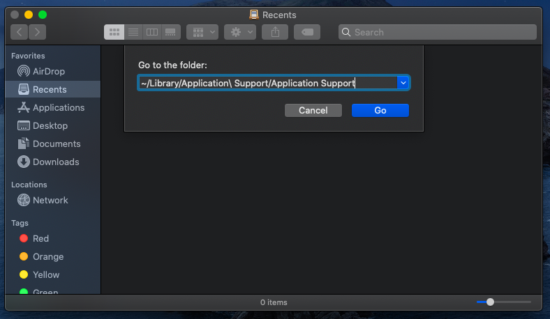

# Wallet Guides


# Windows QT Wallet Backup and Upgrade Guide

* First of all, don't forget to back up your current data.

* Close your wallet.

* Open the Run window using the WIN + R key combination.


* Enter the `%appdata%/SIN` command and click the OK button. Thus, you will reach the directory where your SIN data is kept.


 

Your wallet.dat file can be either in the wallets directory or in the SIN home directory, depending on the situation. Pay attention to this and back up these files to a suitable medium. We recommend that you do this periodically.

  


*Shut down the wallet. Backup wallet.dat and infinitynode.conf file.


Download the latest version of Windows Wallet at [https://github.com/SINOVATEblockchain/sinovate/releases](https://github.com/SINOVATEblockchain/sinovate/releases)
 


<br>
 
 Replace the sin-qt.exe file in the compressed file you downloaded with the sin-qt.exe file you are currently using.

:warning: Important Notice. Please pay attention!! :warning: :

- Close the wallet
- Back up
- Delete everything except wallet.dat.
- Copy the files extracted from the [bootstrap.zip](https://service.sinovate.io/mainnet/latest/bootstrap.zip) file to the SIN directory.
- Start the wallet.
 
<br>


# MAC QT Wallet Backup and Upgrade Guide

* First of all, don't forget to back up your current data.

* Close your wallet.

* In order to see hidden folders, such as `~/Library` from Finder, simply hit `shift + ⌘ (command) + G` which will GO to a folder, then paste in this location:


* ```~/Library/Application Support/SIN```




 

Your wallet.dat file can be either in the wallets directory or in the SIN home directory, depending on the situation. Pay attention to this and back up these files to a suitable medium. We recommend that you do this periodically.

  


*Shut down the wallet. Backup wallet.dat and Remove all old files and folders. 


Download the latest version of MAC Wallet at [https://github.com/SINOVATEblockchain/sinovate/releases](https://github.com/SINOVATEblockchain/sinovate/releases)
 


  

Replace the `sin-qt app` file in the compressed file you downloaded with the `sin-qt app` file you are currently using.

*Start the new wallet and wait for synchronization.


# VPS Infinity Node Update And Sync Guide

:warning: **You must log in with the user you created during installation.**

**1- disable it if you are using a crontab**
```bash
crontab -l > my_cron_backup.txt
crontab -r
```

**2- if running Infinity Node, stop it.**
```bash
sudo systemctl stop sinovate.service
./sin-cli stop
```

**3- update Latest Wallet** 
```bash
wget -O daemon.tar.gz https://github.com/SINOVATEblockchain/sinovate/releases/latest/download/daemon.tar.gz

tar -xzvf daemon.tar.gz
```
:warning: **If you don't have a sync problem, you can skip to step 9 and ignore step 11.**
# 4- install unzip package
```bash
sudo apt update && sudo apt install unzip
```
# 5- remove old files and folders
```bash
rm -rf ~/.sin/{blocks,chainstate,indexes,debug.log,mnpayments.dat,mncache.dat,banlist.dat,peers.dat,netfulfilled.dat,governance.dat,fee_estimates.dat}
```

# 6- download latest bootstrap archive
```bash
wget -O ~/bootstrap.zip https://service.sinovate.io/mainnet/latest/bootstrap.zip
```

# 7- unzip the bootstrap archive
```
unzip ~/bootstrap.zip
```

# 8- move bootstrap files
```bash
mv -ft ~/.sin ~/bootstrap/blocks ~/bootstrap/chainstate ~/bootstrap/indexes ~/bootstrap/infinitynode*.dat
```

# 9- run daemon 
```bash
./sind
```

# 10- To restore crontab

```bash
crontab my_cron_backup.txt
crontab -l
```

# 11- remove unnecessary files
```bash
rm -rf ~/{bootstrap,bootstrap.zip}
```

